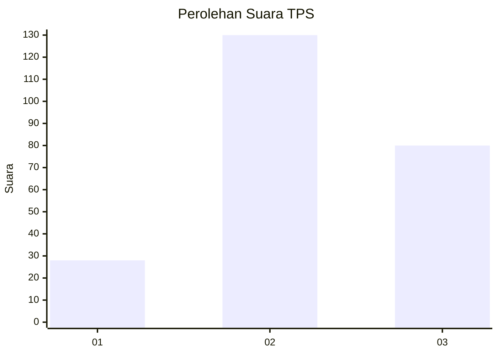
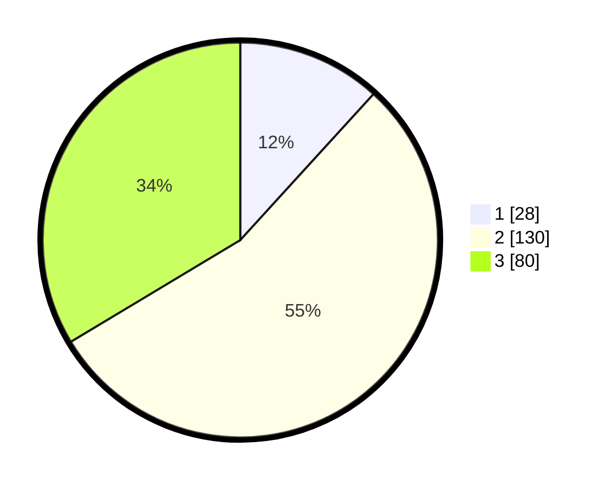

# Hasil

## Grafik

## Tabel

| No. | Nama Paslon    | Suara | Suara (raw) | Persentase |
|:--- |:-------------- | -----:| -----------:| ----------:|
| 1   | ANIES MUHAIMIN | 28    | [28][p-1]   | 11,76      |
| 2   | PRABOWO GIBRAN | 130   | [130][p-2]  | 54,62      |
| 3   | GANJAR MAHFUD  | 80    | [80][p-3]   | 33,61      |

[p-1]: https://github.com/gigit-pemilu/pemilu-2024-34-di-yogyakarta/blob/main/pilpres/hitung-suara/sub/34-di-yogyakarta/sub/02-bantul/sub/06-pandak/sub/2003-gilangharjo/sub/039-tps/sub/paslon-1.txt
[p-2]: https://github.com/gigit-pemilu/pemilu-2024-34-di-yogyakarta/blob/main/pilpres/hitung-suara/sub/34-di-yogyakarta/sub/02-bantul/sub/06-pandak/sub/2003-gilangharjo/sub/039-tps/sub/paslon-2.txt
[p-3]: https://github.com/gigit-pemilu/pemilu-2024-34-di-yogyakarta/blob/main/pilpres/hitung-suara/sub/34-di-yogyakarta/sub/02-bantul/sub/06-pandak/sub/2003-gilangharjo/sub/039-tps/sub/paslon-3.txt

## Foto C Plano

https://sirekap-obj-formc.kpu.go.id/f333/pemilu/ppwp/34/02/06/20/03/3402062003039-20240215-023402--762666b9-7e08-402b-87e2-0e98ff6a471c.jpg

https://sirekap-obj-formc.kpu.go.id/f333/pemilu/ppwp/34/02/06/20/03/3402062003039-20240215-044737--c7becfc0-1fa6-497d-816c-ef96aef86b20.jpg

https://sirekap-obj-formc.kpu.go.id/f333/pemilu/ppwp/34/02/06/20/03/3402062003039-20240215-044836--3a1586d5-31c6-48fb-b99f-5c78bd82cea9.jpg

## Metadata

| Key        | Value               |
| ---------- | ------------------- |
| Time Stamp | 2024-02-24 22:31:28 |

