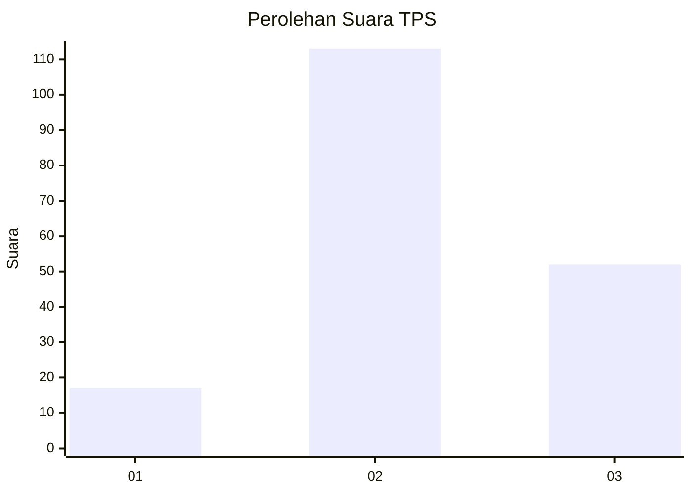
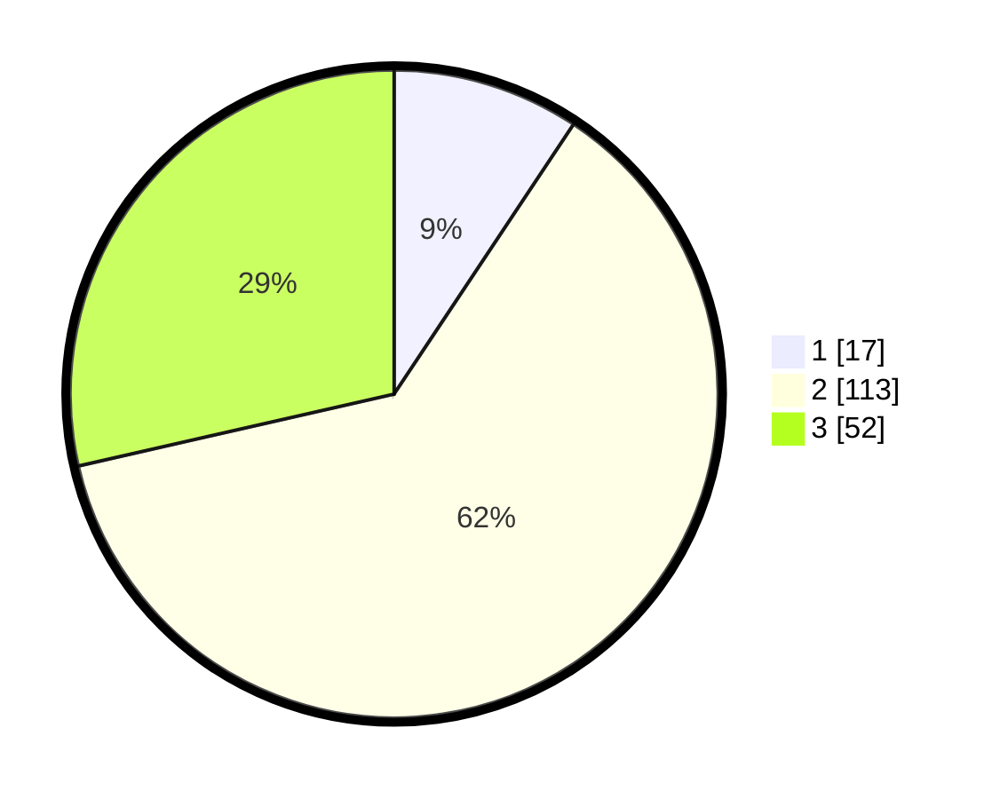

# Hasil

## Grafik

## Tabel

| No. | Nama Paslon    | Suara | Suara (raw) | Persentase |
|:--- |:-------------- | -----:| -----------:| ----------:|
| 1   | ANIES MUHAIMIN | 17    | [17][p-1]   | 9,34       |
| 2   | PRABOWO GIBRAN | 113   | [113][p-2]  | 62,09      |
| 3   | GANJAR MAHFUD  | 52    | [52][p-3]   | 28,57      |

[p-1]: https://github.com/gigit-pemilu/pemilu-2024-34-di-yogyakarta/blob/main/pilpres/hitung-suara/sub/34-di-yogyakarta/sub/02-bantul/sub/06-pandak/sub/2003-gilangharjo/sub/040-tps/sub/paslon-1.txt
[p-2]: https://github.com/gigit-pemilu/pemilu-2024-34-di-yogyakarta/blob/main/pilpres/hitung-suara/sub/34-di-yogyakarta/sub/02-bantul/sub/06-pandak/sub/2003-gilangharjo/sub/040-tps/sub/paslon-2.txt
[p-3]: https://github.com/gigit-pemilu/pemilu-2024-34-di-yogyakarta/blob/main/pilpres/hitung-suara/sub/34-di-yogyakarta/sub/02-bantul/sub/06-pandak/sub/2003-gilangharjo/sub/040-tps/sub/paslon-3.txt

## Foto C Plano

https://sirekap-obj-formc.kpu.go.id/0e24/pemilu/ppwp/34/02/06/20/03/3402062003040-20240214-235310--6e0c336f-ebcc-4dd5-b176-aa3bb07f8b63.jpg

https://sirekap-obj-formc.kpu.go.id/0e24/pemilu/ppwp/34/02/06/20/03/3402062003040-20240214-234932--6c8b5fef-2c1e-45f1-9ec9-f604d6fc91ed.jpg

https://sirekap-obj-formc.kpu.go.id/0e24/pemilu/ppwp/34/02/06/20/03/3402062003040-20240214-235103--7bfb77a8-aa67-4b6b-ab4e-3a4e8214b8d8.jpg

## Metadata

| Key        | Value               |
| ---------- | ------------------- |
| Time Stamp | 2024-02-24 22:31:28 |

