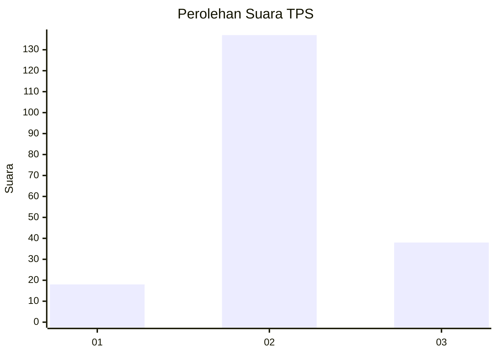
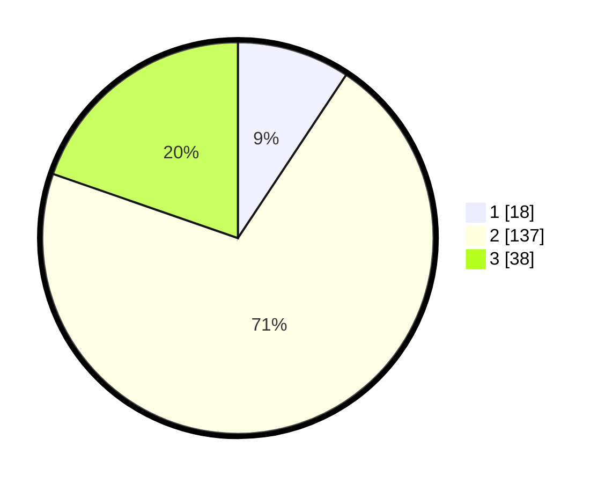

# Hasil

## Grafik

## Tabel

| No. | Nama Paslon    | Suara | Suara (raw) | Persentase |
|:--- |:-------------- | -----:| -----------:| ----------:|
| 1   | ANIES MUHAIMIN | 18    | [18][p-1]   | 9,33       |
| 2   | PRABOWO GIBRAN | 137   | [137][p-2]  | 70,98      |
| 3   | GANJAR MAHFUD  | 38    | [38][p-3]   | 19,69      |

[p-1]: https://github.com/gigit-pemilu/pemilu-2024-34-di-yogyakarta/blob/main/pilpres/hitung-suara/sub/34-di-yogyakarta/sub/02-bantul/sub/06-pandak/sub/2003-gilangharjo/sub/041-tps/sub/paslon-1.txt
[p-2]: https://github.com/gigit-pemilu/pemilu-2024-34-di-yogyakarta/blob/main/pilpres/hitung-suara/sub/34-di-yogyakarta/sub/02-bantul/sub/06-pandak/sub/2003-gilangharjo/sub/041-tps/sub/paslon-2.txt
[p-3]: https://github.com/gigit-pemilu/pemilu-2024-34-di-yogyakarta/blob/main/pilpres/hitung-suara/sub/34-di-yogyakarta/sub/02-bantul/sub/06-pandak/sub/2003-gilangharjo/sub/041-tps/sub/paslon-3.txt

## Foto C Plano

https://sirekap-obj-formc.kpu.go.id/11ba/pemilu/ppwp/34/02/06/20/03/3402062003041-20240215-001848--27a9c311-a9c2-45ec-bef9-8f2be695e68a.jpg

https://sirekap-obj-formc.kpu.go.id/11ba/pemilu/ppwp/34/02/06/20/03/3402062003041-20240215-001629--f14da73f-7fc3-4bd4-94b8-b1b3644d9778.jpg

https://sirekap-obj-formc.kpu.go.id/11ba/pemilu/ppwp/34/02/06/20/03/3402062003041-20240215-001405--58c9c07e-22b2-4aaa-bf32-fffc014894fe.jpg

## Metadata

| Key        | Value               |
| ---------- | ------------------- |
| Time Stamp | 2024-02-19 06:16:00 |

