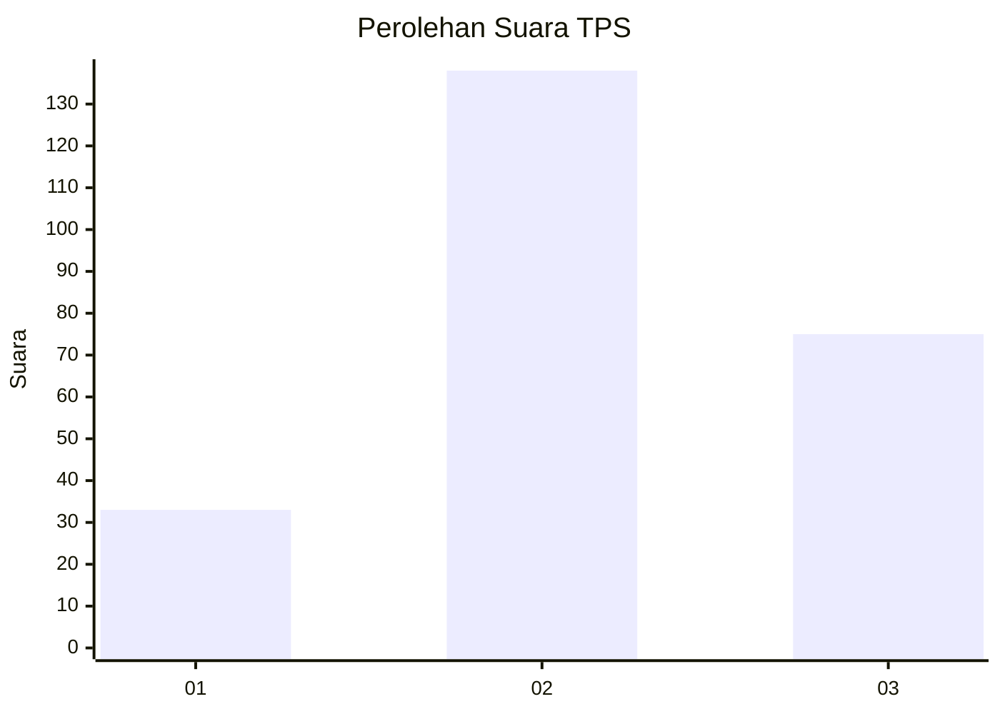
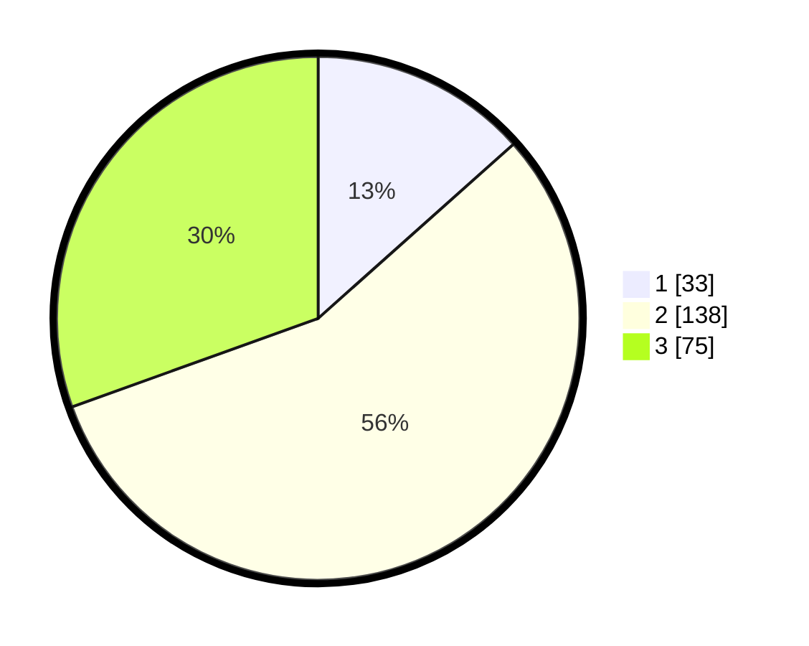

# Hasil

## Grafik

## Tabel

| No. | Nama Paslon    | Suara | Suara (raw) | Persentase |
|:--- |:-------------- | -----:| -----------:| ----------:|
| 1   | ANIES MUHAIMIN | 33    | [33][p-1]   | 13,41      |
| 2   | PRABOWO GIBRAN | 138   | [138][p-2]  | 56,10      |
| 3   | GANJAR MAHFUD  | 75    | [75][p-3]   | 30,49      |

[p-1]: https://github.com/gigit-pemilu/pemilu-2024-34-di-yogyakarta/blob/main/pilpres/hitung-suara/sub/34-di-yogyakarta/sub/02-bantul/sub/06-pandak/sub/2003-gilangharjo/sub/043-tps/sub/paslon-1.txt
[p-2]: https://github.com/gigit-pemilu/pemilu-2024-34-di-yogyakarta/blob/main/pilpres/hitung-suara/sub/34-di-yogyakarta/sub/02-bantul/sub/06-pandak/sub/2003-gilangharjo/sub/043-tps/sub/paslon-2.txt
[p-3]: https://github.com/gigit-pemilu/pemilu-2024-34-di-yogyakarta/blob/main/pilpres/hitung-suara/sub/34-di-yogyakarta/sub/02-bantul/sub/06-pandak/sub/2003-gilangharjo/sub/043-tps/sub/paslon-3.txt

## Foto C Plano

https://sirekap-obj-formc.kpu.go.id/7be0/pemilu/ppwp/34/02/06/20/03/3402062003043-20240220-155848--36a68ba2-e3ad-41be-95bf-d97db875fd18.jpg

https://sirekap-obj-formc.kpu.go.id/7be0/pemilu/ppwp/34/02/06/20/03/3402062003043-20240220-160116--dc96802d-8c55-4038-86df-ac9df4e7425e.jpg

https://sirekap-obj-formc.kpu.go.id/7be0/pemilu/ppwp/34/02/06/20/03/3402062003043-20240220-155911--7f12961a-6a08-40ae-8d86-0970df02e1dd.jpg

## Metadata

| Key        | Value               |
| ---------- | ------------------- |
| Time Stamp | 2024-02-24 22:31:28 |

