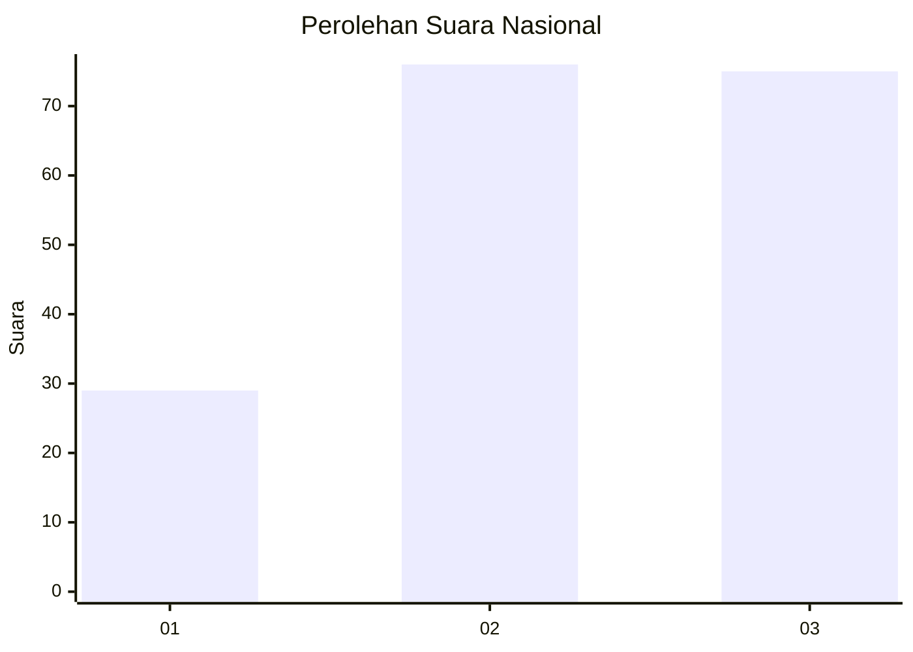
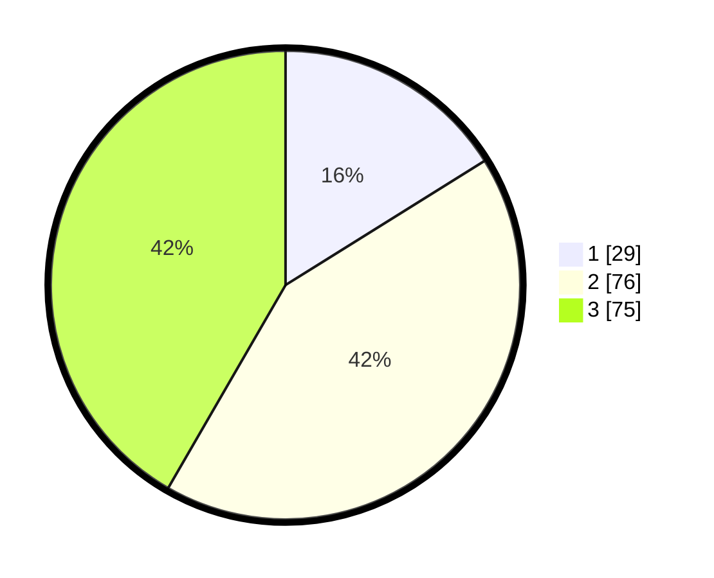

# Hasil

## Grafik

## Tabel

| No. | Nama Paslon    | Suara | Suara (raw) | Persentase |
|:--- |:-------------- | -----:| -----------:| ----------:|
| 1   | ANIES MUHAIMIN | 29    | [29][p-1]   | 16,11      |
| 2   | PRABOWO GIBRAN | 76    | [76][p-2]   | 42,22      |
| 3   | GANJAR MAHFUD  | 75    | [75][p-3]   | 41,67      |

[p-1]: https://github.com/gigit-pemilu/pemilu-2024/blob/main/pilpres/hitung-suara/sub/34-di-yogyakarta/sub/02-bantul/sub/06-pandak/sub/2003-gilangharjo/sub/044-tps/sub/paslon-1.txt
[p-2]: https://github.com/gigit-pemilu/pemilu-2024/blob/main/pilpres/hitung-suara/sub/34-di-yogyakarta/sub/02-bantul/sub/06-pandak/sub/2003-gilangharjo/sub/044-tps/sub/paslon-2.txt
[p-3]: https://github.com/gigit-pemilu/pemilu-2024/blob/main/pilpres/hitung-suara/sub/34-di-yogyakarta/sub/02-bantul/sub/06-pandak/sub/2003-gilangharjo/sub/044-tps/sub/paslon-3.txt

## Foto C Plano

https://sirekap-obj-formc.kpu.go.id/5a2b/pemilu/ppwp/34/02/06/20/03/3402062003044-20240221-193931--fa07a142-9ba3-4639-be8b-a25784382294.jpg

https://sirekap-obj-formc.kpu.go.id/5a2b/pemilu/ppwp/34/02/06/20/03/3402062003044-20240221-194033--992c0238-afe6-459d-ae25-82213b5b1fb1.jpg

https://sirekap-obj-formc.kpu.go.id/5a2b/pemilu/ppwp/34/02/06/20/03/3402062003044-20240221-194130--2ce2ac0d-b5c4-4fd6-be4f-2dccca246457.jpg

## Metadata

| Key        | Value               |
| ---------- | ------------------- |
| Time Stamp | 2024-02-24 22:31:28 |

