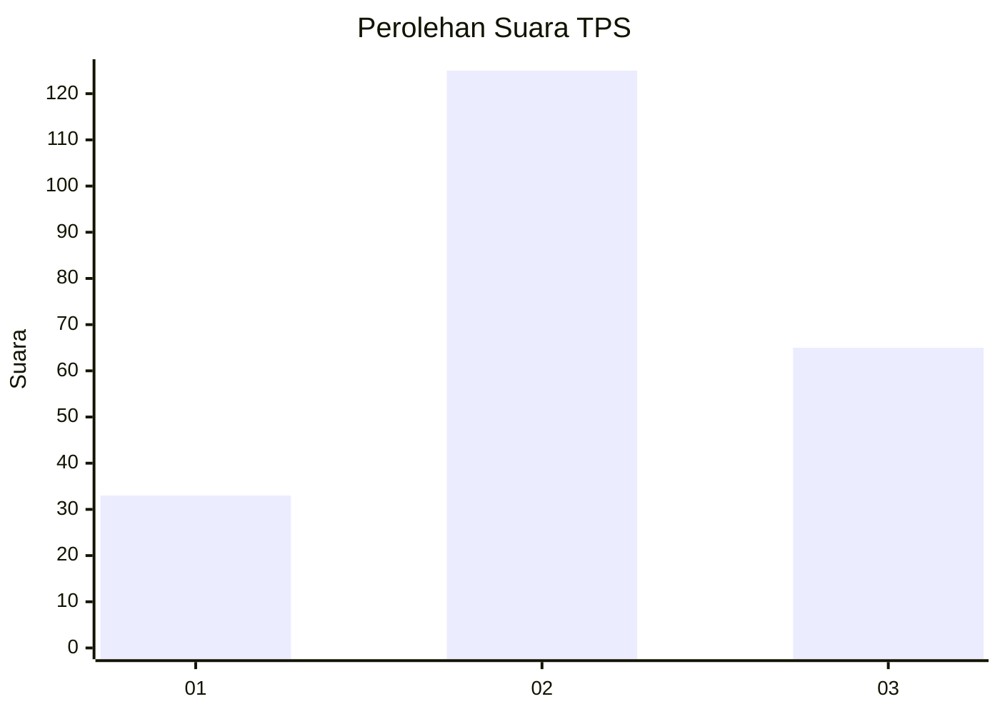
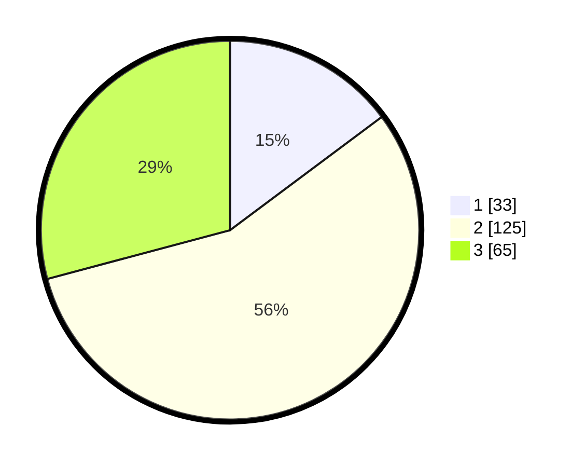

# Hasil

## Grafik

## Tabel

| No. | Nama Paslon    | Suara | Suara (raw) | Persentase |
|:--- |:-------------- | -----:| -----------:| ----------:|
| 1   | ANIES MUHAIMIN | 33    | [33][p-1]   | 14,80      |
| 2   | PRABOWO GIBRAN | 125   | [125][p-2]  | 56,05      |
| 3   | GANJAR MAHFUD  | 65    | [65][p-3]   | 29,15      |

[p-1]: https://github.com/gigit-pemilu/pemilu-2024-34-di-yogyakarta/blob/main/pilpres/hitung-suara/sub/34-di-yogyakarta/sub/02-bantul/sub/06-pandak/sub/2003-gilangharjo/sub/045-tps/sub/paslon-1.txt
[p-2]: https://github.com/gigit-pemilu/pemilu-2024-34-di-yogyakarta/blob/main/pilpres/hitung-suara/sub/34-di-yogyakarta/sub/02-bantul/sub/06-pandak/sub/2003-gilangharjo/sub/045-tps/sub/paslon-2.txt
[p-3]: https://github.com/gigit-pemilu/pemilu-2024-34-di-yogyakarta/blob/main/pilpres/hitung-suara/sub/34-di-yogyakarta/sub/02-bantul/sub/06-pandak/sub/2003-gilangharjo/sub/045-tps/sub/paslon-3.txt

## Foto C Plano

https://sirekap-obj-formc.kpu.go.id/4431/pemilu/ppwp/34/02/06/20/03/3402062003045-20240220-170303--5d719068-9eda-4da2-9c81-ee71fa6d1b51.jpg

https://sirekap-obj-formc.kpu.go.id/4431/pemilu/ppwp/34/02/06/20/03/3402062003045-20240220-170328--d1c86086-cf1b-473e-a19e-36045b402a9e.jpg

https://sirekap-obj-formc.kpu.go.id/4431/pemilu/ppwp/34/02/06/20/03/3402062003045-20240220-170408--0ac23463-1534-4cf4-9726-a40c9a738397.jpg

## Metadata

| Key        | Value               |
| ---------- | ------------------- |
| Time Stamp | 2024-02-26 14:00:00 |

