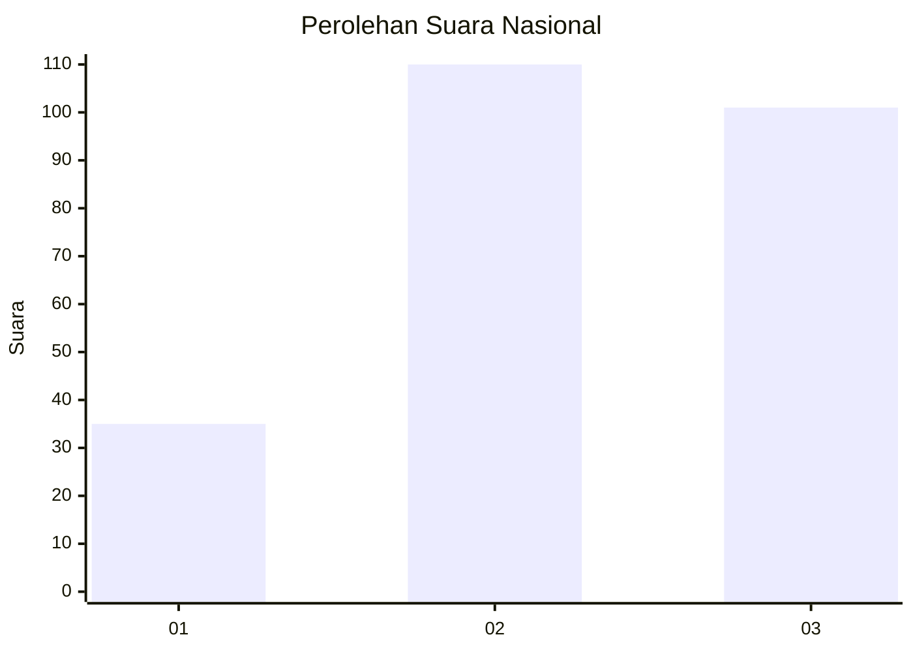
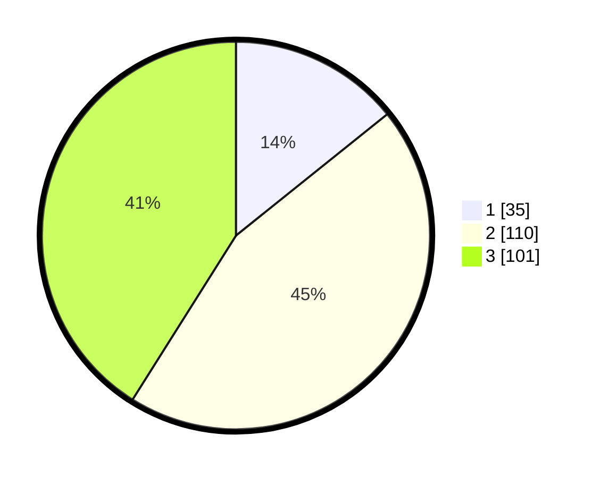

# Hasil

## Grafik

## Tabel

| No. | Nama Paslon    | Suara | Suara (raw) | Persentase |
|:--- |:-------------- | -----:| -----------:| ----------:|
| 1   | ANIES MUHAIMIN | 35    | [35][p-1]   | 14,23      |
| 2   | PRABOWO GIBRAN | 110   | [110][p-2]  | 44,72      |
| 3   | GANJAR MAHFUD  | 101   | [101][p-3]  | 41,06      |

[p-1]: https://github.com/gigit-pemilu/pemilu-2024/blob/main/pilpres/hitung-suara/sub/34-di-yogyakarta/sub/02-bantul/sub/06-pandak/sub/2003-gilangharjo/sub/046-tps/sub/paslon-1.txt
[p-2]: https://github.com/gigit-pemilu/pemilu-2024/blob/main/pilpres/hitung-suara/sub/34-di-yogyakarta/sub/02-bantul/sub/06-pandak/sub/2003-gilangharjo/sub/046-tps/sub/paslon-2.txt
[p-3]: https://github.com/gigit-pemilu/pemilu-2024/blob/main/pilpres/hitung-suara/sub/34-di-yogyakarta/sub/02-bantul/sub/06-pandak/sub/2003-gilangharjo/sub/046-tps/sub/paslon-3.txt

## Foto C Plano

https://sirekap-obj-formc.kpu.go.id/6915/pemilu/ppwp/34/02/06/20/03/3402062003046-20240220-195520--1b89ecb6-a0bb-4cfc-ae95-f58fc546ab3d.jpg

https://sirekap-obj-formc.kpu.go.id/6915/pemilu/ppwp/34/02/06/20/03/3402062003046-20240220-195559--8b2132ac-c407-4bd7-ab4f-61bf9caab240.jpg

https://sirekap-obj-formc.kpu.go.id/6915/pemilu/ppwp/34/02/06/20/03/3402062003046-20240220-195641--7de6f981-7f0a-46b8-bf64-d043adc14c37.jpg

## Metadata

| Key        | Value               |
| ---------- | ------------------- |
| Time Stamp | 2024-02-24 22:31:28 |

