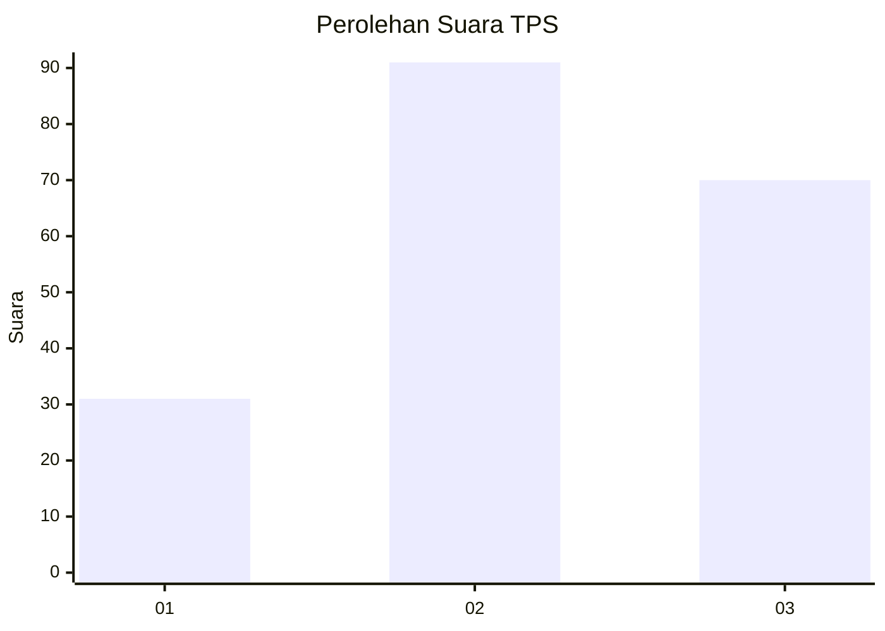
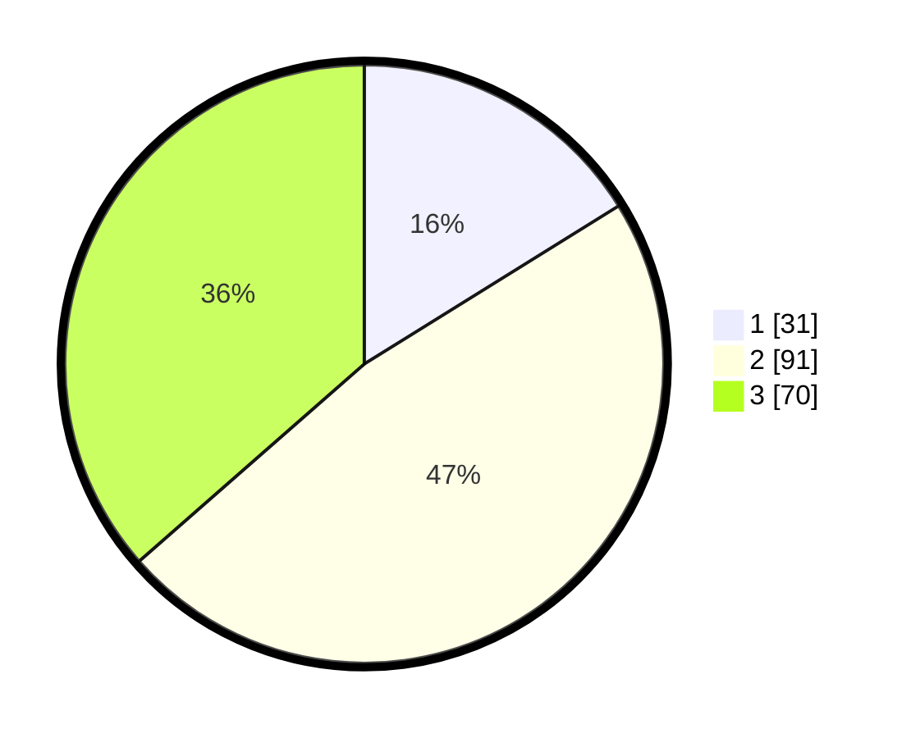

# Hasil

## Grafik

## Tabel

| No. | Nama Paslon    | Suara | Suara (raw) | Persentase |
|:--- |:-------------- | -----:| -----------:| ----------:|
| 1   | ANIES MUHAIMIN | 31    | [31][p-1]   | 16,15      |
| 2   | PRABOWO GIBRAN | 91    | [91][p-2]   | 47,40      |
| 3   | GANJAR MAHFUD  | 70    | [70][p-3]   | 36,46      |

[p-1]: https://github.com/gigit-pemilu/pemilu-2024-34-di-yogyakarta/blob/main/pilpres/hitung-suara/sub/34-di-yogyakarta/sub/02-bantul/sub/06-pandak/sub/2003-gilangharjo/sub/047-tps/sub/paslon-1.txt
[p-2]: https://github.com/gigit-pemilu/pemilu-2024-34-di-yogyakarta/blob/main/pilpres/hitung-suara/sub/34-di-yogyakarta/sub/02-bantul/sub/06-pandak/sub/2003-gilangharjo/sub/047-tps/sub/paslon-2.txt
[p-3]: https://github.com/gigit-pemilu/pemilu-2024-34-di-yogyakarta/blob/main/pilpres/hitung-suara/sub/34-di-yogyakarta/sub/02-bantul/sub/06-pandak/sub/2003-gilangharjo/sub/047-tps/sub/paslon-3.txt

## Foto C Plano

https://sirekap-obj-formc.kpu.go.id/c874/pemilu/ppwp/34/02/06/20/03/3402062003047-20240220-204147--be906e23-9140-402a-8ebc-90adba49bcdf.jpg

https://sirekap-obj-formc.kpu.go.id/c874/pemilu/ppwp/34/02/06/20/03/3402062003047-20240220-204235--b68e29f7-630d-418f-adc8-db185dea37e1.jpg

https://sirekap-obj-formc.kpu.go.id/c874/pemilu/ppwp/34/02/06/20/03/3402062003047-20240220-204328--e9697977-126e-4e28-8aa2-8d4395b180b5.jpg

## Metadata

| Key        | Value               |
| ---------- | ------------------- |
| Time Stamp | 2024-02-25 23:00:00 |

