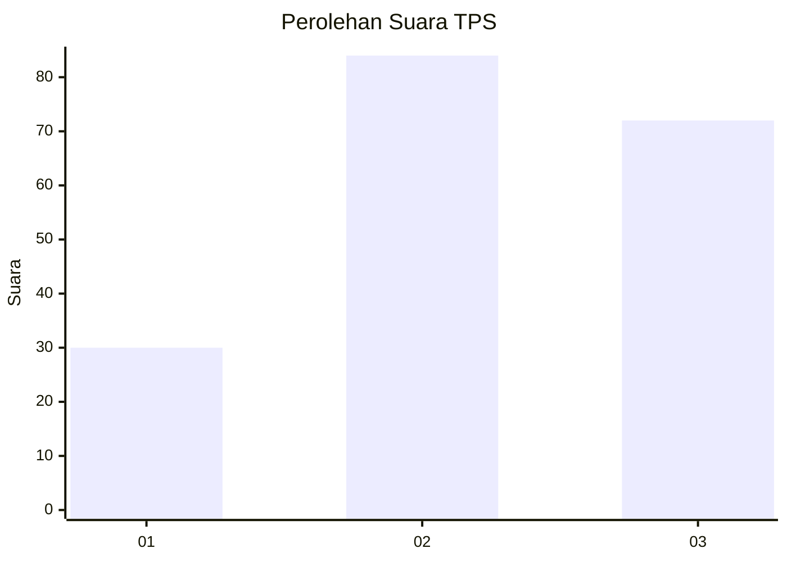
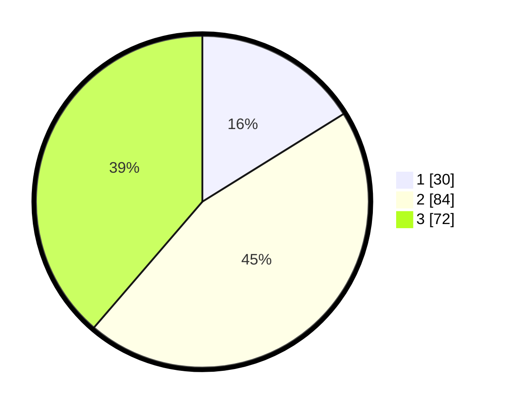

# Hasil

## Grafik

## Tabel

| No. | Nama Paslon    | Suara | Suara (raw) | Persentase |
|:--- |:-------------- | -----:| -----------:| ----------:|
| 1   | ANIES MUHAIMIN | 30    | [30][p-1]   | 16,13      |
| 2   | PRABOWO GIBRAN | 84    | [84][p-2]   | 45,16      |
| 3   | GANJAR MAHFUD  | 72    | [72][p-3]   | 38,71      |

[p-1]: https://github.com/gigit-pemilu/pemilu-2024-34-di-yogyakarta/blob/main/pilpres/hitung-suara/sub/34-di-yogyakarta/sub/02-bantul/sub/06-pandak/sub/2003-gilangharjo/sub/048-tps/sub/paslon-1.txt
[p-2]: https://github.com/gigit-pemilu/pemilu-2024-34-di-yogyakarta/blob/main/pilpres/hitung-suara/sub/34-di-yogyakarta/sub/02-bantul/sub/06-pandak/sub/2003-gilangharjo/sub/048-tps/sub/paslon-2.txt
[p-3]: https://github.com/gigit-pemilu/pemilu-2024-34-di-yogyakarta/blob/main/pilpres/hitung-suara/sub/34-di-yogyakarta/sub/02-bantul/sub/06-pandak/sub/2003-gilangharjo/sub/048-tps/sub/paslon-3.txt

## Foto C Plano

https://sirekap-obj-formc.kpu.go.id/536a/pemilu/ppwp/34/02/06/20/03/3402062003048-20240220-210859--6b06076d-2584-4bb1-ae5b-5e77e252f06e.jpg

https://sirekap-obj-formc.kpu.go.id/536a/pemilu/ppwp/34/02/06/20/03/3402062003048-20240220-210930--24869063-9eba-44d3-b2b7-238b9c5ba57e.jpg

https://sirekap-obj-formc.kpu.go.id/536a/pemilu/ppwp/34/02/06/20/03/3402062003048-20240220-211056--16a5d99f-578d-4c44-8626-6fefbadd8d1f.jpg

## Metadata

| Key        | Value               |
| ---------- | ------------------- |
| Time Stamp | 2024-02-24 22:31:28 |

