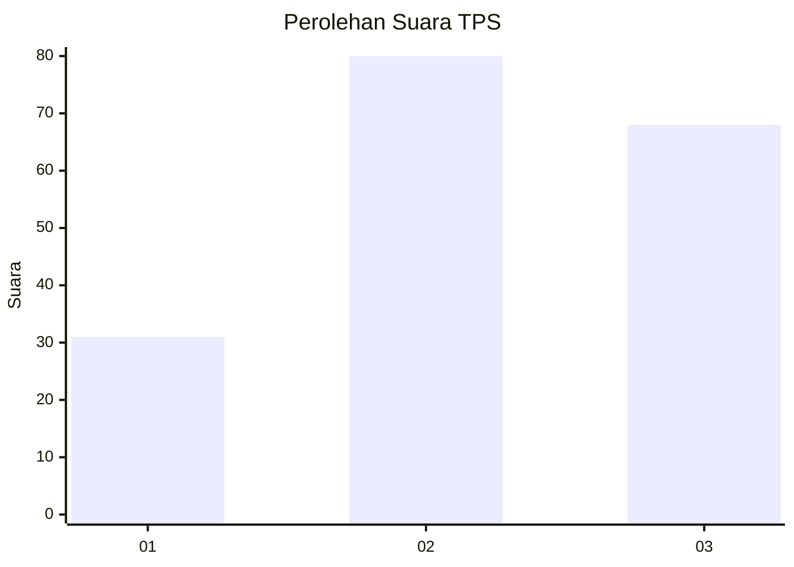
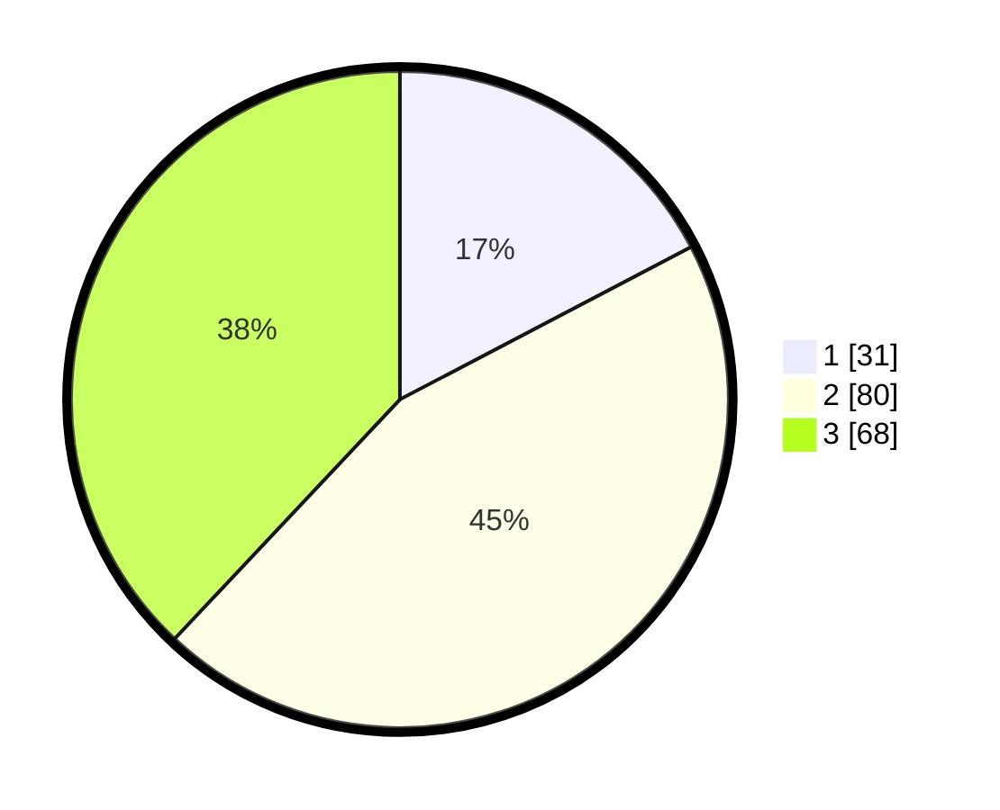

# Hasil

## Grafik

## Tabel

| No. | Nama Paslon    | Suara | Suara (raw) | Persentase |
|:--- |:-------------- | -----:| -----------:| ----------:|
| 1   | ANIES MUHAIMIN | 31    | [31][p-1]   | 17,32      |
| 2   | PRABOWO GIBRAN | 80    | [80][p-2]   | 44,69      |
| 3   | GANJAR MAHFUD  | 68    | [68][p-3]   | 37,99      |

[p-1]: https://github.com/gigit-pemilu/pemilu-2024-34-di-yogyakarta/blob/main/pilpres/hitung-suara/sub/34-di-yogyakarta/sub/02-bantul/sub/06-pandak/sub/2003-gilangharjo/sub/049-tps/sub/paslon-1.txt
[p-2]: https://github.com/gigit-pemilu/pemilu-2024-34-di-yogyakarta/blob/main/pilpres/hitung-suara/sub/34-di-yogyakarta/sub/02-bantul/sub/06-pandak/sub/2003-gilangharjo/sub/049-tps/sub/paslon-2.txt
[p-3]: https://github.com/gigit-pemilu/pemilu-2024-34-di-yogyakarta/blob/main/pilpres/hitung-suara/sub/34-di-yogyakarta/sub/02-bantul/sub/06-pandak/sub/2003-gilangharjo/sub/049-tps/sub/paslon-3.txt

## Foto C Plano

https://sirekap-obj-formc.kpu.go.id/0fd9/pemilu/ppwp/34/02/06/20/03/3402062003049-20240220-211345--d3d545b9-1efa-4d71-967d-c4ab515282ac.jpg

https://sirekap-obj-formc.kpu.go.id/0fd9/pemilu/ppwp/34/02/06/20/03/3402062003049-20240220-211830--79f2b1aa-8c23-4556-a774-7d7118f03b36.jpg

https://sirekap-obj-formc.kpu.go.id/0fd9/pemilu/ppwp/34/02/06/20/03/3402062003049-20240220-212033--d1c8dd46-ae2c-4d2d-be37-921e1e663981.jpg

## Metadata

| Key        | Value               |
| ---------- | ------------------- |
| Time Stamp | 2024-02-24 22:31:28 |

