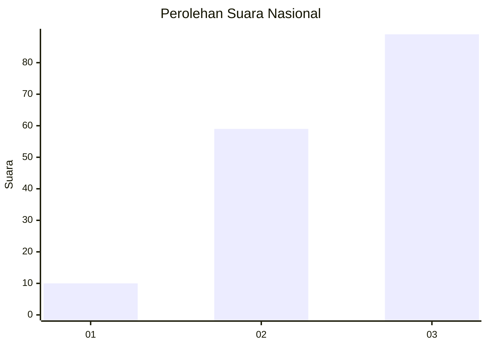
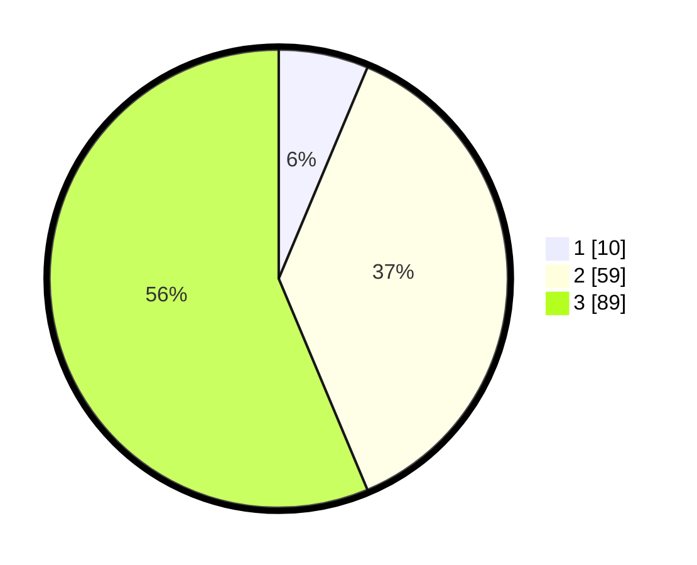

# Hasil

## Grafik

## Tabel

| No. | Nama Paslon    | Suara | Suara (raw) | Persentase |
|:--- |:-------------- | -----:| -----------:| ----------:|
| 1   | ANIES MUHAIMIN | 10    | [10][p-1]   | 6,33       |
| 2   | PRABOWO GIBRAN | 59    | [59][p-2]   | 37,34      |
| 3   | GANJAR MAHFUD  | 89    | [89][p-3]   | 56,33      |

[p-1]: https://github.com/gigit-pemilu/pemilu-2024/blob/main/pilpres/hitung-suara/sub/34-di-yogyakarta/sub/02-bantul/sub/06-pandak/sub/2003-gilangharjo/sub/050-tps/sub/paslon-1.txt
[p-2]: https://github.com/gigit-pemilu/pemilu-2024/blob/main/pilpres/hitung-suara/sub/34-di-yogyakarta/sub/02-bantul/sub/06-pandak/sub/2003-gilangharjo/sub/050-tps/sub/paslon-2.txt
[p-3]: https://github.com/gigit-pemilu/pemilu-2024/blob/main/pilpres/hitung-suara/sub/34-di-yogyakarta/sub/02-bantul/sub/06-pandak/sub/2003-gilangharjo/sub/050-tps/sub/paslon-3.txt

## Foto C Plano

https://sirekap-obj-formc.kpu.go.id/81fe/pemilu/ppwp/34/02/06/20/03/3402062003050-20240220-212418--bd41a78c-b4ce-4b7b-ab32-dfd3f4e4faa1.jpg

https://sirekap-obj-formc.kpu.go.id/81fe/pemilu/ppwp/34/02/06/20/03/3402062003050-20240220-212444--5d973131-c220-4c13-a253-cc874ee69b6e.jpg

https://sirekap-obj-formc.kpu.go.id/81fe/pemilu/ppwp/34/02/06/20/03/3402062003050-20240220-212508--eb31b9e0-8662-4db9-822d-f67ae69d65d6.jpg

## Metadata

| Key        | Value               |
| ---------- | ------------------- |
| Time Stamp | 2024-02-24 22:31:28 |

