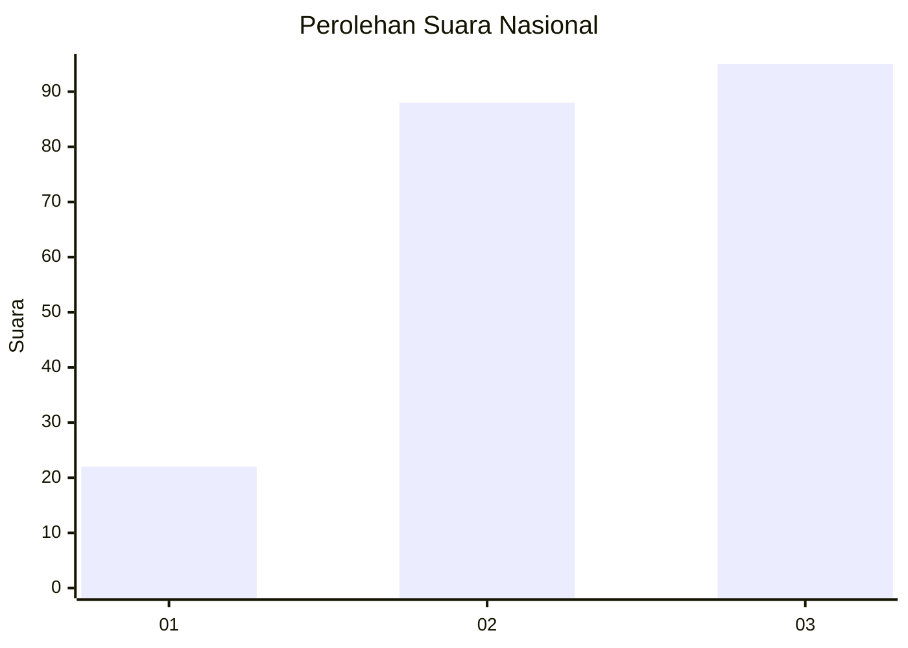
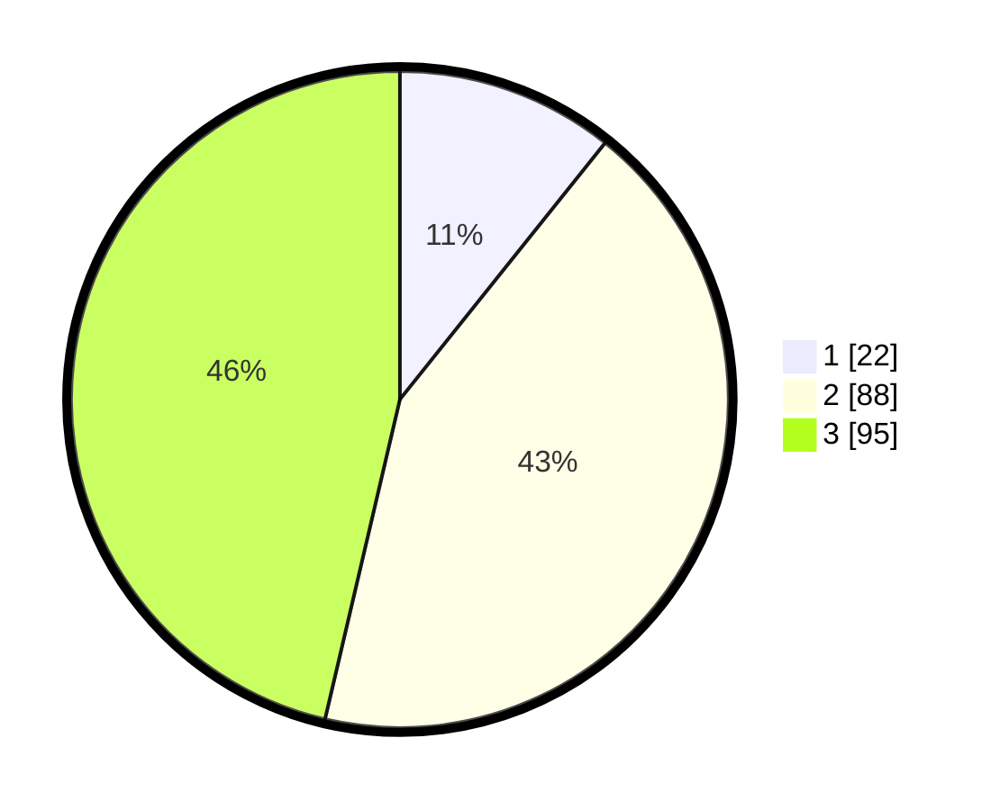

# Hasil

## Grafik

## Tabel

| No. | Nama Paslon    | Suara | Suara (raw) | Persentase |
|:--- |:-------------- | -----:| -----------:| ----------:|
| 1   | ANIES MUHAIMIN | 22    | [22][p-1]   | 10,73      |
| 2   | PRABOWO GIBRAN | 88    | [88][p-2]   | 42,93      |
| 3   | GANJAR MAHFUD  | 95    | [95][p-3]   | 46,34      |

[p-1]: https://github.com/gigit-pemilu/pemilu-2024/blob/main/pilpres/hitung-suara/sub/34-di-yogyakarta/sub/02-bantul/sub/06-pandak/sub/2003-gilangharjo/sub/051-tps/sub/paslon-1.txt
[p-2]: https://github.com/gigit-pemilu/pemilu-2024/blob/main/pilpres/hitung-suara/sub/34-di-yogyakarta/sub/02-bantul/sub/06-pandak/sub/2003-gilangharjo/sub/051-tps/sub/paslon-2.txt
[p-3]: https://github.com/gigit-pemilu/pemilu-2024/blob/main/pilpres/hitung-suara/sub/34-di-yogyakarta/sub/02-bantul/sub/06-pandak/sub/2003-gilangharjo/sub/051-tps/sub/paslon-3.txt

## Foto C Plano

https://sirekap-obj-formc.kpu.go.id/0668/pemilu/ppwp/34/02/06/20/03/3402062003051-20240214-225837--38b7c21e-a246-450c-ab70-28416d16205e.jpg

https://sirekap-obj-formc.kpu.go.id/0668/pemilu/ppwp/34/02/06/20/03/3402062003051-20240214-212533--9d2a5d4b-b43b-40e5-aa53-a52f0f188665.jpg

https://sirekap-obj-formc.kpu.go.id/0668/pemilu/ppwp/34/02/06/20/03/3402062003051-20240214-212412--fba25caf-ca05-47a5-b2a2-8b7169d97a4e.jpg

## Metadata

| Key        | Value               |
| ---------- | ------------------- |
| Time Stamp | 2024-02-15 02:10:27 |

