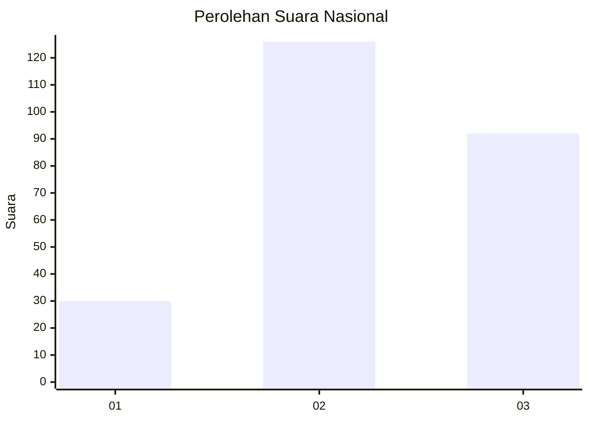
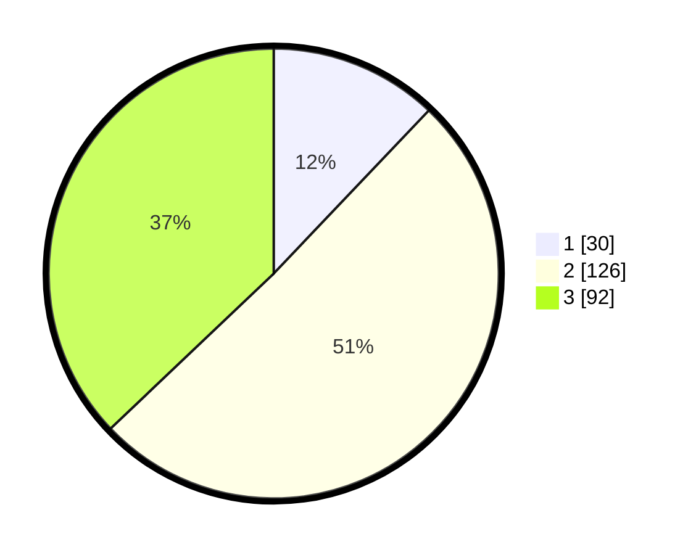

# Hasil

## Grafik

## Tabel

| No. | Nama Paslon    | Suara | Suara (raw) | Persentase |
|:--- |:-------------- | -----:| -----------:| ----------:|
| 1   | ANIES MUHAIMIN | 30    | [30][p-1]   | 12,10      |
| 2   | PRABOWO GIBRAN | 126   | [126][p-2]  | 50,81      |
| 3   | GANJAR MAHFUD  | 92    | [92][p-3]   | 37,10      |

[p-1]: https://github.com/gigit-pemilu/pemilu-2024/blob/main/pilpres/hitung-suara/sub/34-di-yogyakarta/sub/02-bantul/sub/06-pandak/sub/2003-gilangharjo/sub/052-tps/sub/paslon-1.txt
[p-2]: https://github.com/gigit-pemilu/pemilu-2024/blob/main/pilpres/hitung-suara/sub/34-di-yogyakarta/sub/02-bantul/sub/06-pandak/sub/2003-gilangharjo/sub/052-tps/sub/paslon-2.txt
[p-3]: https://github.com/gigit-pemilu/pemilu-2024/blob/main/pilpres/hitung-suara/sub/34-di-yogyakarta/sub/02-bantul/sub/06-pandak/sub/2003-gilangharjo/sub/052-tps/sub/paslon-3.txt

## Foto C Plano

https://sirekap-obj-formc.kpu.go.id/e7f3/pemilu/ppwp/34/02/06/20/03/3402062003052-20240220-220825--3a148917-d5b7-434d-90ba-7c6b03c33456.jpg

https://sirekap-obj-formc.kpu.go.id/e7f3/pemilu/ppwp/34/02/06/20/03/3402062003052-20240220-220902--e04ca8da-c429-4d3f-bc86-0bf5fa007eea.jpg

https://sirekap-obj-formc.kpu.go.id/e7f3/pemilu/ppwp/34/02/06/20/03/3402062003052-20240220-220930--082c46de-869f-41b1-87e4-ae48ad7e5166.jpg

## Metadata

| Key        | Value               |
| ---------- | ------------------- |
| Time Stamp | 2024-02-25 17:00:00 |

