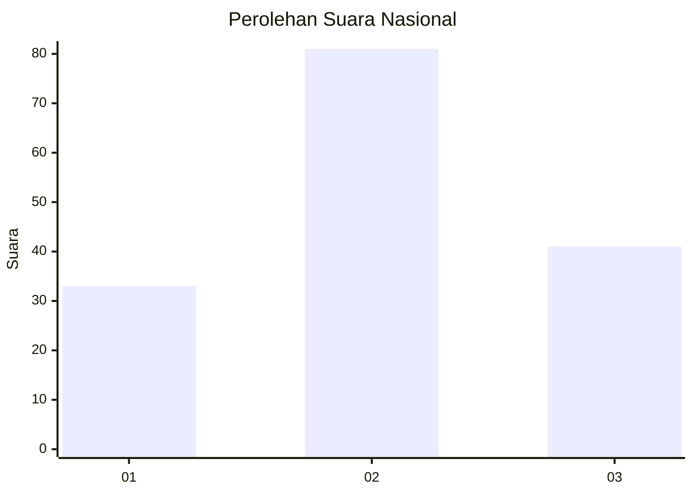
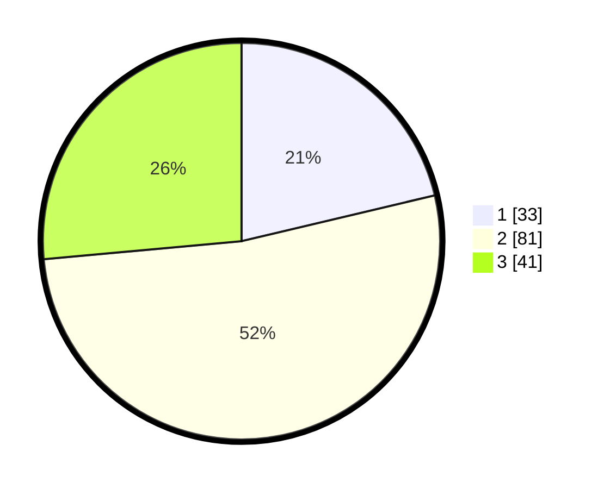

# Hasil

## Grafik

## Tabel

| No. | Nama Paslon    | Suara | Suara (raw) | Persentase |
|:--- |:-------------- | -----:| -----------:| ----------:|
| 1   | ANIES MUHAIMIN | 33    | [33][p-1]   | 21,29      |
| 2   | PRABOWO GIBRAN | 81    | [81][p-2]   | 52,26      |
| 3   | GANJAR MAHFUD  | 41    | [41][p-3]   | 26,45      |

[p-1]: https://github.com/gigit-pemilu/pemilu-2024/blob/main/pilpres/hitung-suara/sub/34-di-yogyakarta/sub/02-bantul/sub/06-pandak/sub/2003-gilangharjo/sub/053-tps/sub/paslon-1.txt
[p-2]: https://github.com/gigit-pemilu/pemilu-2024/blob/main/pilpres/hitung-suara/sub/34-di-yogyakarta/sub/02-bantul/sub/06-pandak/sub/2003-gilangharjo/sub/053-tps/sub/paslon-2.txt
[p-3]: https://github.com/gigit-pemilu/pemilu-2024/blob/main/pilpres/hitung-suara/sub/34-di-yogyakarta/sub/02-bantul/sub/06-pandak/sub/2003-gilangharjo/sub/053-tps/sub/paslon-3.txt

## Foto C Plano

https://sirekap-obj-formc.kpu.go.id/65ef/pemilu/ppwp/34/02/06/20/03/3402062003053-20240215-001911--cfa6fd02-e123-4399-bc5b-ba35c1caa074.jpg

https://sirekap-obj-formc.kpu.go.id/65ef/pemilu/ppwp/34/02/06/20/03/3402062003053-20240215-001937--084b5423-ebeb-4422-ab14-e7e2204f45dc.jpg

https://sirekap-obj-formc.kpu.go.id/65ef/pemilu/ppwp/34/02/06/20/03/3402062003053-20240215-002009--a83ed4ea-cb58-4836-8d32-078701a5ce97.jpg

## Metadata

| Key        | Value               |
| ---------- | ------------------- |
| Time Stamp | 2024-02-25 12:00:00 |

