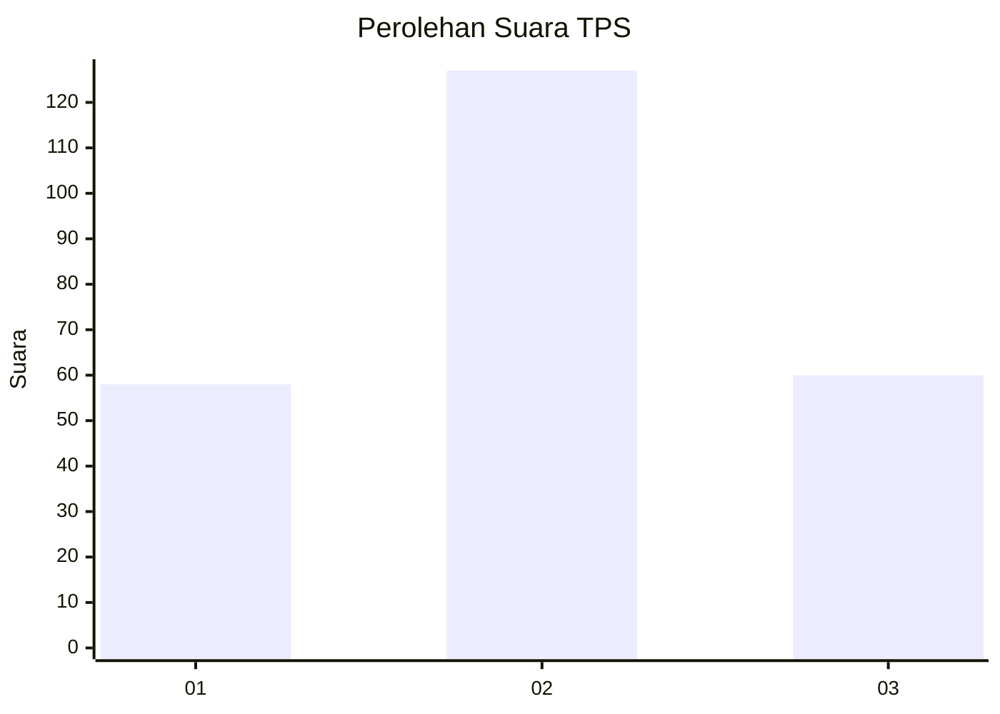
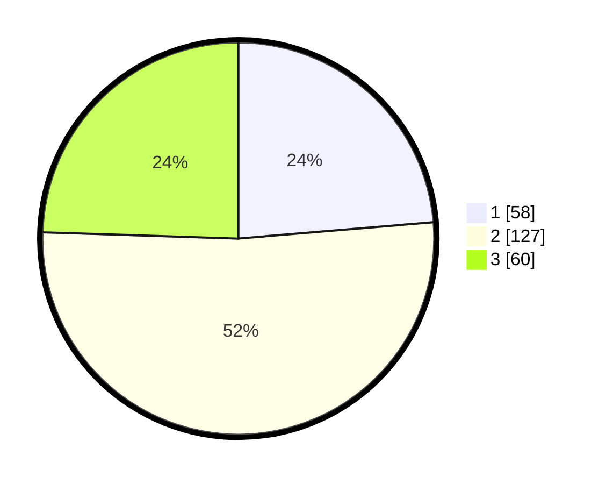

# Hasil

## Grafik

## Tabel

| No. | Nama Paslon    | Suara | Suara (raw) | Persentase |
|:--- |:-------------- | -----:| -----------:| ----------:|
| 1   | ANIES MUHAIMIN | 58    | [58][p-1]   | 23,67      |
| 2   | PRABOWO GIBRAN | 127   | [127][p-2]  | 51,84      |
| 3   | GANJAR MAHFUD  | 60    | [60][p-3]   | 24,49      |

[p-1]: https://github.com/gigit-pemilu/pemilu-2024-34-di-yogyakarta/blob/main/pilpres/hitung-suara/sub/34-di-yogyakarta/sub/02-bantul/sub/06-pandak/sub/2004-wijirejo/sub/004-tps/sub/paslon-1.txt
[p-2]: https://github.com/gigit-pemilu/pemilu-2024-34-di-yogyakarta/blob/main/pilpres/hitung-suara/sub/34-di-yogyakarta/sub/02-bantul/sub/06-pandak/sub/2004-wijirejo/sub/004-tps/sub/paslon-2.txt
[p-3]: https://github.com/gigit-pemilu/pemilu-2024-34-di-yogyakarta/blob/main/pilpres/hitung-suara/sub/34-di-yogyakarta/sub/02-bantul/sub/06-pandak/sub/2004-wijirejo/sub/004-tps/sub/paslon-3.txt

## Foto C Plano

https://sirekap-obj-formc.kpu.go.id/4bf4/pemilu/ppwp/34/02/06/20/04/3402062004004-20240216-171856--46f1a35a-1a08-43b7-9d02-2e15d7f6978d.jpg

https://sirekap-obj-formc.kpu.go.id/4bf4/pemilu/ppwp/34/02/06/20/04/3402062004004-20240216-171720--aaa76827-37de-4804-a98c-664dddd628ee.jpg

https://sirekap-obj-formc.kpu.go.id/4bf4/pemilu/ppwp/34/02/06/20/04/3402062004004-20240216-171801--bb159006-1bac-4994-ab16-4f7403c23764.jpg

## Metadata

| Key        | Value               |
| ---------- | ------------------- |
| Time Stamp | 2024-02-24 22:31:28 |

