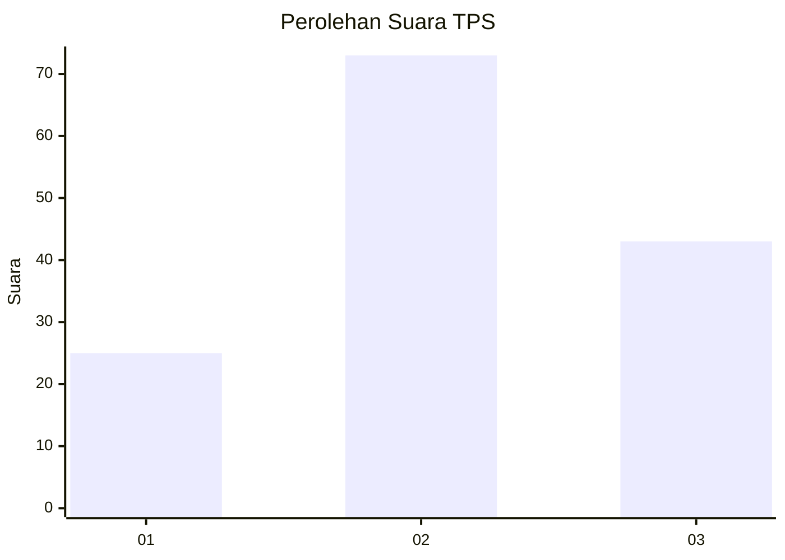
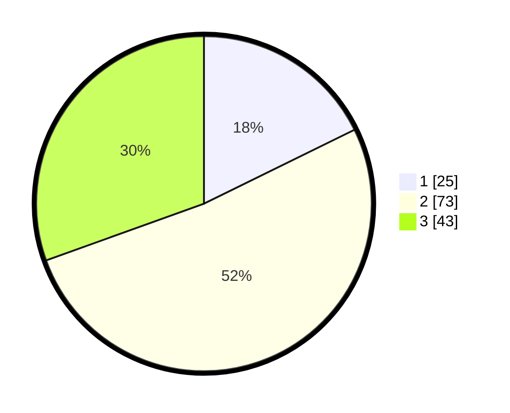

# Hasil

## Grafik

## Tabel

| No. | Nama Paslon    | Suara | Suara (raw) | Persentase |
|:--- |:-------------- | -----:| -----------:| ----------:|
| 1   | ANIES MUHAIMIN | 25    | [25][p-1]   | 17,73      |
| 2   | PRABOWO GIBRAN | 73    | [73][p-2]   | 51,77      |
| 3   | GANJAR MAHFUD  | 43    | [43][p-3]   | 30,50      |

[p-1]: https://github.com/gigit-pemilu/pemilu-2024-34-di-yogyakarta/blob/main/pilpres/hitung-suara/sub/34-di-yogyakarta/sub/02-bantul/sub/06-pandak/sub/2004-wijirejo/sub/007-tps/sub/paslon-1.txt
[p-2]: https://github.com/gigit-pemilu/pemilu-2024-34-di-yogyakarta/blob/main/pilpres/hitung-suara/sub/34-di-yogyakarta/sub/02-bantul/sub/06-pandak/sub/2004-wijirejo/sub/007-tps/sub/paslon-2.txt
[p-3]: https://github.com/gigit-pemilu/pemilu-2024-34-di-yogyakarta/blob/main/pilpres/hitung-suara/sub/34-di-yogyakarta/sub/02-bantul/sub/06-pandak/sub/2004-wijirejo/sub/007-tps/sub/paslon-3.txt

## Foto C Plano

https://sirekap-obj-formc.kpu.go.id/bb6f/pemilu/ppwp/34/02/06/20/04/3402062004007-20240217-140913--4ac348bb-4ffc-4d6a-9264-8d64a8048df6.jpg

https://sirekap-obj-formc.kpu.go.id/bb6f/pemilu/ppwp/34/02/06/20/04/3402062004007-20240217-141005--2373dc70-2ab4-4b35-99ec-b57b9253a040.jpg

https://sirekap-obj-formc.kpu.go.id/bb6f/pemilu/ppwp/34/02/06/20/04/3402062004007-20240217-141121--e9932f63-15d4-4aa0-a0e6-3ad755022fb5.jpg

## Metadata

| Key        | Value               |
| ---------- | ------------------- |
| Time Stamp | 2024-02-26 14:00:00 |

