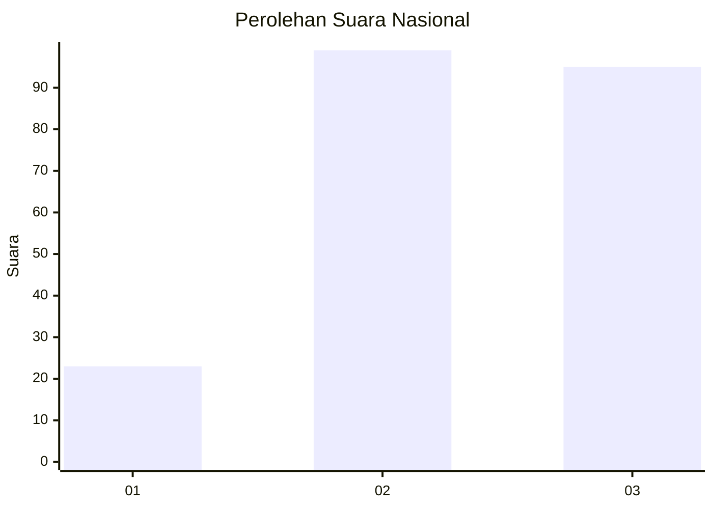
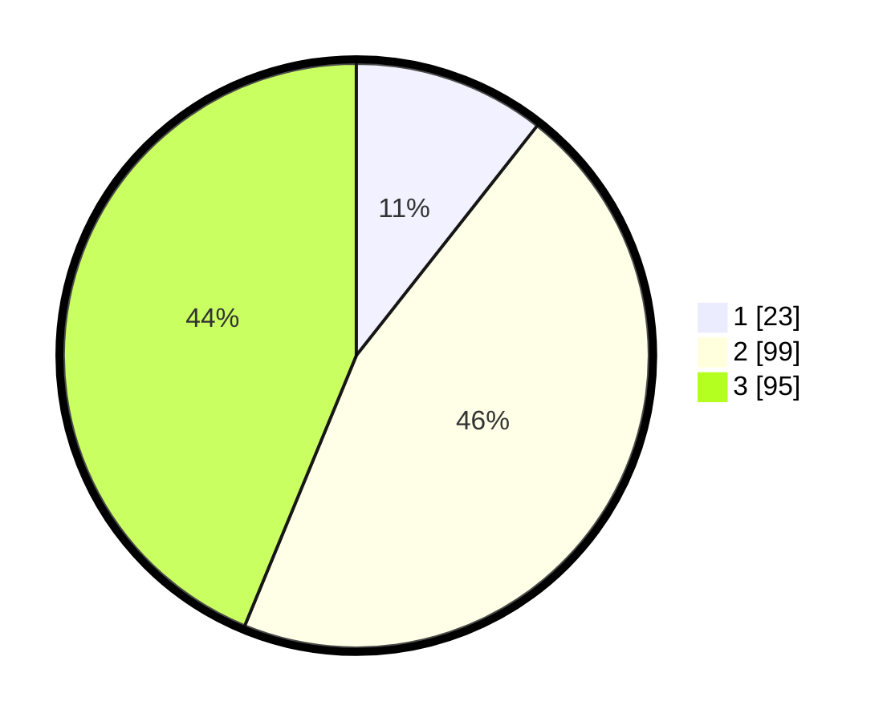

# Hasil

## Grafik

## Tabel

| No. | Nama Paslon    | Suara | Suara (raw) | Persentase |
|:--- |:-------------- | -----:| -----------:| ----------:|
| 1   | ANIES MUHAIMIN | 23    | [23][p-1]   | 10,60      |
| 2   | PRABOWO GIBRAN | 99    | [99][p-2]   | 45,62      |
| 3   | GANJAR MAHFUD  | 95    | [95][p-3]   | 43,78      |

[p-1]: https://github.com/gigit-pemilu/pemilu-2024/blob/main/pilpres/hitung-suara/sub/34-di-yogyakarta/sub/02-bantul/sub/06-pandak/sub/2004-wijirejo/sub/008-tps/sub/paslon-1.txt
[p-2]: https://github.com/gigit-pemilu/pemilu-2024/blob/main/pilpres/hitung-suara/sub/34-di-yogyakarta/sub/02-bantul/sub/06-pandak/sub/2004-wijirejo/sub/008-tps/sub/paslon-2.txt
[p-3]: https://github.com/gigit-pemilu/pemilu-2024/blob/main/pilpres/hitung-suara/sub/34-di-yogyakarta/sub/02-bantul/sub/06-pandak/sub/2004-wijirejo/sub/008-tps/sub/paslon-3.txt

## Foto C Plano

https://sirekap-obj-formc.kpu.go.id/a12c/pemilu/ppwp/34/02/06/20/04/3402062004008-20240217-155049--85e05bae-68a5-4ea9-a164-71a6ebb3de35.jpg

https://sirekap-obj-formc.kpu.go.id/a12c/pemilu/ppwp/34/02/06/20/04/3402062004008-20240217-155130--fca63de0-17c3-4dae-a89b-59b64f70351e.jpg

https://sirekap-obj-formc.kpu.go.id/a12c/pemilu/ppwp/34/02/06/20/04/3402062004008-20240217-155321--c700932f-d117-4dbf-a718-dc6507a4929f.jpg

## Metadata

| Key        | Value               |
| ---------- | ------------------- |
| Time Stamp | 2024-02-24 22:31:28 |

