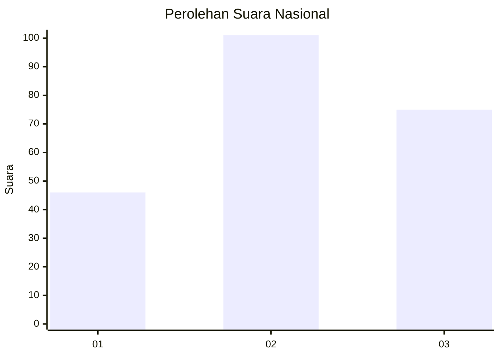
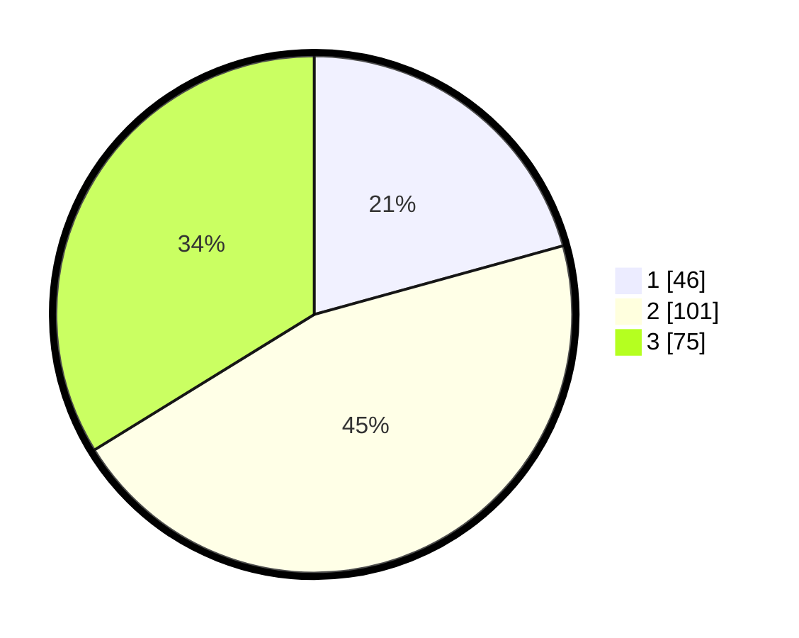

# Hasil

## Grafik

## Tabel

| No. | Nama Paslon    | Suara | Suara (raw) | Persentase |
|:--- |:-------------- | -----:| -----------:| ----------:|
| 1   | ANIES MUHAIMIN | 46    | [46][p-1]   | 20,72      |
| 2   | PRABOWO GIBRAN | 101   | [101][p-2]  | 45,50      |
| 3   | GANJAR MAHFUD  | 75    | [75][p-3]   | 33,78      |

[p-1]: https://github.com/gigit-pemilu/pemilu-2024/blob/main/pilpres/hitung-suara/sub/34-di-yogyakarta/sub/02-bantul/sub/06-pandak/sub/2004-wijirejo/sub/010-tps/sub/paslon-1.txt
[p-2]: https://github.com/gigit-pemilu/pemilu-2024/blob/main/pilpres/hitung-suara/sub/34-di-yogyakarta/sub/02-bantul/sub/06-pandak/sub/2004-wijirejo/sub/010-tps/sub/paslon-2.txt
[p-3]: https://github.com/gigit-pemilu/pemilu-2024/blob/main/pilpres/hitung-suara/sub/34-di-yogyakarta/sub/02-bantul/sub/06-pandak/sub/2004-wijirejo/sub/010-tps/sub/paslon-3.txt

## Foto C Plano

https://sirekap-obj-formc.kpu.go.id/9653/pemilu/ppwp/34/02/06/20/04/3402062004010-20240217-154505--8aee5485-1bf9-4cb9-b2f8-8179d43959e9.jpg

https://sirekap-obj-formc.kpu.go.id/9653/pemilu/ppwp/34/02/06/20/04/3402062004010-20240217-142429--c5949223-ca2d-4ca1-af7a-688d4e1e38ec.jpg

https://sirekap-obj-formc.kpu.go.id/9653/pemilu/ppwp/34/02/06/20/04/3402062004010-20240217-154647--c9917201-c156-4bed-aa1d-f78ab76232ad.jpg

## Metadata

| Key        | Value               |
| ---------- | ------------------- |
| Time Stamp | 2024-02-24 22:31:28 |

