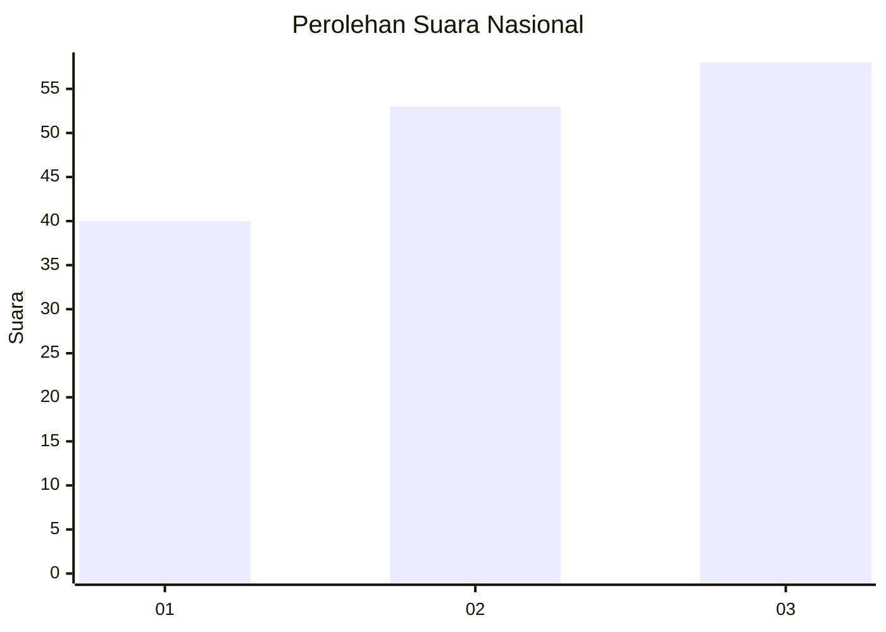
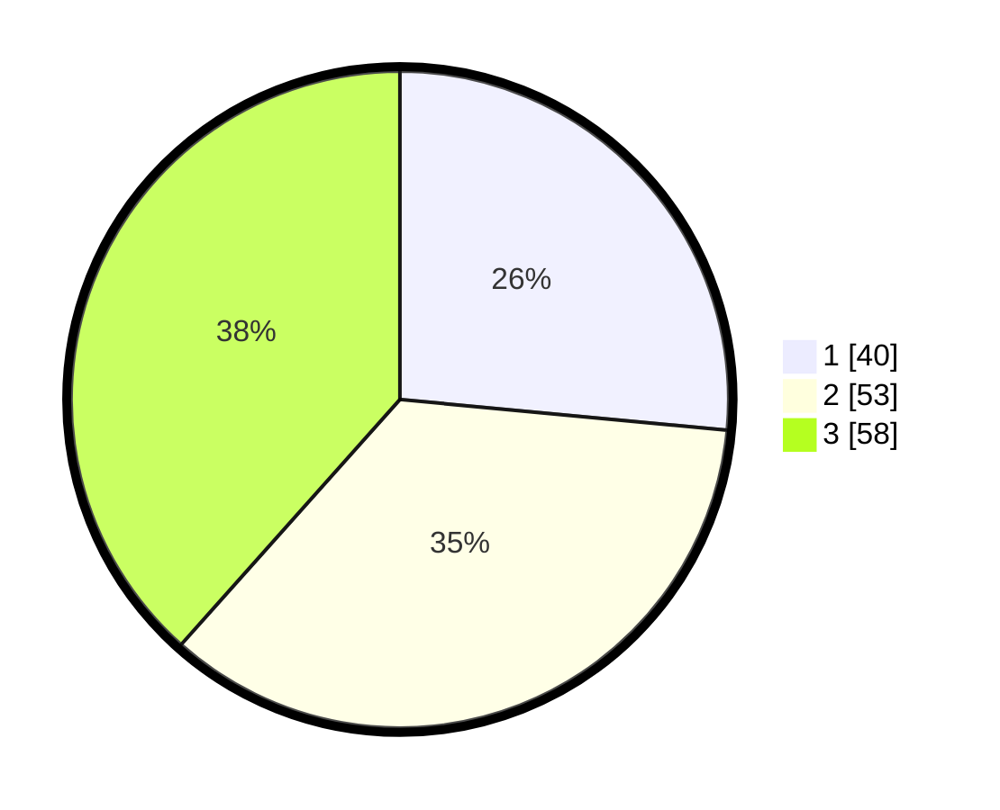

# Hasil

## Grafik

## Tabel

| No. | Nama Paslon    | Suara | Suara (raw) | Persentase |
|:--- |:-------------- | -----:| -----------:| ----------:|
| 1   | ANIES MUHAIMIN | 40    | [40][p-1]   | 26,49      |
| 2   | PRABOWO GIBRAN | 53    | [53][p-2]   | 35,10      |
| 3   | GANJAR MAHFUD  | 58    | [58][p-3]   | 38,41      |

[p-1]: https://github.com/gigit-pemilu/pemilu-2024/blob/main/pilpres/hitung-suara/sub/34-di-yogyakarta/sub/02-bantul/sub/06-pandak/sub/2004-wijirejo/sub/011-tps/sub/paslon-1.txt
[p-2]: https://github.com/gigit-pemilu/pemilu-2024/blob/main/pilpres/hitung-suara/sub/34-di-yogyakarta/sub/02-bantul/sub/06-pandak/sub/2004-wijirejo/sub/011-tps/sub/paslon-2.txt
[p-3]: https://github.com/gigit-pemilu/pemilu-2024/blob/main/pilpres/hitung-suara/sub/34-di-yogyakarta/sub/02-bantul/sub/06-pandak/sub/2004-wijirejo/sub/011-tps/sub/paslon-3.txt

## Foto C Plano

https://sirekap-obj-formc.kpu.go.id/015b/pemilu/ppwp/34/02/06/20/04/3402062004011-20240215-002809--147dfb8c-6eec-453f-bb3c-0d6dffc62e7d.jpg

https://sirekap-obj-formc.kpu.go.id/015b/pemilu/ppwp/34/02/06/20/04/3402062004011-20240214-223716--c0ceae81-3296-4a49-8d47-ad00770da349.jpg

https://sirekap-obj-formc.kpu.go.id/015b/pemilu/ppwp/34/02/06/20/04/3402062004011-20240214-223900--44958322-6408-43bf-b008-5d317450ea94.jpg

## Metadata

| Key        | Value               |
| ---------- | ------------------- |
| Time Stamp | 2024-02-24 22:31:28 |

