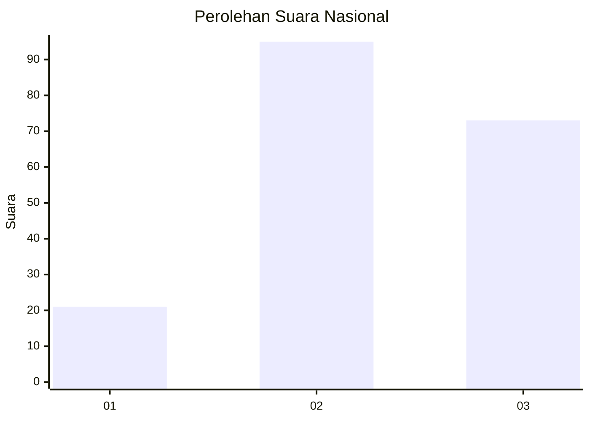
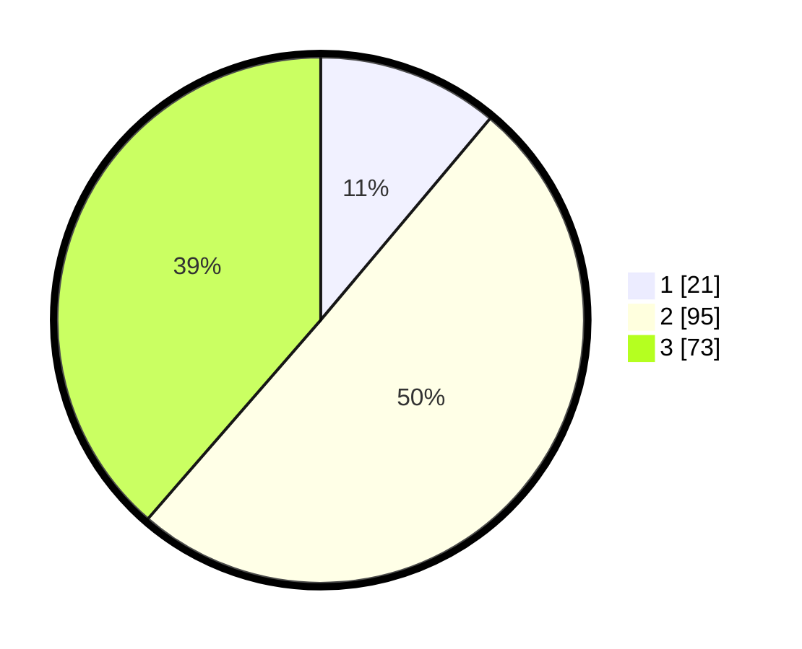

# Hasil

## Grafik

## Tabel

| No. | Nama Paslon    | Suara | Suara (raw) | Persentase |
|:--- |:-------------- | -----:| -----------:| ----------:|
| 1   | ANIES MUHAIMIN | 21    | [21][p-1]   | 11,11      |
| 2   | PRABOWO GIBRAN | 95    | [95][p-2]   | 50,26      |
| 3   | GANJAR MAHFUD  | 73    | [73][p-3]   | 38,62      |

[p-1]: https://github.com/gigit-pemilu/pemilu-2024/blob/main/pilpres/hitung-suara/sub/34-di-yogyakarta/sub/02-bantul/sub/06-pandak/sub/2004-wijirejo/sub/016-tps/sub/paslon-1.txt
[p-2]: https://github.com/gigit-pemilu/pemilu-2024/blob/main/pilpres/hitung-suara/sub/34-di-yogyakarta/sub/02-bantul/sub/06-pandak/sub/2004-wijirejo/sub/016-tps/sub/paslon-2.txt
[p-3]: https://github.com/gigit-pemilu/pemilu-2024/blob/main/pilpres/hitung-suara/sub/34-di-yogyakarta/sub/02-bantul/sub/06-pandak/sub/2004-wijirejo/sub/016-tps/sub/paslon-3.txt

## Foto C Plano

https://sirekap-obj-formc.kpu.go.id/ae85/pemilu/ppwp/34/02/06/20/04/3402062004016-20240215-001400--ce99d727-886c-4278-81d2-9152e4f76ebc.jpg

https://sirekap-obj-formc.kpu.go.id/ae85/pemilu/ppwp/34/02/06/20/04/3402062004016-20240215-001455--7acd66d9-ffeb-499f-b385-864df5bfacd6.jpg

https://sirekap-obj-formc.kpu.go.id/ae85/pemilu/ppwp/34/02/06/20/04/3402062004016-20240215-001628--1efcef6e-0176-41e8-8a01-e0fe943d9592.jpg

## Metadata

| Key        | Value               |
| ---------- | ------------------- |
| Time Stamp | 2024-02-24 22:31:28 |

