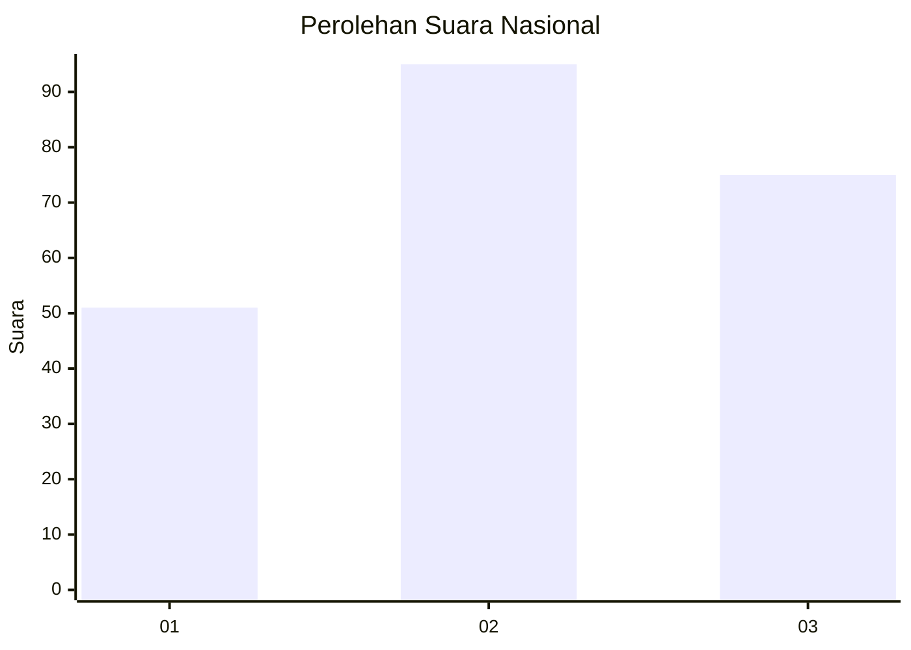
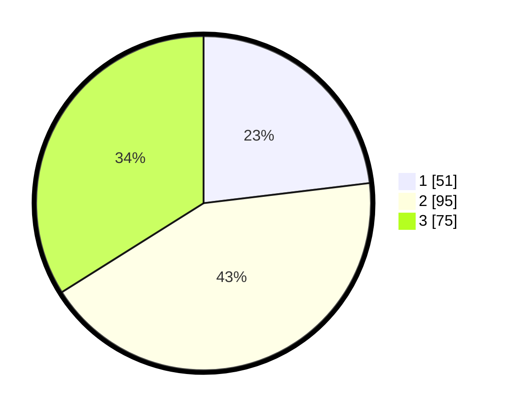

# Hasil

## Grafik

## Tabel

| No. | Nama Paslon    | Suara | Suara (raw) | Persentase |
|:--- |:-------------- | -----:| -----------:| ----------:|
| 1   | ANIES MUHAIMIN | 51    | [51][p-1]   | 23,08      |
| 2   | PRABOWO GIBRAN | 95    | [95][p-2]   | 42,99      |
| 3   | GANJAR MAHFUD  | 75    | [75][p-3]   | 33,94      |

[p-1]: https://github.com/gigit-pemilu/pemilu-2024/blob/main/pilpres/hitung-suara/sub/34-di-yogyakarta/sub/02-bantul/sub/06-pandak/sub/2004-wijirejo/sub/019-tps/sub/paslon-1.txt
[p-2]: https://github.com/gigit-pemilu/pemilu-2024/blob/main/pilpres/hitung-suara/sub/34-di-yogyakarta/sub/02-bantul/sub/06-pandak/sub/2004-wijirejo/sub/019-tps/sub/paslon-2.txt
[p-3]: https://github.com/gigit-pemilu/pemilu-2024/blob/main/pilpres/hitung-suara/sub/34-di-yogyakarta/sub/02-bantul/sub/06-pandak/sub/2004-wijirejo/sub/019-tps/sub/paslon-3.txt

## Foto C Plano

https://sirekap-obj-formc.kpu.go.id/90dc/pemilu/ppwp/34/02/06/20/04/3402062004019-20240214-224724--a17f2c8a-5127-4338-9846-93f0d3588642.jpg

https://sirekap-obj-formc.kpu.go.id/90dc/pemilu/ppwp/34/02/06/20/04/3402062004019-20240214-215309--e6c9b1b4-304e-407e-a269-c7b527d1795f.jpg

https://sirekap-obj-formc.kpu.go.id/90dc/pemilu/ppwp/34/02/06/20/04/3402062004019-20240214-215332--ba9df98e-c2b2-4a9c-a2f3-37362e0ddb4f.jpg

## Metadata

| Key        | Value               |
| ---------- | ------------------- |
| Time Stamp | 2024-02-24 22:31:28 |

