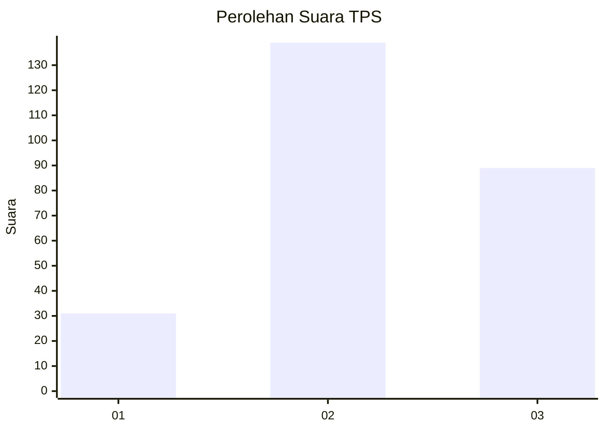
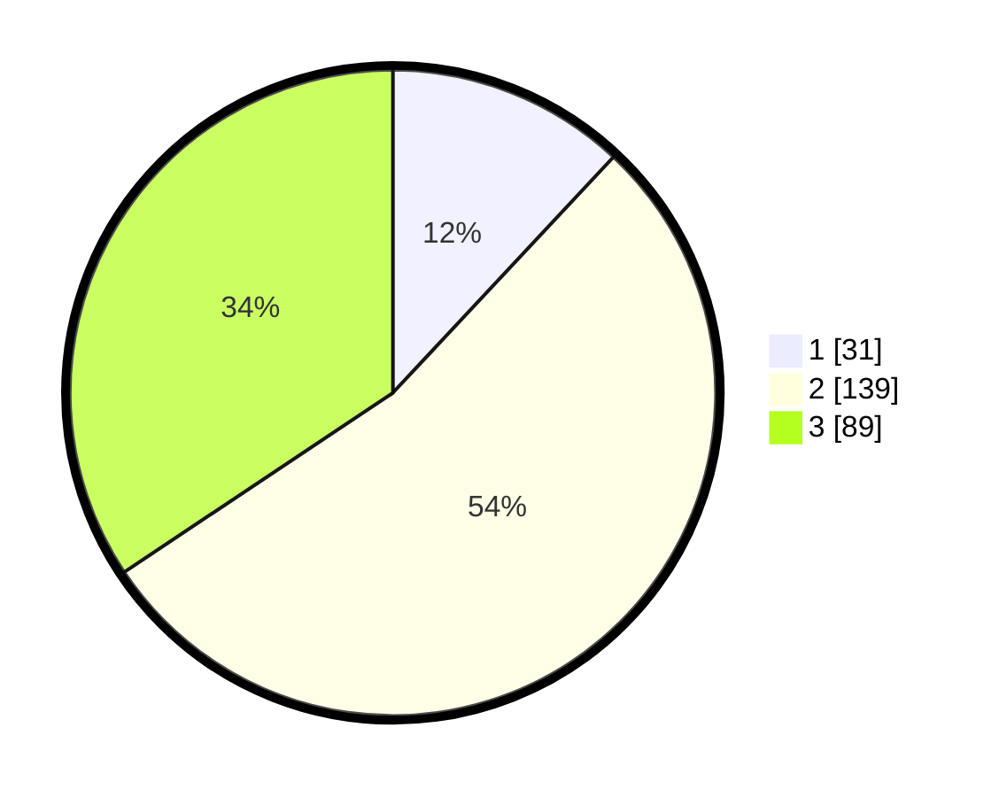

# Hasil

## Grafik

## Tabel

| No. | Nama Paslon    | Suara | Suara (raw) | Persentase |
|:--- |:-------------- | -----:| -----------:| ----------:|
| 1   | ANIES MUHAIMIN | 31    | [31][p-1]   | 11,97      |
| 2   | PRABOWO GIBRAN | 139   | [139][p-2]  | 53,67      |
| 3   | GANJAR MAHFUD  | 89    | [89][p-3]   | 34,36      |

[p-1]: https://github.com/gigit-pemilu/pemilu-2024-34-di-yogyakarta/blob/main/pilpres/hitung-suara/sub/34-di-yogyakarta/sub/02-bantul/sub/06-pandak/sub/2004-wijirejo/sub/020-tps/sub/paslon-1.txt
[p-2]: https://github.com/gigit-pemilu/pemilu-2024-34-di-yogyakarta/blob/main/pilpres/hitung-suara/sub/34-di-yogyakarta/sub/02-bantul/sub/06-pandak/sub/2004-wijirejo/sub/020-tps/sub/paslon-2.txt
[p-3]: https://github.com/gigit-pemilu/pemilu-2024-34-di-yogyakarta/blob/main/pilpres/hitung-suara/sub/34-di-yogyakarta/sub/02-bantul/sub/06-pandak/sub/2004-wijirejo/sub/020-tps/sub/paslon-3.txt

## Foto C Plano

https://sirekap-obj-formc.kpu.go.id/b662/pemilu/ppwp/34/02/06/20/04/3402062004020-20240218-224408--b0161510-02ec-4a68-bb2a-2eb92e1635ec.jpg

https://sirekap-obj-formc.kpu.go.id/b662/pemilu/ppwp/34/02/06/20/04/3402062004020-20240218-224444--a48adb4a-2a28-4a4e-a5f1-0d3d221cd306.jpg

https://sirekap-obj-formc.kpu.go.id/b662/pemilu/ppwp/34/02/06/20/04/3402062004020-20240218-224859--be15beeb-6596-4515-8eb8-3ef960824cf6.jpg

## Metadata

| Key        | Value               |
| ---------- | ------------------- |
| Time Stamp | 2024-02-25 11:00:00 |

