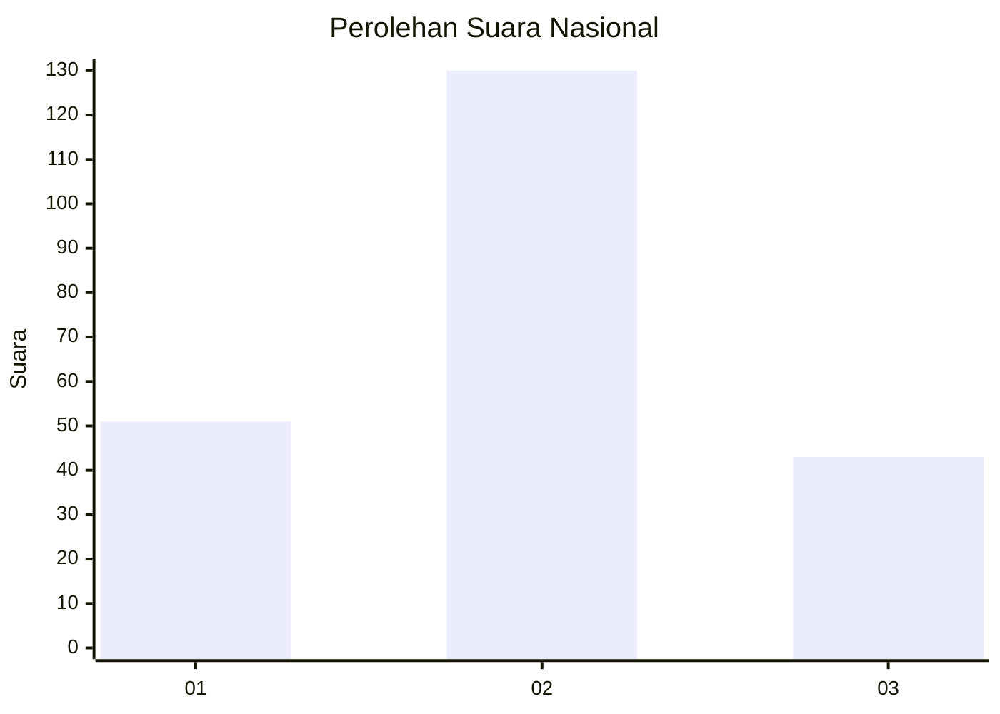
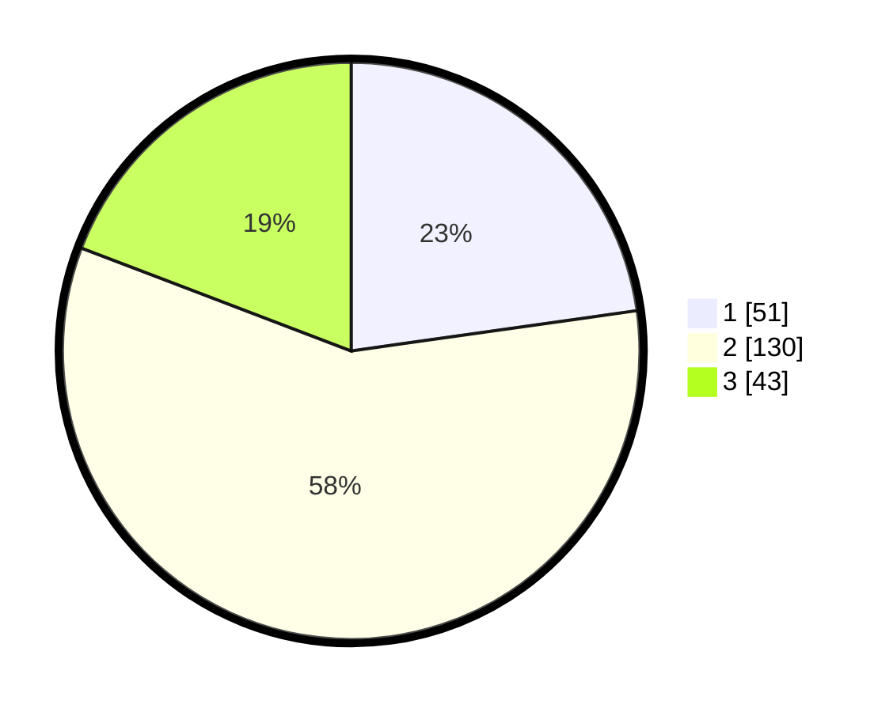

# Hasil

## Grafik

## Tabel

| No. | Nama Paslon    | Suara | Suara (raw) | Persentase |
|:--- |:-------------- | -----:| -----------:| ----------:|
| 1   | ANIES MUHAIMIN | 51    | [51][p-1]   | 22,77      |
| 2   | PRABOWO GIBRAN | 130   | [130][p-2]  | 58,04      |
| 3   | GANJAR MAHFUD  | 43    | [43][p-3]   | 19,20      |

[p-1]: https://github.com/gigit-pemilu/pemilu-2024/blob/main/pilpres/hitung-suara/sub/34-di-yogyakarta/sub/02-bantul/sub/06-pandak/sub/2004-wijirejo/sub/021-tps/sub/paslon-1.txt
[p-2]: https://github.com/gigit-pemilu/pemilu-2024/blob/main/pilpres/hitung-suara/sub/34-di-yogyakarta/sub/02-bantul/sub/06-pandak/sub/2004-wijirejo/sub/021-tps/sub/paslon-2.txt
[p-3]: https://github.com/gigit-pemilu/pemilu-2024/blob/main/pilpres/hitung-suara/sub/34-di-yogyakarta/sub/02-bantul/sub/06-pandak/sub/2004-wijirejo/sub/021-tps/sub/paslon-3.txt

## Foto C Plano

https://sirekap-obj-formc.kpu.go.id/f208/pemilu/ppwp/34/02/06/20/04/3402062004021-20240218-131543--0f2fd310-c4dc-43a3-8021-c0f5bfc345d5.jpg

https://sirekap-obj-formc.kpu.go.id/f208/pemilu/ppwp/34/02/06/20/04/3402062004021-20240218-131638--636e3318-85b3-4449-ba20-a19d42835c6c.jpg

https://sirekap-obj-formc.kpu.go.id/f208/pemilu/ppwp/34/02/06/20/04/3402062004021-20240218-131909--2e2eca4f-e584-4f42-b297-8014395ed01e.jpg

## Metadata

| Key        | Value               |
| ---------- | ------------------- |
| Time Stamp | 2024-02-25 12:00:00 |

