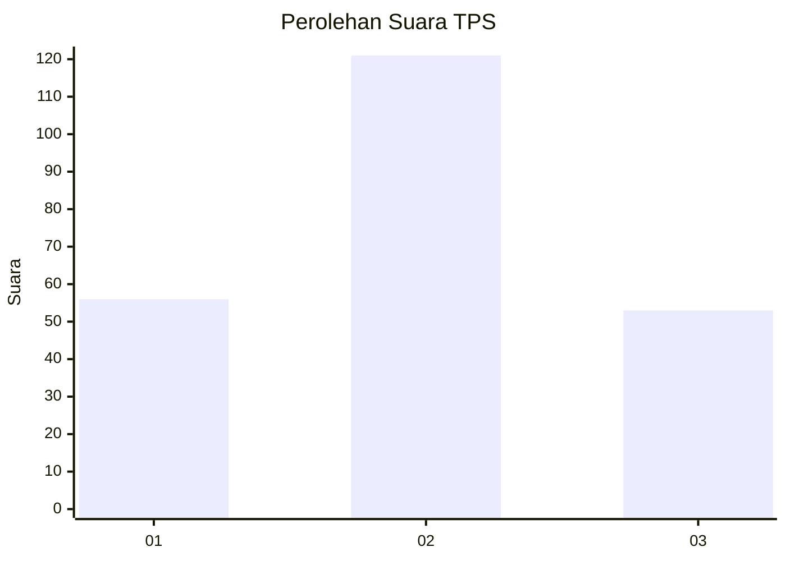
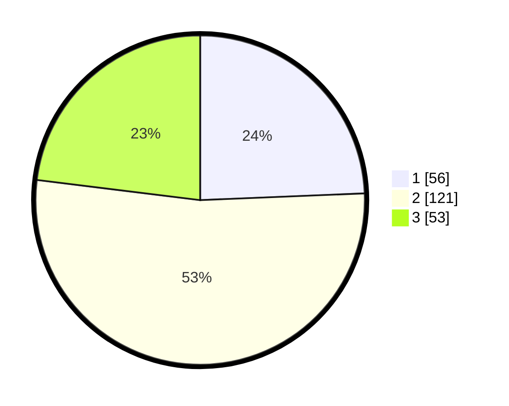

# Hasil

## Grafik

## Tabel

| No. | Nama Paslon    | Suara | Suara (raw) | Persentase |
|:--- |:-------------- | -----:| -----------:| ----------:|
| 1   | ANIES MUHAIMIN | 56    | [56][p-1]   | 24,35      |
| 2   | PRABOWO GIBRAN | 121   | [121][p-2]  | 52,61      |
| 3   | GANJAR MAHFUD  | 53    | [53][p-3]   | 23,04      |

[p-1]: https://github.com/gigit-pemilu/pemilu-2024-34-di-yogyakarta/blob/main/pilpres/hitung-suara/sub/34-di-yogyakarta/sub/02-bantul/sub/06-pandak/sub/2004-wijirejo/sub/022-tps/sub/paslon-1.txt
[p-2]: https://github.com/gigit-pemilu/pemilu-2024-34-di-yogyakarta/blob/main/pilpres/hitung-suara/sub/34-di-yogyakarta/sub/02-bantul/sub/06-pandak/sub/2004-wijirejo/sub/022-tps/sub/paslon-2.txt
[p-3]: https://github.com/gigit-pemilu/pemilu-2024-34-di-yogyakarta/blob/main/pilpres/hitung-suara/sub/34-di-yogyakarta/sub/02-bantul/sub/06-pandak/sub/2004-wijirejo/sub/022-tps/sub/paslon-3.txt

## Foto C Plano

https://sirekap-obj-formc.kpu.go.id/4388/pemilu/ppwp/34/02/06/20/04/3402062004022-20240218-143048--3f473c33-7327-4d3e-87c3-41e43b068383.jpg

https://sirekap-obj-formc.kpu.go.id/4388/pemilu/ppwp/34/02/06/20/04/3402062004022-20240218-143441--ca4e6363-2299-48ba-b782-771f48ceb6c2.jpg

https://sirekap-obj-formc.kpu.go.id/4388/pemilu/ppwp/34/02/06/20/04/3402062004022-20240218-143714--91fc888a-7822-44c7-9039-736a0d60f0ba.jpg

## Metadata

| Key        | Value               |
| ---------- | ------------------- |
| Time Stamp | 2024-02-24 22:31:28 |

