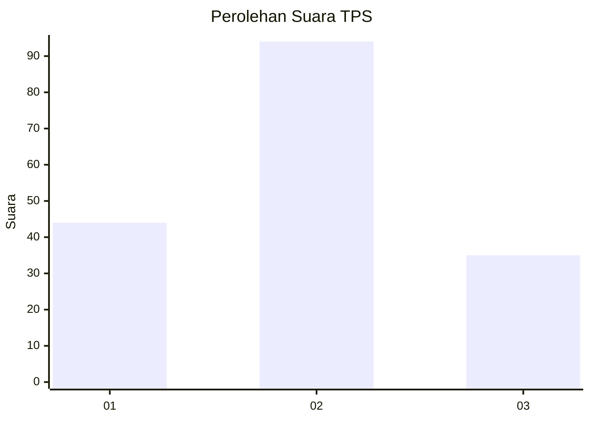
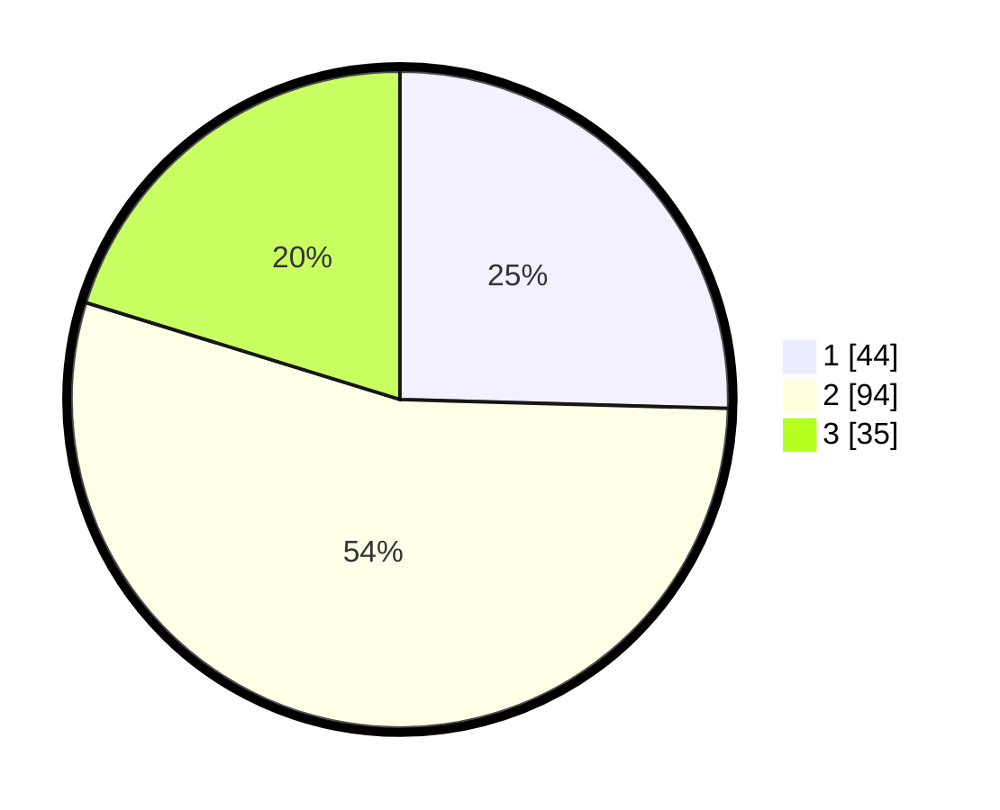

# Hasil

## Grafik

## Tabel

| No. | Nama Paslon    | Suara | Suara (raw) | Persentase |
|:--- |:-------------- | -----:| -----------:| ----------:|
| 1   | ANIES MUHAIMIN | 44    | [44][p-1]   | 25,43      |
| 2   | PRABOWO GIBRAN | 94    | [94][p-2]   | 54,34      |
| 3   | GANJAR MAHFUD  | 35    | [35][p-3]   | 20,23      |

[p-1]: https://github.com/gigit-pemilu/pemilu-2024-34-di-yogyakarta/blob/main/pilpres/hitung-suara/sub/34-di-yogyakarta/sub/02-bantul/sub/06-pandak/sub/2004-wijirejo/sub/023-tps/sub/paslon-1.txt
[p-2]: https://github.com/gigit-pemilu/pemilu-2024-34-di-yogyakarta/blob/main/pilpres/hitung-suara/sub/34-di-yogyakarta/sub/02-bantul/sub/06-pandak/sub/2004-wijirejo/sub/023-tps/sub/paslon-2.txt
[p-3]: https://github.com/gigit-pemilu/pemilu-2024-34-di-yogyakarta/blob/main/pilpres/hitung-suara/sub/34-di-yogyakarta/sub/02-bantul/sub/06-pandak/sub/2004-wijirejo/sub/023-tps/sub/paslon-3.txt

## Foto C Plano

https://sirekap-obj-formc.kpu.go.id/6a3e/pemilu/ppwp/34/02/06/20/04/3402062004023-20240214-233941--72ad9c97-149c-4767-ade0-f542ff0d0dae.jpg

https://sirekap-obj-formc.kpu.go.id/6a3e/pemilu/ppwp/34/02/06/20/04/3402062004023-20240214-234159--f7b07129-a51a-4d7c-b282-807f00369106.jpg

https://sirekap-obj-formc.kpu.go.id/6a3e/pemilu/ppwp/34/02/06/20/04/3402062004023-20240214-234522--0a81c8c5-8f0b-4f6b-aac6-11109cdafea1.jpg

## Metadata

| Key        | Value               |
| ---------- | ------------------- |
| Time Stamp | 2024-02-24 22:31:28 |

