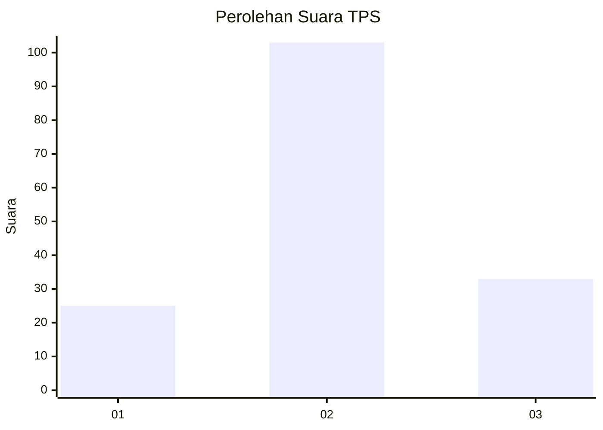
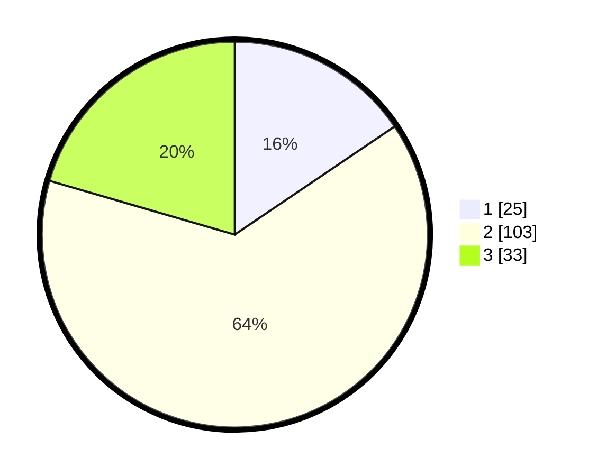

# Hasil

## Grafik

## Tabel

| No. | Nama Paslon    | Suara | Suara (raw) | Persentase |
|:--- |:-------------- | -----:| -----------:| ----------:|
| 1   | ANIES MUHAIMIN | 25    | [25][p-1]   | 15,53      |
| 2   | PRABOWO GIBRAN | 103   | [103][p-2]  | 63,98      |
| 3   | GANJAR MAHFUD  | 33    | [33][p-3]   | 20,50      |

[p-1]: https://github.com/gigit-pemilu/pemilu-2024-34-di-yogyakarta/blob/main/pilpres/hitung-suara/sub/34-di-yogyakarta/sub/02-bantul/sub/06-pandak/sub/2004-wijirejo/sub/024-tps/sub/paslon-1.txt
[p-2]: https://github.com/gigit-pemilu/pemilu-2024-34-di-yogyakarta/blob/main/pilpres/hitung-suara/sub/34-di-yogyakarta/sub/02-bantul/sub/06-pandak/sub/2004-wijirejo/sub/024-tps/sub/paslon-2.txt
[p-3]: https://github.com/gigit-pemilu/pemilu-2024-34-di-yogyakarta/blob/main/pilpres/hitung-suara/sub/34-di-yogyakarta/sub/02-bantul/sub/06-pandak/sub/2004-wijirejo/sub/024-tps/sub/paslon-3.txt

## Foto C Plano

https://sirekap-obj-formc.kpu.go.id/8dee/pemilu/ppwp/34/02/06/20/04/3402062004024-20240218-145754--eea0be86-4bce-4431-8bff-ffdd805b9c7b.jpg

https://sirekap-obj-formc.kpu.go.id/8dee/pemilu/ppwp/34/02/06/20/04/3402062004024-20240218-145851--c759dcd9-d0ae-4dd4-8af5-e357d0973372.jpg

https://sirekap-obj-formc.kpu.go.id/8dee/pemilu/ppwp/34/02/06/20/04/3402062004024-20240218-150033--a9ca7e99-68dd-4d2e-a633-f973148328f4.jpg

## Metadata

| Key        | Value               |
| ---------- | ------------------- |
| Time Stamp | 2024-02-24 22:31:28 |

