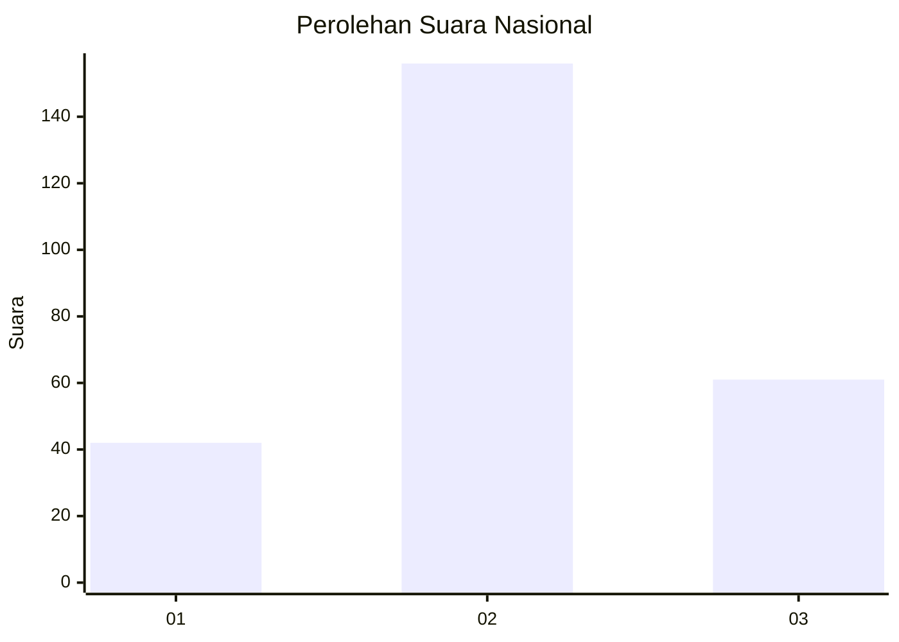
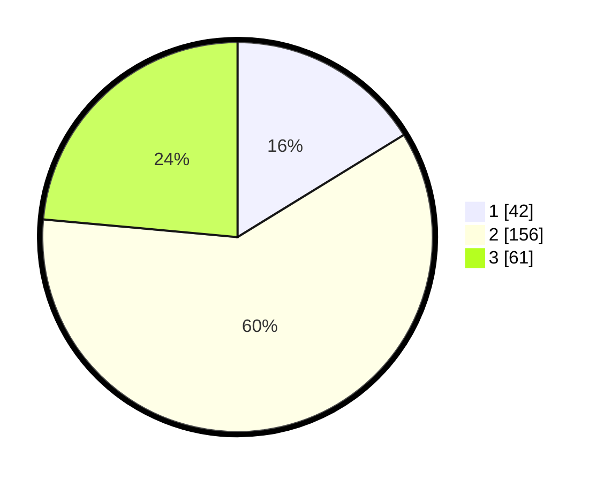

# Hasil

## Grafik

## Tabel

| No. | Nama Paslon    | Suara | Suara (raw) | Persentase |
|:--- |:-------------- | -----:| -----------:| ----------:|
| 1   | ANIES MUHAIMIN | 42    | [42][p-1]   | 16,22      |
| 2   | PRABOWO GIBRAN | 156   | [156][p-2]  | 60,23      |
| 3   | GANJAR MAHFUD  | 61    | [61][p-3]   | 23,55      |

[p-1]: https://github.com/gigit-pemilu/pemilu-2024/blob/main/pilpres/hitung-suara/sub/34-di-yogyakarta/sub/02-bantul/sub/06-pandak/sub/2004-wijirejo/sub/025-tps/sub/paslon-1.txt
[p-2]: https://github.com/gigit-pemilu/pemilu-2024/blob/main/pilpres/hitung-suara/sub/34-di-yogyakarta/sub/02-bantul/sub/06-pandak/sub/2004-wijirejo/sub/025-tps/sub/paslon-2.txt
[p-3]: https://github.com/gigit-pemilu/pemilu-2024/blob/main/pilpres/hitung-suara/sub/34-di-yogyakarta/sub/02-bantul/sub/06-pandak/sub/2004-wijirejo/sub/025-tps/sub/paslon-3.txt

## Foto C Plano

https://sirekap-obj-formc.kpu.go.id/b013/pemilu/ppwp/34/02/06/20/04/3402062004025-20240218-152847--606d9471-9ccb-4898-a4ed-d3b0087063fd.jpg

https://sirekap-obj-formc.kpu.go.id/b013/pemilu/ppwp/34/02/06/20/04/3402062004025-20240218-152942--10114f41-95d8-4668-9014-20f16b1330b9.jpg

https://sirekap-obj-formc.kpu.go.id/b013/pemilu/ppwp/34/02/06/20/04/3402062004025-20240218-153309--af8f3963-28f9-4ff6-acea-43961fcaff95.jpg

## Metadata

| Key        | Value               |
| ---------- | ------------------- |
| Time Stamp | 2024-02-24 22:31:28 |

