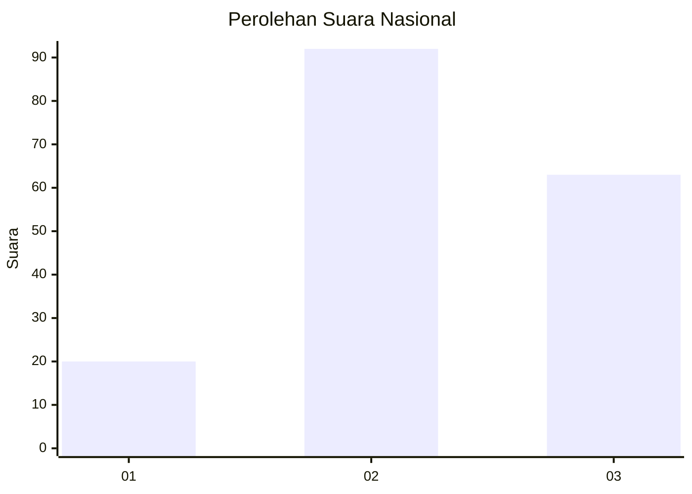
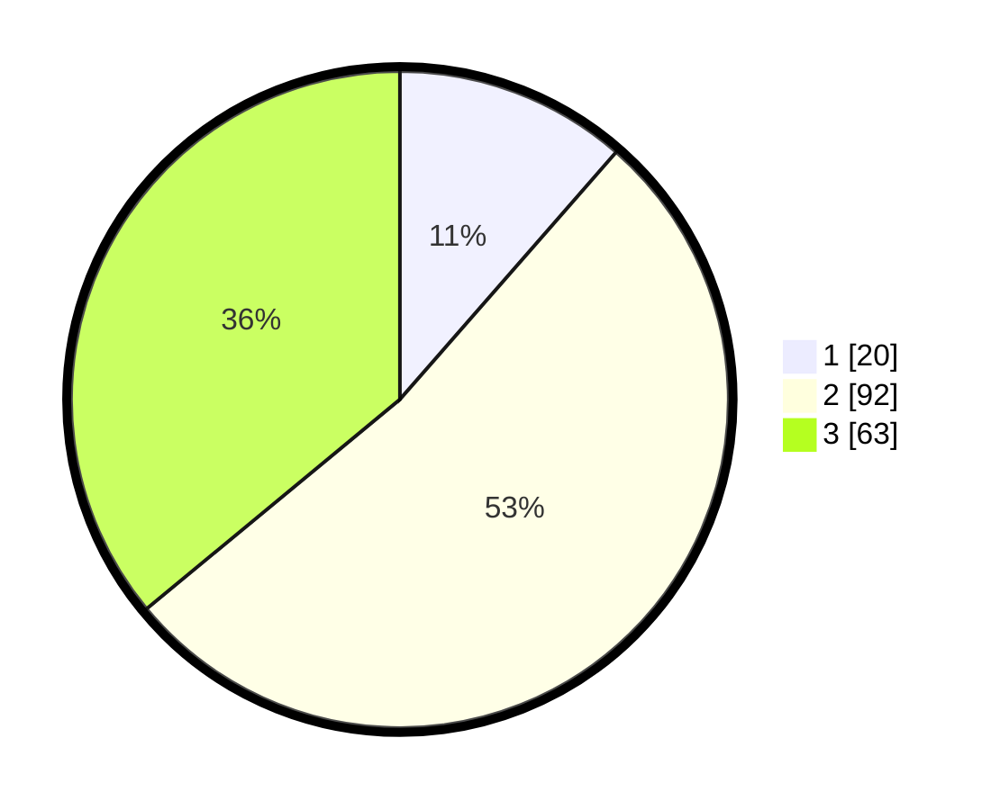

# Hasil

## Grafik

## Tabel

| No. | Nama Paslon    | Suara | Suara (raw) | Persentase |
|:--- |:-------------- | -----:| -----------:| ----------:|
| 1   | ANIES MUHAIMIN | 20    | [20][p-1]   | 11,43      |
| 2   | PRABOWO GIBRAN | 92    | [92][p-2]   | 52,57      |
| 3   | GANJAR MAHFUD  | 63    | [63][p-3]   | 36,00      |

[p-1]: https://github.com/gigit-pemilu/pemilu-2024/blob/main/pilpres/hitung-suara/sub/34-di-yogyakarta/sub/02-bantul/sub/06-pandak/sub/2004-wijirejo/sub/027-tps/sub/paslon-1.txt
[p-2]: https://github.com/gigit-pemilu/pemilu-2024/blob/main/pilpres/hitung-suara/sub/34-di-yogyakarta/sub/02-bantul/sub/06-pandak/sub/2004-wijirejo/sub/027-tps/sub/paslon-2.txt
[p-3]: https://github.com/gigit-pemilu/pemilu-2024/blob/main/pilpres/hitung-suara/sub/34-di-yogyakarta/sub/02-bantul/sub/06-pandak/sub/2004-wijirejo/sub/027-tps/sub/paslon-3.txt

## Foto C Plano

https://sirekap-obj-formc.kpu.go.id/5211/pemilu/ppwp/34/02/06/20/04/3402062004027-20240218-172713--8919d1e5-31ce-4cce-8fe9-f1b4d9904d88.jpg

https://sirekap-obj-formc.kpu.go.id/5211/pemilu/ppwp/34/02/06/20/04/3402062004027-20240218-172758--8151354c-03fe-4a5b-b115-a0c107a0611a.jpg

https://sirekap-obj-formc.kpu.go.id/5211/pemilu/ppwp/34/02/06/20/04/3402062004027-20240218-172840--e0f30b7b-412c-478f-8b8d-d83f7b5e2356.jpg

## Metadata

| Key        | Value               |
| ---------- | ------------------- |
| Time Stamp | 2024-02-24 23:00:00 |

