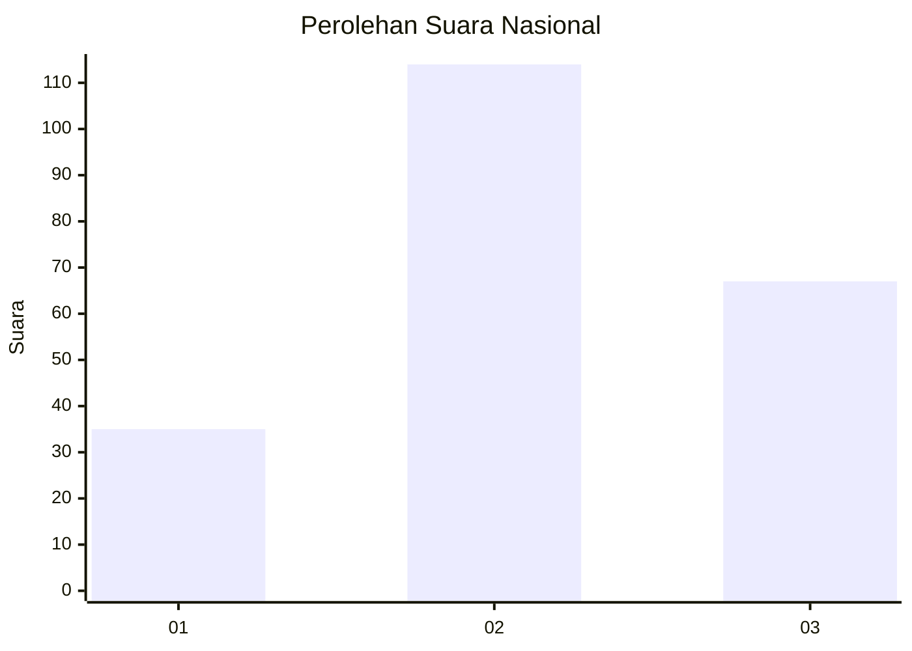
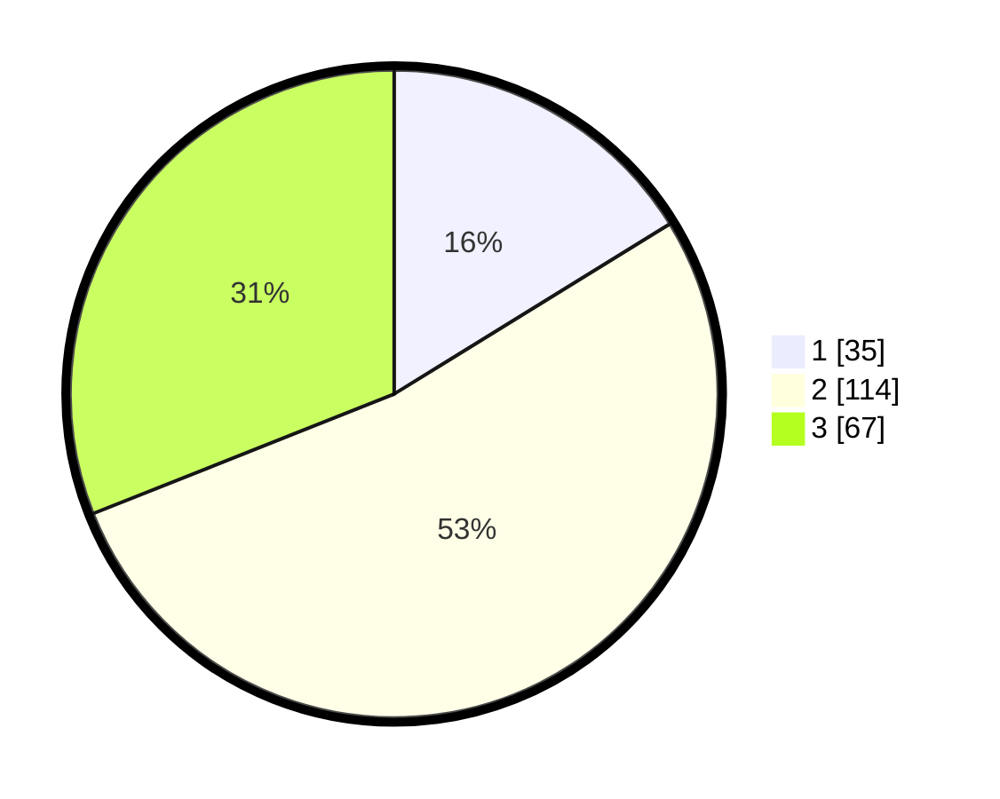

# Hasil

## Grafik

## Tabel

| No. | Nama Paslon    | Suara | Suara (raw) | Persentase |
|:--- |:-------------- | -----:| -----------:| ----------:|
| 1   | ANIES MUHAIMIN | 35    | [35][p-1]   | 16,20      |
| 2   | PRABOWO GIBRAN | 114   | [114][p-2]  | 52,78      |
| 3   | GANJAR MAHFUD  | 67    | [67][p-3]   | 31,02      |

[p-1]: https://github.com/gigit-pemilu/pemilu-2024/blob/main/pilpres/hitung-suara/sub/34-di-yogyakarta/sub/02-bantul/sub/06-pandak/sub/2004-wijirejo/sub/031-tps/sub/paslon-1.txt
[p-2]: https://github.com/gigit-pemilu/pemilu-2024/blob/main/pilpres/hitung-suara/sub/34-di-yogyakarta/sub/02-bantul/sub/06-pandak/sub/2004-wijirejo/sub/031-tps/sub/paslon-2.txt
[p-3]: https://github.com/gigit-pemilu/pemilu-2024/blob/main/pilpres/hitung-suara/sub/34-di-yogyakarta/sub/02-bantul/sub/06-pandak/sub/2004-wijirejo/sub/031-tps/sub/paslon-3.txt

## Foto C Plano

https://sirekap-obj-formc.kpu.go.id/65cf/pemilu/ppwp/34/02/06/20/04/3402062004031-20240216-005511--a206b769-fb94-488a-8b8c-f4607d858aae.jpg

https://sirekap-obj-formc.kpu.go.id/65cf/pemilu/ppwp/34/02/06/20/04/3402062004031-20240216-005520--2e21c761-73d8-4e5e-bd38-c08e9cbc9b1c.jpg

https://sirekap-obj-formc.kpu.go.id/65cf/pemilu/ppwp/34/02/06/20/04/3402062004031-20240216-005518--5b8d930d-b681-4fdb-aa77-d85e1b9ec130.jpg

## Metadata

| Key        | Value               |
| ---------- | ------------------- |
| Time Stamp | 2024-02-20 11:00:00 |

## DATA PEMILIH TETAP

Jumlah pemilih dalam DPT: **233**.
 * L: **124**.
 * P: **109**.

## DATA PENGGUNA HAK PILIH

Jumlah pengguna hak pilih dalam DPT: **218**.
 * L: **113**.
 * P: **105**.

Jumlah pengguna hak pilih dalam DPTb: **7**.
 * L: **0**.
 * P: **7**.

Jumlah pengguna hak pilih dalam DPK: **0**.
 * L: **0**.
 * P: **0**.

Jumlah pengguna hak pilih: **225**.
 * L: **113**.
 * P: **112**.

## JUMLAH SUARA SAH DAN TIDAK SAH

JUMLAH SELURUH SUARA SAH: **216**.

JUMLAH SUARA TIDAK SAH: **9**.

JUMLAH SELURUH SUARA SAH DAN SUARA TIDAK SAH: **225**.

