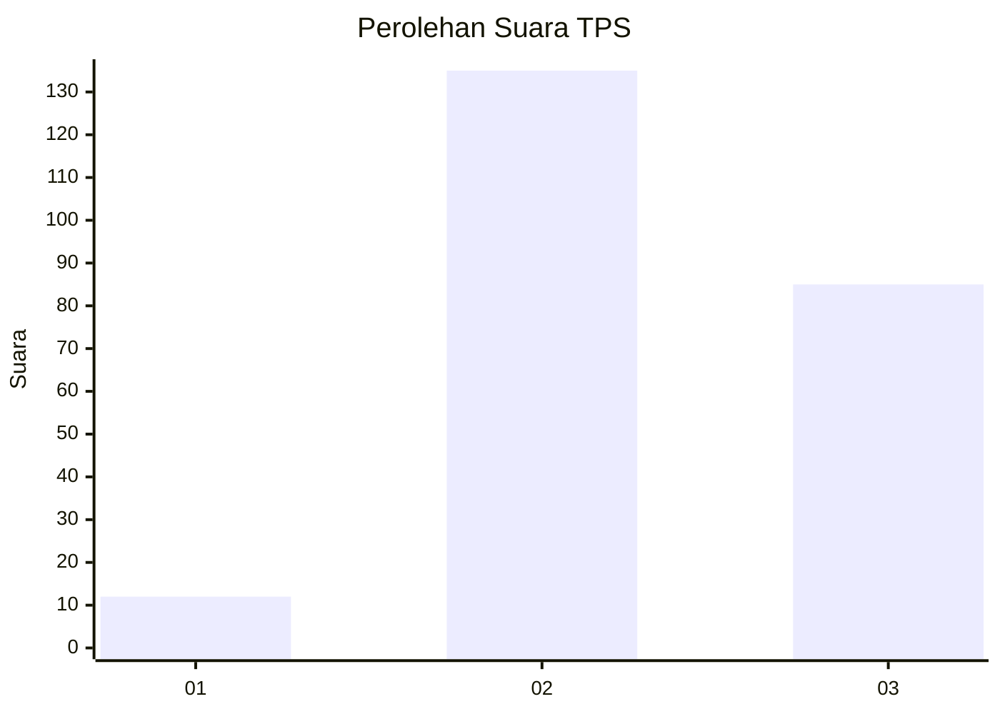
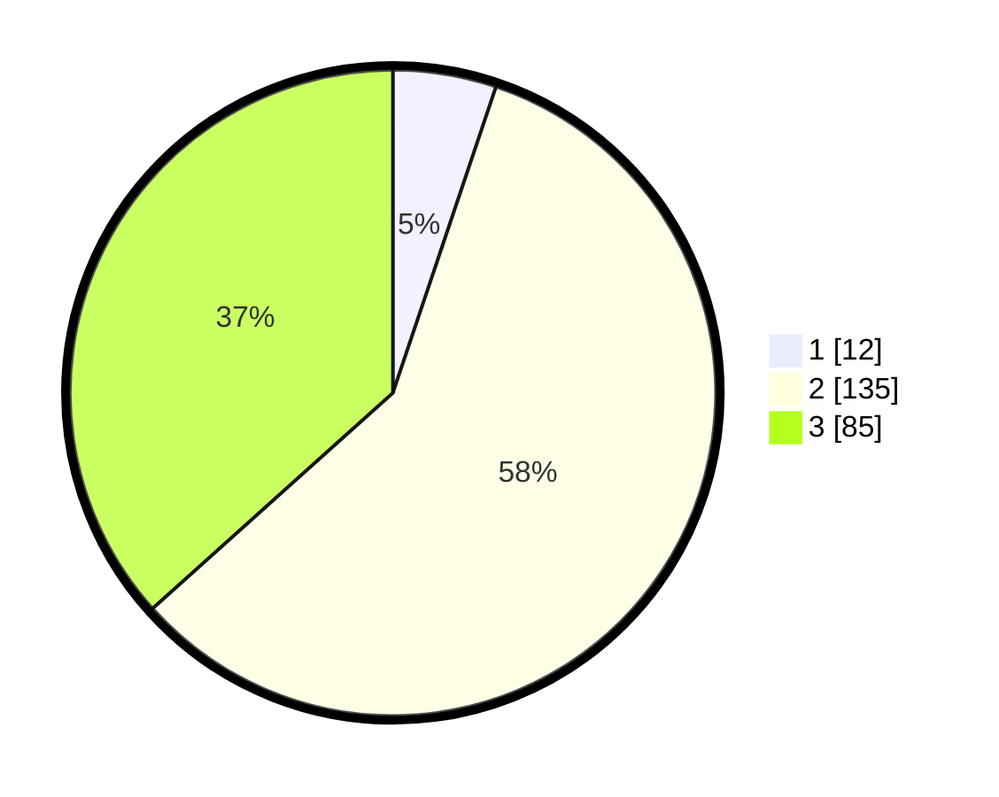

# Hasil

## Grafik

## Tabel

| No. | Nama Paslon    | Suara | Suara (raw) | Persentase |
|:--- |:-------------- | -----:| -----------:| ----------:|
| 1   | ANIES MUHAIMIN | 12    | [12][p-1]   | 5,17       |
| 2   | PRABOWO GIBRAN | 135   | [135][p-2]  | 58,19      |
| 3   | GANJAR MAHFUD  | 85    | [85][p-3]   | 36,64      |

[p-1]: https://github.com/gigit-pemilu/pemilu-2024-34-di-yogyakarta/blob/main/pilpres/hitung-suara/sub/34-di-yogyakarta/sub/02-bantul/sub/06-pandak/sub/2004-wijirejo/sub/032-tps/sub/paslon-1.txt
[p-2]: https://github.com/gigit-pemilu/pemilu-2024-34-di-yogyakarta/blob/main/pilpres/hitung-suara/sub/34-di-yogyakarta/sub/02-bantul/sub/06-pandak/sub/2004-wijirejo/sub/032-tps/sub/paslon-2.txt
[p-3]: https://github.com/gigit-pemilu/pemilu-2024-34-di-yogyakarta/blob/main/pilpres/hitung-suara/sub/34-di-yogyakarta/sub/02-bantul/sub/06-pandak/sub/2004-wijirejo/sub/032-tps/sub/paslon-3.txt

## Foto C Plano

https://sirekap-obj-formc.kpu.go.id/cae7/pemilu/ppwp/34/02/06/20/04/3402062004032-20240220-111314--dc559c7c-20a5-49e2-8306-85508b7954d5.jpg

https://sirekap-obj-formc.kpu.go.id/cae7/pemilu/ppwp/34/02/06/20/04/3402062004032-20240220-111349--7b7ba2ee-1465-4fc2-b500-26e0a1ca05ac.jpg

https://sirekap-obj-formc.kpu.go.id/cae7/pemilu/ppwp/34/02/06/20/04/3402062004032-20240220-111503--3542745e-ba6a-45b0-a307-1847252e7277.jpg

## Metadata

| Key        | Value               |
| ---------- | ------------------- |
| Time Stamp | 2024-02-24 22:31:28 |

