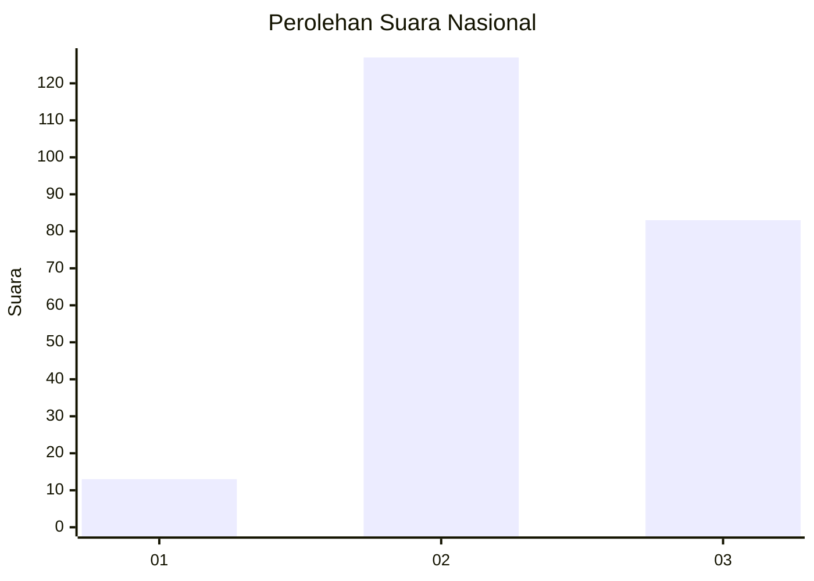
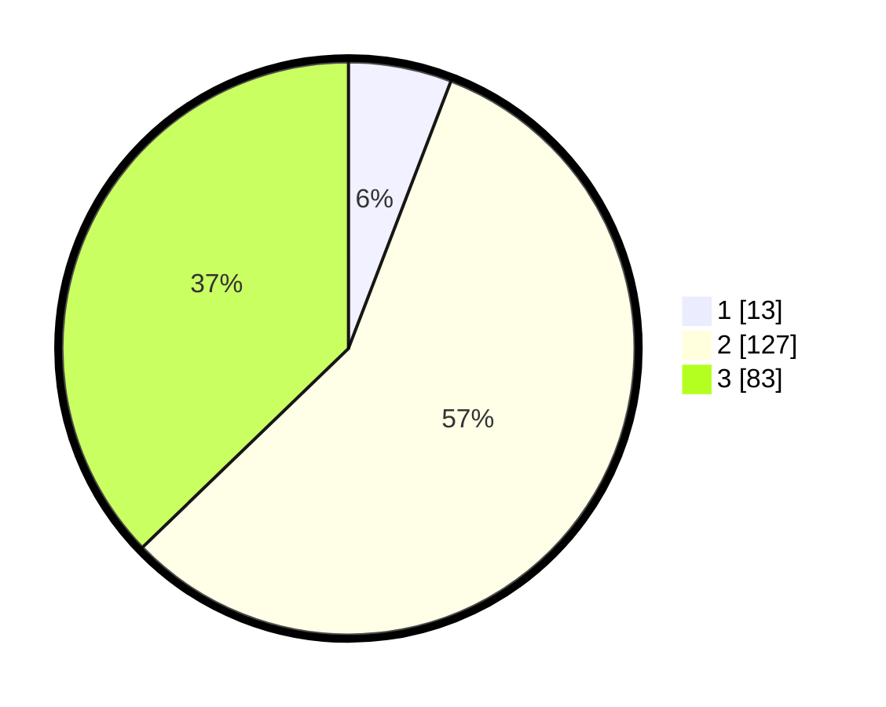

# Hasil

## Grafik

## Tabel

| No. | Nama Paslon    | Suara | Suara (raw) | Persentase |
|:--- |:-------------- | -----:| -----------:| ----------:|
| 1   | ANIES MUHAIMIN | 13    | [13][p-1]   | 5,83       |
| 2   | PRABOWO GIBRAN | 127   | [127][p-2]  | 56,95      |
| 3   | GANJAR MAHFUD  | 83    | [83][p-3]   | 37,22      |

[p-1]: https://github.com/gigit-pemilu/pemilu-2024/blob/main/pilpres/hitung-suara/sub/34-di-yogyakarta/sub/02-bantul/sub/06-pandak/sub/2004-wijirejo/sub/033-tps/sub/paslon-1.txt
[p-2]: https://github.com/gigit-pemilu/pemilu-2024/blob/main/pilpres/hitung-suara/sub/34-di-yogyakarta/sub/02-bantul/sub/06-pandak/sub/2004-wijirejo/sub/033-tps/sub/paslon-2.txt
[p-3]: https://github.com/gigit-pemilu/pemilu-2024/blob/main/pilpres/hitung-suara/sub/34-di-yogyakarta/sub/02-bantul/sub/06-pandak/sub/2004-wijirejo/sub/033-tps/sub/paslon-3.txt

## Foto C Plano

https://sirekap-obj-formc.kpu.go.id/029c/pemilu/ppwp/34/02/06/20/04/3402062004033-20240220-123644--48f83aa2-0d3d-48d0-b7f3-dd988b7de822.jpg

https://sirekap-obj-formc.kpu.go.id/029c/pemilu/ppwp/34/02/06/20/04/3402062004033-20240220-123821--88f297dc-164a-44e1-afc9-a6e2afd4e17f.jpg

https://sirekap-obj-formc.kpu.go.id/029c/pemilu/ppwp/34/02/06/20/04/3402062004033-20240220-124010--b09fa3a7-4280-4320-ba9a-d9a27d5938f3.jpg

## Metadata

| Key        | Value               |
| ---------- | ------------------- |
| Time Stamp | 2024-02-24 22:31:28 |

