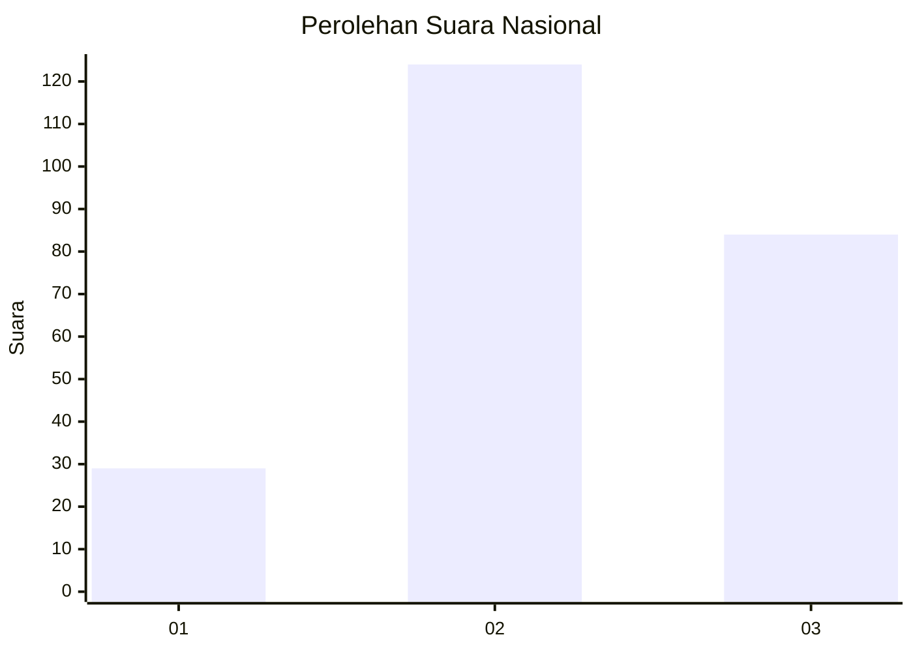
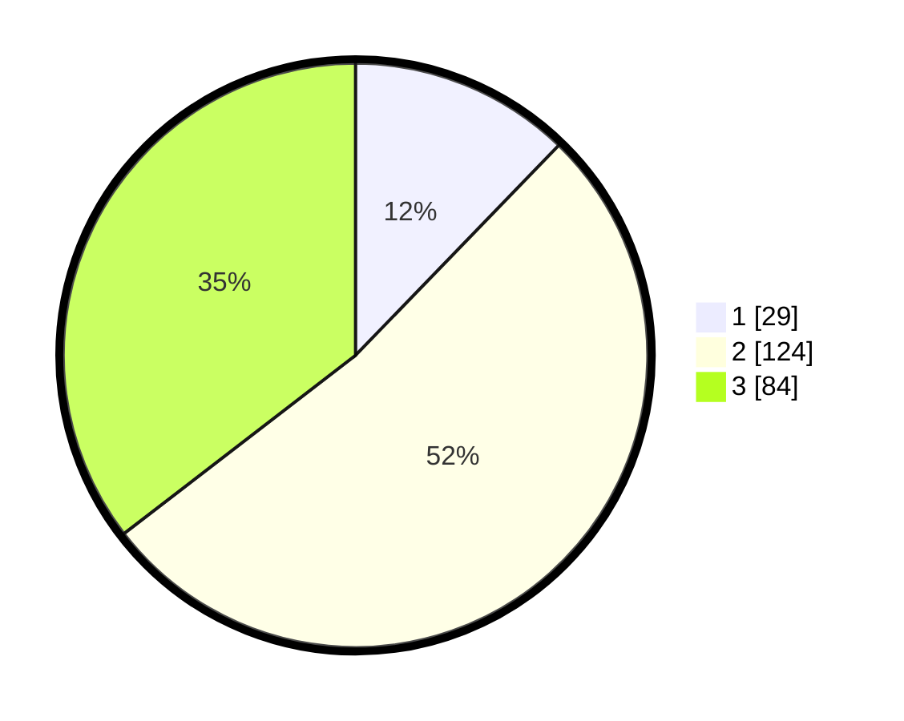

# Hasil

## Grafik

## Tabel

| No. | Nama Paslon    | Suara | Suara (raw) | Persentase |
|:--- |:-------------- | -----:| -----------:| ----------:|
| 1   | ANIES MUHAIMIN | 29    | [29][p-1]   | 12,24      |
| 2   | PRABOWO GIBRAN | 124   | [124][p-2]  | 52,32      |
| 3   | GANJAR MAHFUD  | 84    | [84][p-3]   | 35,44      |

[p-1]: https://github.com/gigit-pemilu/pemilu-2024/blob/main/pilpres/hitung-suara/sub/34-di-yogyakarta/sub/02-bantul/sub/06-pandak/sub/2004-wijirejo/sub/035-tps/sub/paslon-1.txt
[p-2]: https://github.com/gigit-pemilu/pemilu-2024/blob/main/pilpres/hitung-suara/sub/34-di-yogyakarta/sub/02-bantul/sub/06-pandak/sub/2004-wijirejo/sub/035-tps/sub/paslon-2.txt
[p-3]: https://github.com/gigit-pemilu/pemilu-2024/blob/main/pilpres/hitung-suara/sub/34-di-yogyakarta/sub/02-bantul/sub/06-pandak/sub/2004-wijirejo/sub/035-tps/sub/paslon-3.txt

## Foto C Plano

https://sirekap-obj-formc.kpu.go.id/5976/pemilu/ppwp/34/02/06/20/04/3402062004035-20240219-123104--6960ded5-cee8-40fe-8a97-1ff8ed6a9847.jpg

https://sirekap-obj-formc.kpu.go.id/5976/pemilu/ppwp/34/02/06/20/04/3402062004035-20240219-123130--5484c343-9ef1-48b6-b628-bdfdbfa423b4.jpg

https://sirekap-obj-formc.kpu.go.id/5976/pemilu/ppwp/34/02/06/20/04/3402062004035-20240219-123203--320f8ff0-911e-4fbf-9054-8454baa70f30.jpg

## Metadata

| Key        | Value               |
| ---------- | ------------------- |
| Time Stamp | 2024-02-25 11:00:00 |

