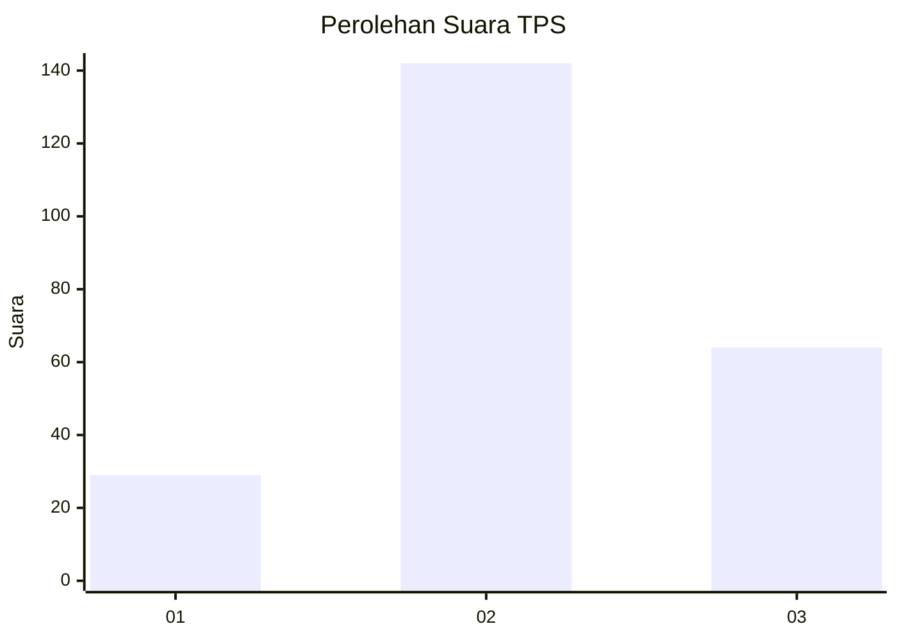
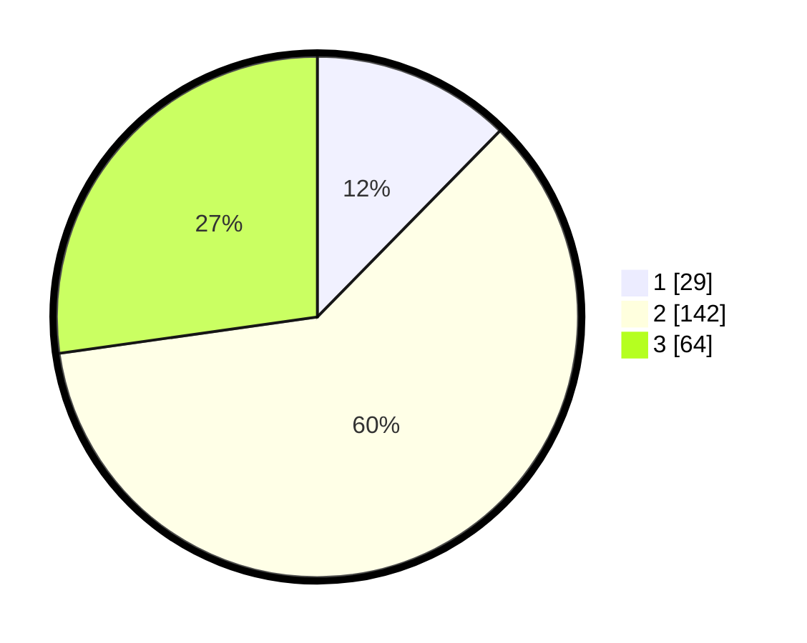

# Hasil

## Grafik

## Tabel

| No. | Nama Paslon    | Suara | Suara (raw) | Persentase |
|:--- |:-------------- | -----:| -----------:| ----------:|
| 1   | ANIES MUHAIMIN | 29    | [29][p-1]   | 12,34      |
| 2   | PRABOWO GIBRAN | 142   | [142][p-2]  | 60,43      |
| 3   | GANJAR MAHFUD  | 64    | [64][p-3]   | 27,23      |

[p-1]: https://github.com/gigit-pemilu/pemilu-2024-34-di-yogyakarta/blob/main/pilpres/hitung-suara/sub/34-di-yogyakarta/sub/02-bantul/sub/06-pandak/sub/2004-wijirejo/sub/037-tps/sub/paslon-1.txt
[p-2]: https://github.com/gigit-pemilu/pemilu-2024-34-di-yogyakarta/blob/main/pilpres/hitung-suara/sub/34-di-yogyakarta/sub/02-bantul/sub/06-pandak/sub/2004-wijirejo/sub/037-tps/sub/paslon-2.txt
[p-3]: https://github.com/gigit-pemilu/pemilu-2024-34-di-yogyakarta/blob/main/pilpres/hitung-suara/sub/34-di-yogyakarta/sub/02-bantul/sub/06-pandak/sub/2004-wijirejo/sub/037-tps/sub/paslon-3.txt

## Foto C Plano

https://sirekap-obj-formc.kpu.go.id/2026/pemilu/ppwp/34/02/06/20/04/3402062004037-20240214-235924--f9773c18-87bf-4ebe-bc98-9bb23832d3cf.jpg

https://sirekap-obj-formc.kpu.go.id/2026/pemilu/ppwp/34/02/06/20/04/3402062004037-20240214-235916--c8cdbead-4486-4c20-aa30-b3ce29d3fc5c.jpg

https://sirekap-obj-formc.kpu.go.id/2026/pemilu/ppwp/34/02/06/20/04/3402062004037-20240214-235927--ad809962-d3ae-48d2-8a0b-8bb6270d318c.jpg

## Metadata

| Key        | Value               |
| ---------- | ------------------- |
| Time Stamp | 2024-02-24 22:31:28 |

