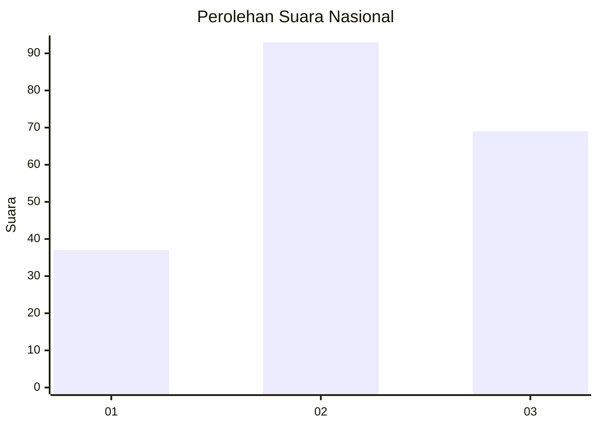
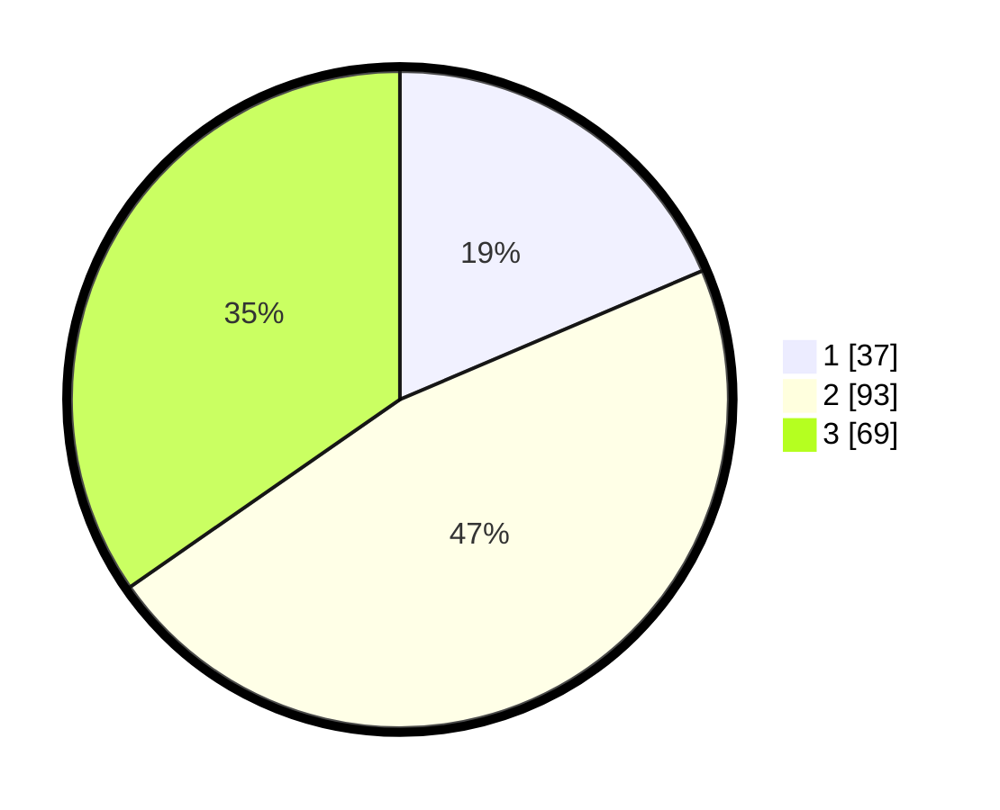

# Hasil

## Grafik

## Tabel

| No. | Nama Paslon    | Suara | Suara (raw) | Persentase |
|:--- |:-------------- | -----:| -----------:| ----------:|
| 1   | ANIES MUHAIMIN | 37    | [37][p-1]   | 18,59      |
| 2   | PRABOWO GIBRAN | 93    | [93][p-2]   | 46,73      |
| 3   | GANJAR MAHFUD  | 69    | [69][p-3]   | 34,67      |

[p-1]: https://github.com/gigit-pemilu/pemilu-2024/blob/main/pilpres/hitung-suara/sub/34-di-yogyakarta/sub/02-bantul/sub/07-pajangan/sub/2001-triwidadi/sub/001-tps/sub/paslon-1.txt
[p-2]: https://github.com/gigit-pemilu/pemilu-2024/blob/main/pilpres/hitung-suara/sub/34-di-yogyakarta/sub/02-bantul/sub/07-pajangan/sub/2001-triwidadi/sub/001-tps/sub/paslon-2.txt
[p-3]: https://github.com/gigit-pemilu/pemilu-2024/blob/main/pilpres/hitung-suara/sub/34-di-yogyakarta/sub/02-bantul/sub/07-pajangan/sub/2001-triwidadi/sub/001-tps/sub/paslon-3.txt

## Foto C Plano

https://sirekap-obj-formc.kpu.go.id/874f/pemilu/ppwp/34/02/07/20/01/3402072001001-20240216-150029--e04bd824-ab87-4401-af8d-900367a8c722.jpg

https://sirekap-obj-formc.kpu.go.id/874f/pemilu/ppwp/34/02/07/20/01/3402072001001-20240216-150030--889a3dfa-ed29-4c05-b7a8-d8a8d95221e3.jpg

https://sirekap-obj-formc.kpu.go.id/874f/pemilu/ppwp/34/02/07/20/01/3402072001001-20240216-150029--db2a89e9-c138-42ad-b887-1dda2772aad3.jpg

## Metadata

| Key        | Value               |
| ---------- | ------------------- |
| Time Stamp | 2024-02-20 11:00:00 |

## DATA PEMILIH TETAP

Jumlah pemilih dalam DPT: **219**.
 * L: **109**.
 * P: **110**.

## DATA PENGGUNA HAK PILIH

Jumlah pengguna hak pilih dalam DPT: **198**.
 * L: **98**.
 * P: **100**.

Jumlah pengguna hak pilih dalam DPTb: **6**.
 * L: **1**.
 * P: **5**.

Jumlah pengguna hak pilih dalam DPK: **1**.
 * L: **1**.
 * P: **0**.

Jumlah pengguna hak pilih: **205**.
 * L: **100**.
 * P: **105**.

## JUMLAH SUARA SAH DAN TIDAK SAH

JUMLAH SELURUH SUARA SAH: **199**.

JUMLAH SUARA TIDAK SAH: **6**.

JUMLAH SELURUH SUARA SAH DAN SUARA TIDAK SAH: **205**.

