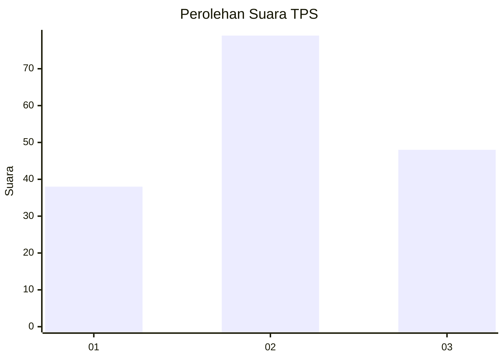
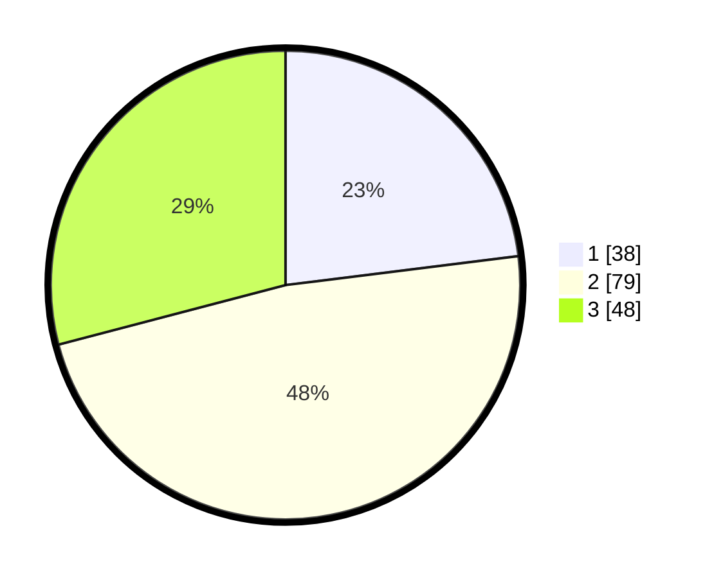

# Hasil

## Grafik

## Tabel

| No. | Nama Paslon    | Suara | Suara (raw) | Persentase |
|:--- |:-------------- | -----:| -----------:| ----------:|
| 1   | ANIES MUHAIMIN | 38    | [38][p-1]   | 23,03      |
| 2   | PRABOWO GIBRAN | 79    | [79][p-2]   | 47,88      |
| 3   | GANJAR MAHFUD  | 48    | [48][p-3]   | 29,09      |

[p-1]: https://github.com/gigit-pemilu/pemilu-2024-34-di-yogyakarta/blob/main/pilpres/hitung-suara/sub/34-di-yogyakarta/sub/02-bantul/sub/07-pajangan/sub/2001-triwidadi/sub/002-tps/sub/paslon-1.txt
[p-2]: https://github.com/gigit-pemilu/pemilu-2024-34-di-yogyakarta/blob/main/pilpres/hitung-suara/sub/34-di-yogyakarta/sub/02-bantul/sub/07-pajangan/sub/2001-triwidadi/sub/002-tps/sub/paslon-2.txt
[p-3]: https://github.com/gigit-pemilu/pemilu-2024-34-di-yogyakarta/blob/main/pilpres/hitung-suara/sub/34-di-yogyakarta/sub/02-bantul/sub/07-pajangan/sub/2001-triwidadi/sub/002-tps/sub/paslon-3.txt

## Foto C Plano

https://sirekap-obj-formc.kpu.go.id/bb93/pemilu/ppwp/34/02/07/20/01/3402072001002-20240216-144940--943c8b53-96e4-4c23-8024-fefc57784700.jpg

https://sirekap-obj-formc.kpu.go.id/bb93/pemilu/ppwp/34/02/07/20/01/3402072001002-20240216-144941--4a873f5f-3dd7-41ff-9706-42286024e095.jpg

https://sirekap-obj-formc.kpu.go.id/bb93/pemilu/ppwp/34/02/07/20/01/3402072001002-20240216-144941--406495ee-0072-4a61-bdb7-a7cdf4e8f582.jpg

## Metadata

| Key        | Value               |
| ---------- | ------------------- |
| Time Stamp | 2024-02-20 11:00:00 |

## DATA PEMILIH TETAP

Jumlah pemilih dalam DPT: **188**.
 * L: **92**.
 * P: **96**.

## DATA PENGGUNA HAK PILIH

Jumlah pengguna hak pilih dalam DPT: **163**.
 * L: **79**.
 * P: **84**.

Jumlah pengguna hak pilih dalam DPTb: **4**.
 * L: **2**.
 * P: **2**.

Jumlah pengguna hak pilih dalam DPK: **1**.
 * L: **1**.
 * P: **0**.

Jumlah pengguna hak pilih: **168**.
 * L: **82**.
 * P: **86**.

## JUMLAH SUARA SAH DAN TIDAK SAH

JUMLAH SELURUH SUARA SAH: **165**.

JUMLAH SUARA TIDAK SAH: **3**.

JUMLAH SELURUH SUARA SAH DAN SUARA TIDAK SAH: **168**.

