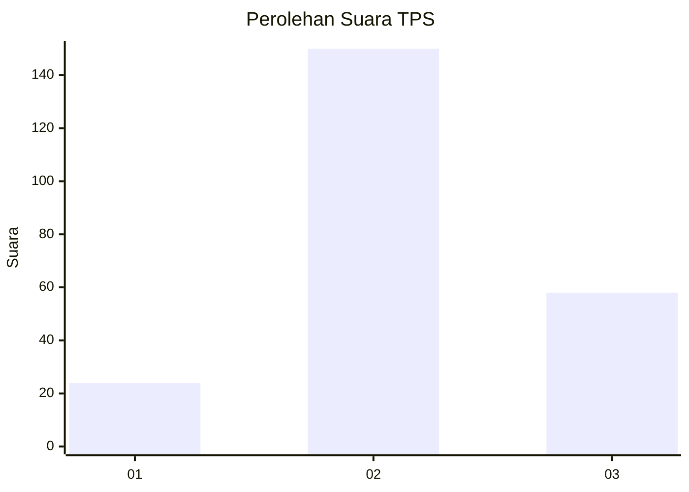
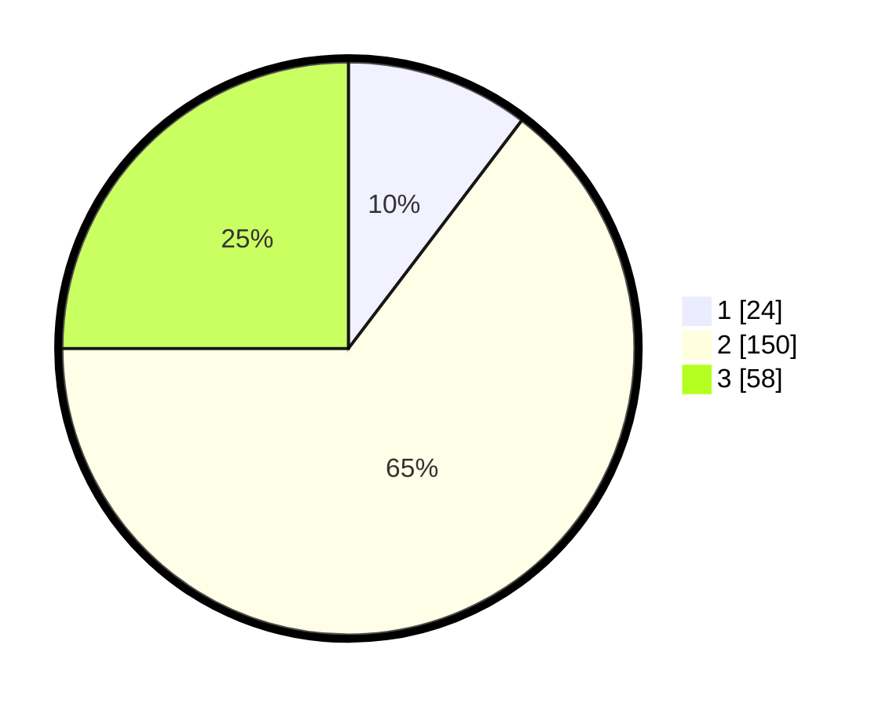

# Hasil

## Grafik

## Tabel

| No. | Nama Paslon    | Suara | Suara (raw) | Persentase |
|:--- |:-------------- | -----:| -----------:| ----------:|
| 1   | ANIES MUHAIMIN | 24    | [24][p-1]   | 10,34      |
| 2   | PRABOWO GIBRAN | 150   | [150][p-2]  | 64,66      |
| 3   | GANJAR MAHFUD  | 58    | [58][p-3]   | 25,00      |

[p-1]: https://github.com/gigit-pemilu/pemilu-2024-34-di-yogyakarta/blob/main/pilpres/hitung-suara/sub/34-di-yogyakarta/sub/02-bantul/sub/07-pajangan/sub/2001-triwidadi/sub/003-tps/sub/paslon-1.txt
[p-2]: https://github.com/gigit-pemilu/pemilu-2024-34-di-yogyakarta/blob/main/pilpres/hitung-suara/sub/34-di-yogyakarta/sub/02-bantul/sub/07-pajangan/sub/2001-triwidadi/sub/003-tps/sub/paslon-2.txt
[p-3]: https://github.com/gigit-pemilu/pemilu-2024-34-di-yogyakarta/blob/main/pilpres/hitung-suara/sub/34-di-yogyakarta/sub/02-bantul/sub/07-pajangan/sub/2001-triwidadi/sub/003-tps/sub/paslon-3.txt

## Foto C Plano

https://sirekap-obj-formc.kpu.go.id/55fc/pemilu/ppwp/34/02/07/20/01/3402072001003-20240216-153232--cd246891-bf5e-410c-8312-ed608c70dbf4.jpg

https://sirekap-obj-formc.kpu.go.id/55fc/pemilu/ppwp/34/02/07/20/01/3402072001003-20240216-153233--7aa452b8-e94a-4f6d-af2a-d082e40f1d96.jpg

https://sirekap-obj-formc.kpu.go.id/55fc/pemilu/ppwp/34/02/07/20/01/3402072001003-20240216-153233--9b39b63f-833d-42ff-ae09-6a50325ccf80.jpg

## Metadata

| Key        | Value               |
| ---------- | ------------------- |
| Time Stamp | 2024-02-20 11:00:00 |

## DATA PEMILIH TETAP

Jumlah pemilih dalam DPT: **243**.
 * L: **113**.
 * P: **130**.

## DATA PENGGUNA HAK PILIH

Jumlah pengguna hak pilih dalam DPT: **230**.
 * L: **109**.
 * P: **121**.

Jumlah pengguna hak pilih dalam DPTb: **4**.
 * L: **0**.
 * P: **4**.

Jumlah pengguna hak pilih dalam DPK: **2**.
 * L: **1**.
 * P: **1**.

Jumlah pengguna hak pilih: **236**.
 * L: **110**.
 * P: **126**.

## JUMLAH SUARA SAH DAN TIDAK SAH

JUMLAH SELURUH SUARA SAH: **232**.

JUMLAH SUARA TIDAK SAH: **4**.

JUMLAH SELURUH SUARA SAH DAN SUARA TIDAK SAH: **236**.

