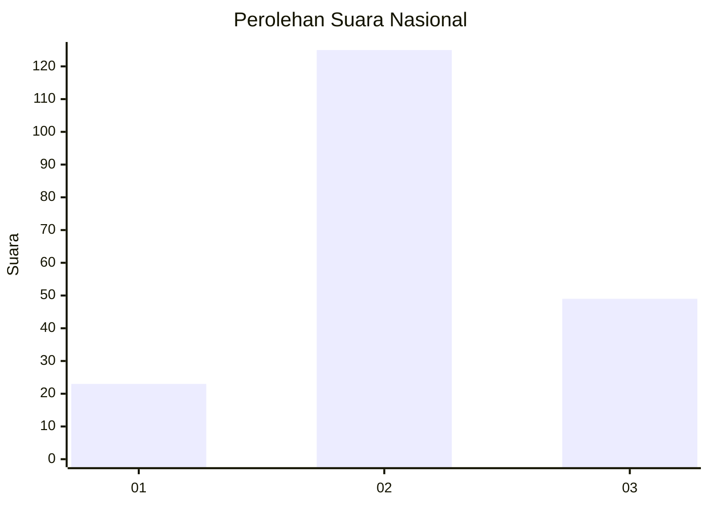
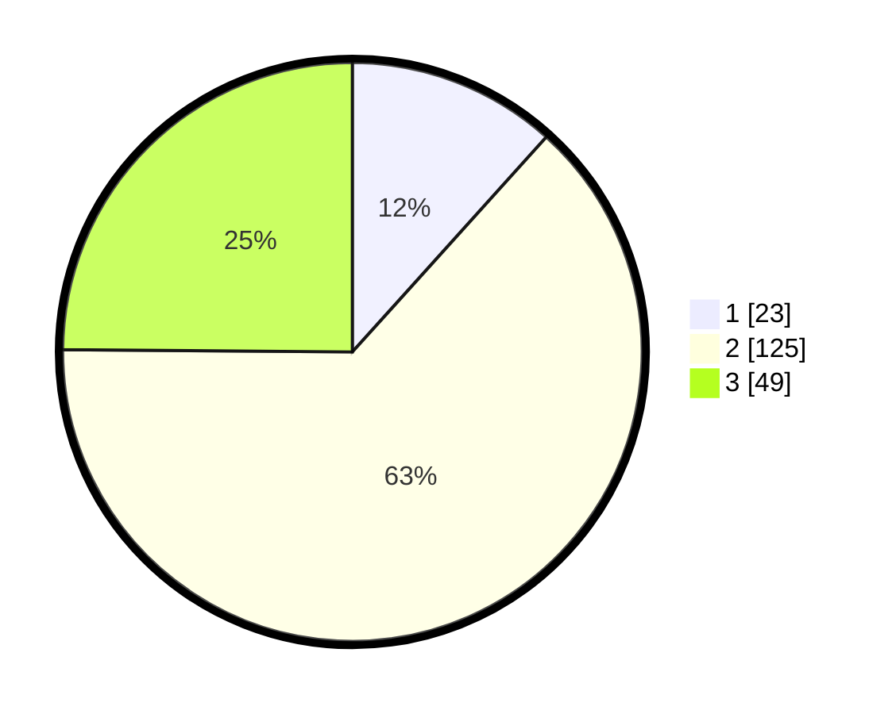

# Hasil

## Grafik

## Tabel

| No. | Nama Paslon    | Suara | Suara (raw) | Persentase |
|:--- |:-------------- | -----:| -----------:| ----------:|
| 1   | ANIES MUHAIMIN | 23    | [23][p-1]   | 11,68      |
| 2   | PRABOWO GIBRAN | 125   | [125][p-2]  | 63,45      |
| 3   | GANJAR MAHFUD  | 49    | [49][p-3]   | 24,87      |

[p-1]: https://github.com/gigit-pemilu/pemilu-2024/blob/main/pilpres/hitung-suara/sub/34-di-yogyakarta/sub/02-bantul/sub/07-pajangan/sub/2001-triwidadi/sub/005-tps/sub/paslon-1.txt
[p-2]: https://github.com/gigit-pemilu/pemilu-2024/blob/main/pilpres/hitung-suara/sub/34-di-yogyakarta/sub/02-bantul/sub/07-pajangan/sub/2001-triwidadi/sub/005-tps/sub/paslon-2.txt
[p-3]: https://github.com/gigit-pemilu/pemilu-2024/blob/main/pilpres/hitung-suara/sub/34-di-yogyakarta/sub/02-bantul/sub/07-pajangan/sub/2001-triwidadi/sub/005-tps/sub/paslon-3.txt

## Foto C Plano

https://sirekap-obj-formc.kpu.go.id/4e5e/pemilu/ppwp/34/02/07/20/01/3402072001005-20240215-013839--37937c39-efda-4369-ada3-681bbe47d234.jpg

https://sirekap-obj-formc.kpu.go.id/4e5e/pemilu/ppwp/34/02/07/20/01/3402072001005-20240214-192320--0b542d5e-f236-4b7b-9ee1-ca36d5b3064d.jpg

https://sirekap-obj-formc.kpu.go.id/4e5e/pemilu/ppwp/34/02/07/20/01/3402072001005-20240215-013727--c4ffceb6-453d-4334-bd9d-431e60342bff.jpg

## Metadata

| Key        | Value               |
| ---------- | ------------------- |
| Time Stamp | 2024-02-15 01:47:43 |

