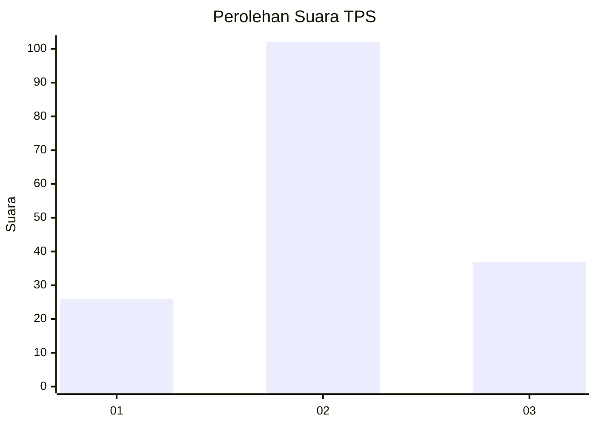
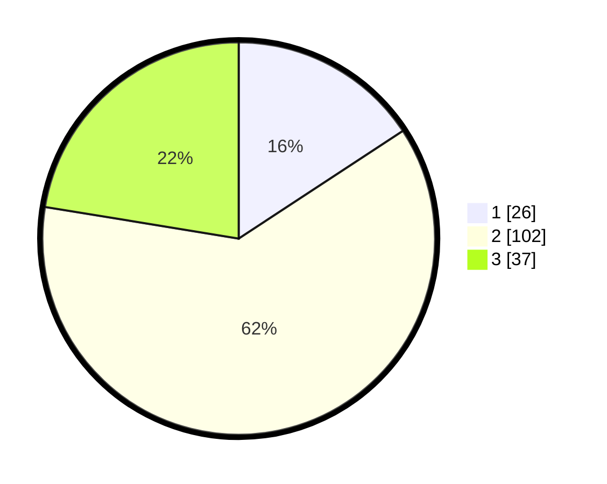

# Hasil

## Grafik

## Tabel

| No. | Nama Paslon    | Suara | Suara (raw) | Persentase |
|:--- |:-------------- | -----:| -----------:| ----------:|
| 1   | ANIES MUHAIMIN | 26    | [26][p-1]   | 15,76      |
| 2   | PRABOWO GIBRAN | 102   | [102][p-2]  | 61,82      |
| 3   | GANJAR MAHFUD  | 37    | [37][p-3]   | 22,42      |

[p-1]: https://github.com/gigit-pemilu/pemilu-2024-34-di-yogyakarta/blob/main/pilpres/hitung-suara/sub/34-di-yogyakarta/sub/02-bantul/sub/07-pajangan/sub/2001-triwidadi/sub/007-tps/sub/paslon-1.txt
[p-2]: https://github.com/gigit-pemilu/pemilu-2024-34-di-yogyakarta/blob/main/pilpres/hitung-suara/sub/34-di-yogyakarta/sub/02-bantul/sub/07-pajangan/sub/2001-triwidadi/sub/007-tps/sub/paslon-2.txt
[p-3]: https://github.com/gigit-pemilu/pemilu-2024-34-di-yogyakarta/blob/main/pilpres/hitung-suara/sub/34-di-yogyakarta/sub/02-bantul/sub/07-pajangan/sub/2001-triwidadi/sub/007-tps/sub/paslon-3.txt

## Foto C Plano

https://sirekap-obj-formc.kpu.go.id/6355/pemilu/ppwp/34/02/07/20/01/3402072001007-20240217-140905--16a407aa-241c-41f1-a8f0-a6e147946a72.jpg

https://sirekap-obj-formc.kpu.go.id/6355/pemilu/ppwp/34/02/07/20/01/3402072001007-20240214-204738--140f4b4b-b865-4eb0-a2af-07414661b773.jpg

https://sirekap-obj-formc.kpu.go.id/6355/pemilu/ppwp/34/02/07/20/01/3402072001007-20240214-205337--30eb1b6a-cc42-42c2-9d9a-318ce6216f61.jpg

## Metadata

| Key        | Value               |
| ---------- | ------------------- |
| Time Stamp | 2024-02-20 11:00:00 |

## DATA PEMILIH TETAP

Jumlah pemilih dalam DPT: **167**.
 * L: **81**.
 * P: **86**.

## DATA PENGGUNA HAK PILIH

Jumlah pengguna hak pilih dalam DPT: **163**.
 * L: **80**.
 * P: **83**.

Jumlah pengguna hak pilih dalam DPTb: **4**.
 * L: **1**.
 * P: **3**.

Jumlah pengguna hak pilih dalam DPK: **0**.
 * L: **0**.
 * P: **0**.

Jumlah pengguna hak pilih: **167**.
 * L: **81**.
 * P: **86**.

## JUMLAH SUARA SAH DAN TIDAK SAH

JUMLAH SELURUH SUARA SAH: **165**.

JUMLAH SUARA TIDAK SAH: **2**.

JUMLAH SELURUH SUARA SAH DAN SUARA TIDAK SAH: **167**.

