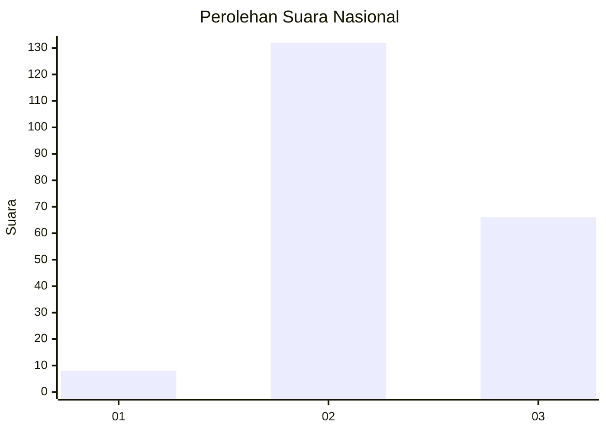
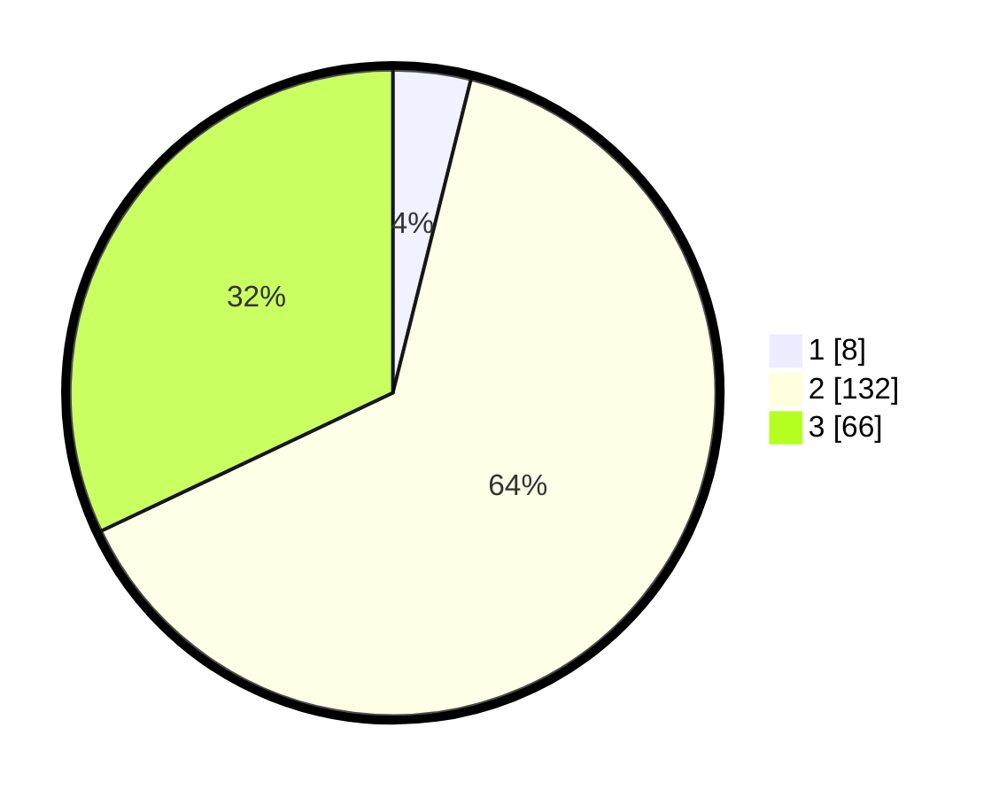

# Hasil

## Grafik

## Tabel

| No. | Nama Paslon    | Suara | Suara (raw) | Persentase |
|:--- |:-------------- | -----:| -----------:| ----------:|
| 1   | ANIES MUHAIMIN | 8     | [8][p-1]    | 3,88       |
| 2   | PRABOWO GIBRAN | 132   | [132][p-2]  | 64,08      |
| 3   | GANJAR MAHFUD  | 66    | [66][p-3]   | 32,04      |

[p-1]: https://github.com/gigit-pemilu/pemilu-2024/blob/main/pilpres/hitung-suara/sub/34-di-yogyakarta/sub/02-bantul/sub/07-pajangan/sub/2001-triwidadi/sub/012-tps/sub/paslon-1.txt
[p-2]: https://github.com/gigit-pemilu/pemilu-2024/blob/main/pilpres/hitung-suara/sub/34-di-yogyakarta/sub/02-bantul/sub/07-pajangan/sub/2001-triwidadi/sub/012-tps/sub/paslon-2.txt
[p-3]: https://github.com/gigit-pemilu/pemilu-2024/blob/main/pilpres/hitung-suara/sub/34-di-yogyakarta/sub/02-bantul/sub/07-pajangan/sub/2001-triwidadi/sub/012-tps/sub/paslon-3.txt

## Foto C Plano

https://sirekap-obj-formc.kpu.go.id/8612/pemilu/ppwp/34/02/07/20/01/3402072001012-20240215-005555--69d3e55a-e5a9-4c57-a004-1b61ff22b76a.jpg

https://sirekap-obj-formc.kpu.go.id/8612/pemilu/ppwp/34/02/07/20/01/3402072001012-20240214-190042--e1c6f866-1e26-4d4d-adcb-3c8d6a6e1a9e.jpg

https://sirekap-obj-formc.kpu.go.id/8612/pemilu/ppwp/34/02/07/20/01/3402072001012-20240215-005852--905a669b-a03a-444f-bcda-8604d488efb8.jpg

## Metadata

| Key        | Value               |
| ---------- | ------------------- |
| Time Stamp | 2024-02-24 22:31:28 |

