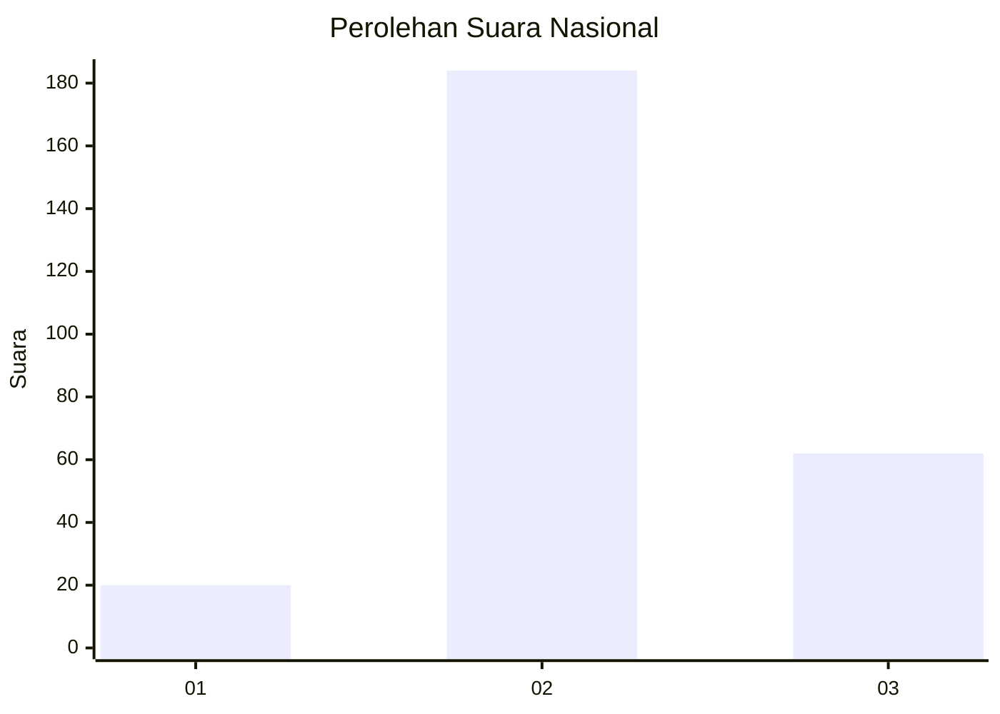
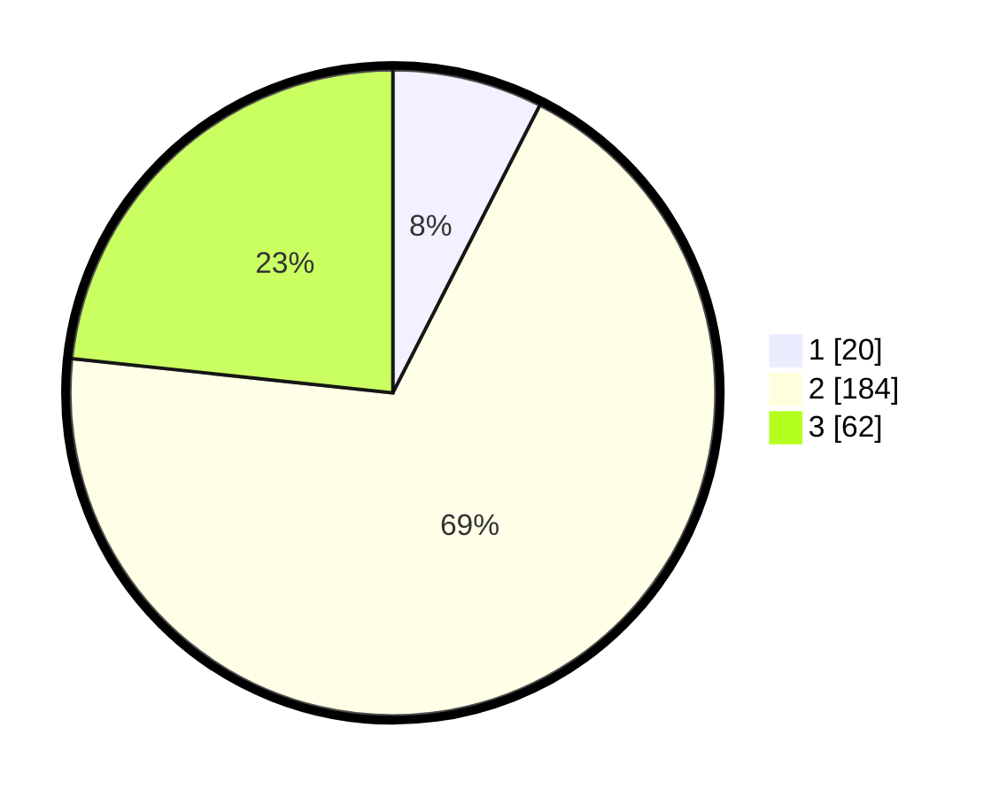

# Hasil

## Grafik

## Tabel

| No. | Nama Paslon    | Suara | Suara (raw) | Persentase |
|:--- |:-------------- | -----:| -----------:| ----------:|
| 1   | ANIES MUHAIMIN | 20    | [20][p-1]   | 7,52       |
| 2   | PRABOWO GIBRAN | 184   | [184][p-2]  | 69,17      |
| 3   | GANJAR MAHFUD  | 62    | [62][p-3]   | 23,31      |

[p-1]: https://github.com/gigit-pemilu/pemilu-2024/blob/main/pilpres/hitung-suara/sub/34-di-yogyakarta/sub/02-bantul/sub/07-pajangan/sub/2001-triwidadi/sub/028-tps/sub/paslon-1.txt
[p-2]: https://github.com/gigit-pemilu/pemilu-2024/blob/main/pilpres/hitung-suara/sub/34-di-yogyakarta/sub/02-bantul/sub/07-pajangan/sub/2001-triwidadi/sub/028-tps/sub/paslon-2.txt
[p-3]: https://github.com/gigit-pemilu/pemilu-2024/blob/main/pilpres/hitung-suara/sub/34-di-yogyakarta/sub/02-bantul/sub/07-pajangan/sub/2001-triwidadi/sub/028-tps/sub/paslon-3.txt

## Foto C Plano

https://sirekap-obj-formc.kpu.go.id/a15e/pemilu/ppwp/34/02/07/20/01/3402072001028-20240214-221454--828f02b5-ebc3-4cf7-a3f3-8beba177ba2a.jpg

https://sirekap-obj-formc.kpu.go.id/a15e/pemilu/ppwp/34/02/07/20/01/3402072001028-20240214-221528--f0c39de3-139c-4e82-acf8-d4f19c23e369.jpg

https://sirekap-obj-formc.kpu.go.id/a15e/pemilu/ppwp/34/02/07/20/01/3402072001028-20240214-221648--54566355-0610-415a-b1c4-ac9b3f228af0.jpg

## Metadata

| Key        | Value               |
| ---------- | ------------------- |
| Time Stamp | 2024-02-15 23:29:50 |

