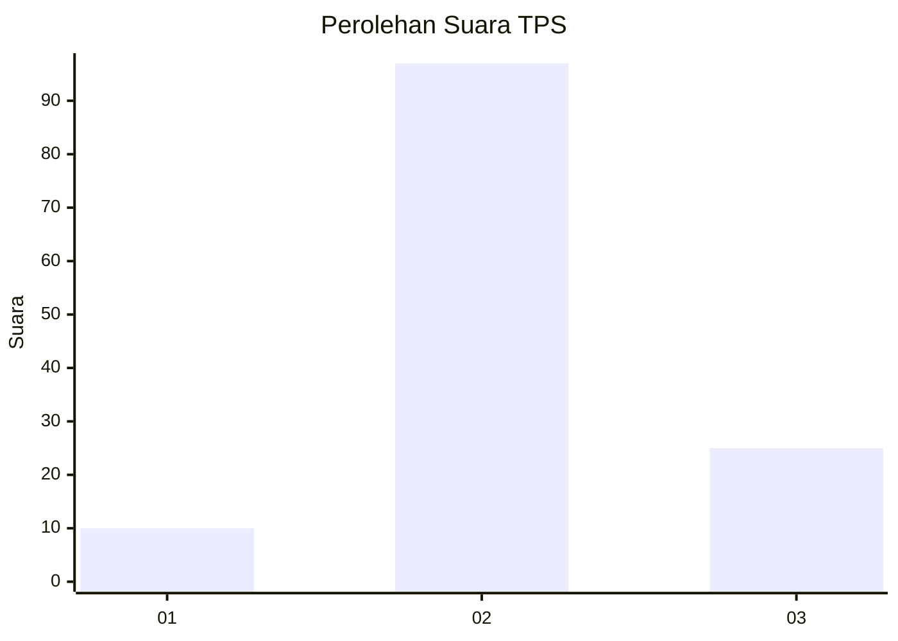
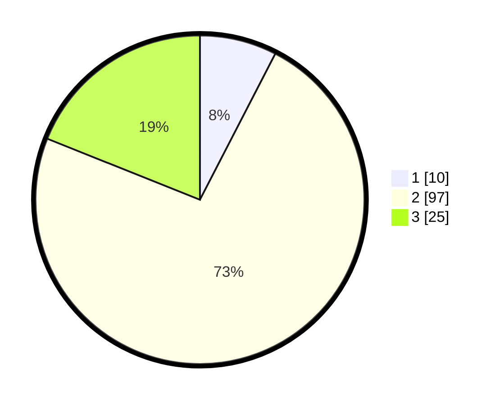

# Hasil

## Grafik

## Tabel

| No. | Nama Paslon    | Suara | Suara (raw) | Persentase |
|:--- |:-------------- | -----:| -----------:| ----------:|
| 1   | ANIES MUHAIMIN | 10    | [10][p-1]   | 7,58       |
| 2   | PRABOWO GIBRAN | 97    | [97][p-2]   | 73,48      |
| 3   | GANJAR MAHFUD  | 25    | [25][p-3]   | 18,94      |

[p-1]: https://github.com/gigit-pemilu/pemilu-2024-34-di-yogyakarta/blob/main/pilpres/hitung-suara/sub/34-di-yogyakarta/sub/02-bantul/sub/07-pajangan/sub/2001-triwidadi/sub/030-tps/sub/paslon-1.txt
[p-2]: https://github.com/gigit-pemilu/pemilu-2024-34-di-yogyakarta/blob/main/pilpres/hitung-suara/sub/34-di-yogyakarta/sub/02-bantul/sub/07-pajangan/sub/2001-triwidadi/sub/030-tps/sub/paslon-2.txt
[p-3]: https://github.com/gigit-pemilu/pemilu-2024-34-di-yogyakarta/blob/main/pilpres/hitung-suara/sub/34-di-yogyakarta/sub/02-bantul/sub/07-pajangan/sub/2001-triwidadi/sub/030-tps/sub/paslon-3.txt

## Foto C Plano

https://sirekap-obj-formc.kpu.go.id/f93f/pemilu/ppwp/34/02/07/20/01/3402072001030-20240216-062733--0930d898-86e9-4dd5-a330-f06114fd9ef0.jpg

https://sirekap-obj-formc.kpu.go.id/f93f/pemilu/ppwp/34/02/07/20/01/3402072001030-20240214-205556--e58cc8d9-a63c-45b3-8e14-cc92ecd9ac46.jpg

https://sirekap-obj-formc.kpu.go.id/f93f/pemilu/ppwp/34/02/07/20/01/3402072001030-20240217-075902--ac372421-392f-472c-b61f-f583fc7e360b.jpg

## Metadata

| Key        | Value               |
| ---------- | ------------------- |
| Time Stamp | 2024-02-17 08:30:03 |

## DATA PEMILIH TETAP

Jumlah pemilih dalam DPT: **147**.
 * L: **72**.
 * P: **75**.

## DATA PENGGUNA HAK PILIH

Jumlah pengguna hak pilih dalam DPT: **131**.
 * L: **65**.
 * P: **66**.

Jumlah pengguna hak pilih dalam DPTb: **4**.
 * L: **2**.
 * P: **2**.

Jumlah pengguna hak pilih dalam DPK: **0**.
 * L: **0**.
 * P: **0**.

Jumlah pengguna hak pilih: **135**.
 * L: **67**.
 * P: **68**.

## JUMLAH SUARA SAH DAN TIDAK SAH

JUMLAH SELURUH SUARA SAH: **132**.

JUMLAH SUARA TIDAK SAH: **3**.

JUMLAH SELURUH SUARA SAH DAN SUARA TIDAK SAH: **135**.

