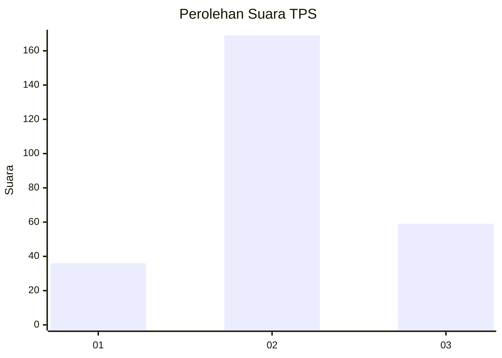
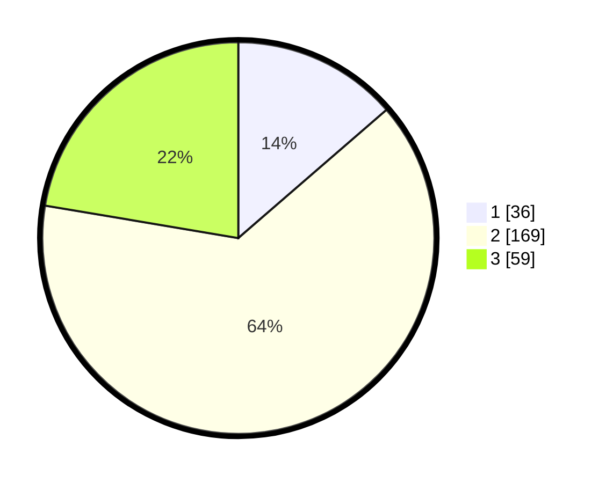

# Hasil

## Grafik

## Tabel

| No. | Nama Paslon    | Suara | Suara (raw) | Persentase |
|:--- |:-------------- | -----:| -----------:| ----------:|
| 1   | ANIES MUHAIMIN | 36    | [36][p-1]   | 13,64      |
| 2   | PRABOWO GIBRAN | 169   | [169][p-2]  | 64,02      |
| 3   | GANJAR MAHFUD  | 59    | [59][p-3]   | 22,35      |

[p-1]: https://github.com/gigit-pemilu/pemilu-2024-34-di-yogyakarta/blob/main/pilpres/hitung-suara/sub/34-di-yogyakarta/sub/02-bantul/sub/07-pajangan/sub/2001-triwidadi/sub/033-tps/sub/paslon-1.txt
[p-2]: https://github.com/gigit-pemilu/pemilu-2024-34-di-yogyakarta/blob/main/pilpres/hitung-suara/sub/34-di-yogyakarta/sub/02-bantul/sub/07-pajangan/sub/2001-triwidadi/sub/033-tps/sub/paslon-2.txt
[p-3]: https://github.com/gigit-pemilu/pemilu-2024-34-di-yogyakarta/blob/main/pilpres/hitung-suara/sub/34-di-yogyakarta/sub/02-bantul/sub/07-pajangan/sub/2001-triwidadi/sub/033-tps/sub/paslon-3.txt

## Foto C Plano

https://sirekap-obj-formc.kpu.go.id/ae0c/pemilu/ppwp/34/02/07/20/01/3402072001033-20240215-013139--cc6bf233-77f9-497c-8d9c-0e628ba7b589.jpg

https://sirekap-obj-formc.kpu.go.id/ae0c/pemilu/ppwp/34/02/07/20/01/3402072001033-20240215-013150--2aa08412-b65a-4ebb-aa7d-24b65a223808.jpg

https://sirekap-obj-formc.kpu.go.id/ae0c/pemilu/ppwp/34/02/07/20/01/3402072001033-20240215-013156--a891aa88-efea-473f-b3b5-2c239ab8dcb7.jpg

## Metadata

| Key        | Value               |
| ---------- | ------------------- |
| Time Stamp | 2024-02-24 22:31:28 |

