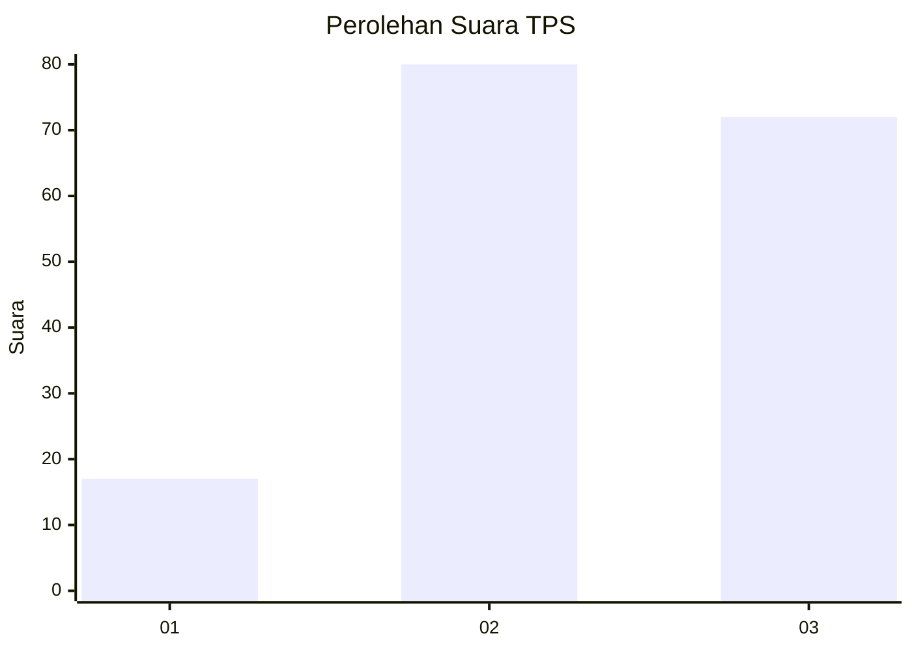
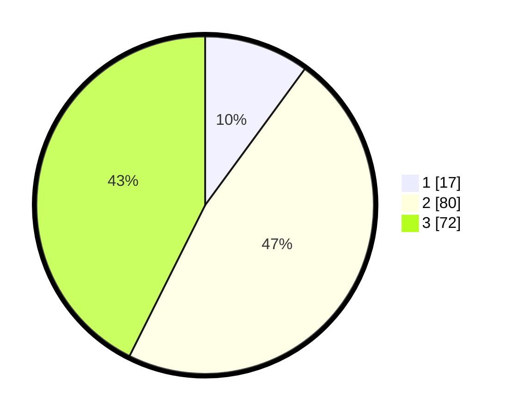

# Hasil

## Grafik

## Tabel

| No. | Nama Paslon    | Suara | Suara (raw) | Persentase |
|:--- |:-------------- | -----:| -----------:| ----------:|
| 1   | ANIES MUHAIMIN | 17    | [17][p-1]   | 10,06      |
| 2   | PRABOWO GIBRAN | 80    | [80][p-2]   | 47,34      |
| 3   | GANJAR MAHFUD  | 72    | [72][p-3]   | 42,60      |

[p-1]: https://github.com/gigit-pemilu/pemilu-2024-34-di-yogyakarta/blob/main/pilpres/hitung-suara/sub/34-di-yogyakarta/sub/02-bantul/sub/07-pajangan/sub/2002-sendangsari/sub/004-tps/sub/paslon-1.txt
[p-2]: https://github.com/gigit-pemilu/pemilu-2024-34-di-yogyakarta/blob/main/pilpres/hitung-suara/sub/34-di-yogyakarta/sub/02-bantul/sub/07-pajangan/sub/2002-sendangsari/sub/004-tps/sub/paslon-2.txt
[p-3]: https://github.com/gigit-pemilu/pemilu-2024-34-di-yogyakarta/blob/main/pilpres/hitung-suara/sub/34-di-yogyakarta/sub/02-bantul/sub/07-pajangan/sub/2002-sendangsari/sub/004-tps/sub/paslon-3.txt

## Foto C Plano

https://sirekap-obj-formc.kpu.go.id/2a84/pemilu/ppwp/34/02/07/20/02/3402072002004-20240214-235200--71ceca7c-8727-4b5d-bb4d-1853c38b2305.jpg

https://sirekap-obj-formc.kpu.go.id/2a84/pemilu/ppwp/34/02/07/20/02/3402072002004-20240214-235438--30d175d1-1079-4e63-af86-576c27ee9dc2.jpg

https://sirekap-obj-formc.kpu.go.id/2a84/pemilu/ppwp/34/02/07/20/02/3402072002004-20240214-235948--ebc5a777-811b-4e93-ac99-2490d9ac64ea.jpg

## Metadata

| Key        | Value               |
| ---------- | ------------------- |
| Time Stamp | 2024-02-24 22:31:28 |

