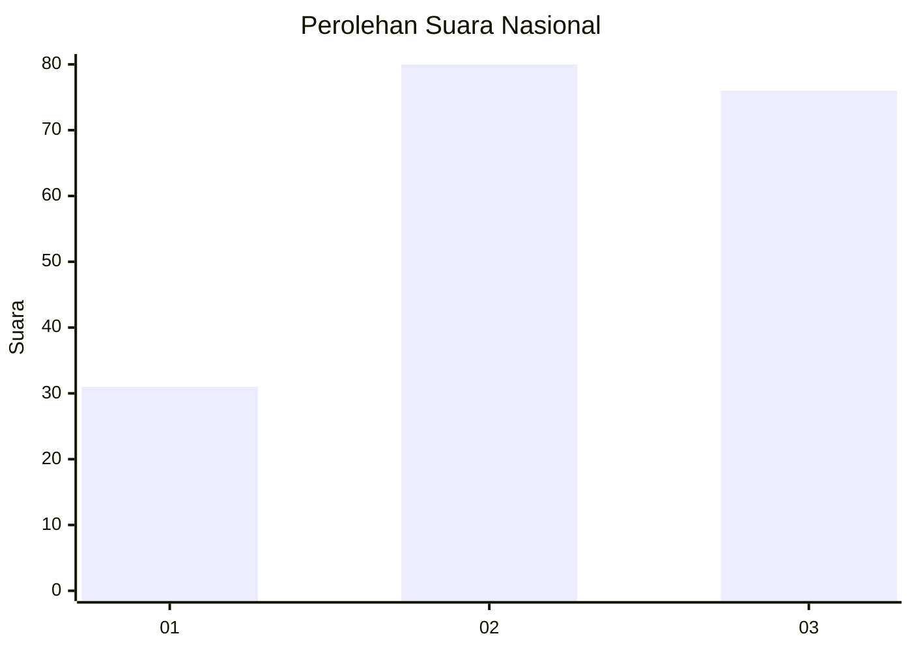
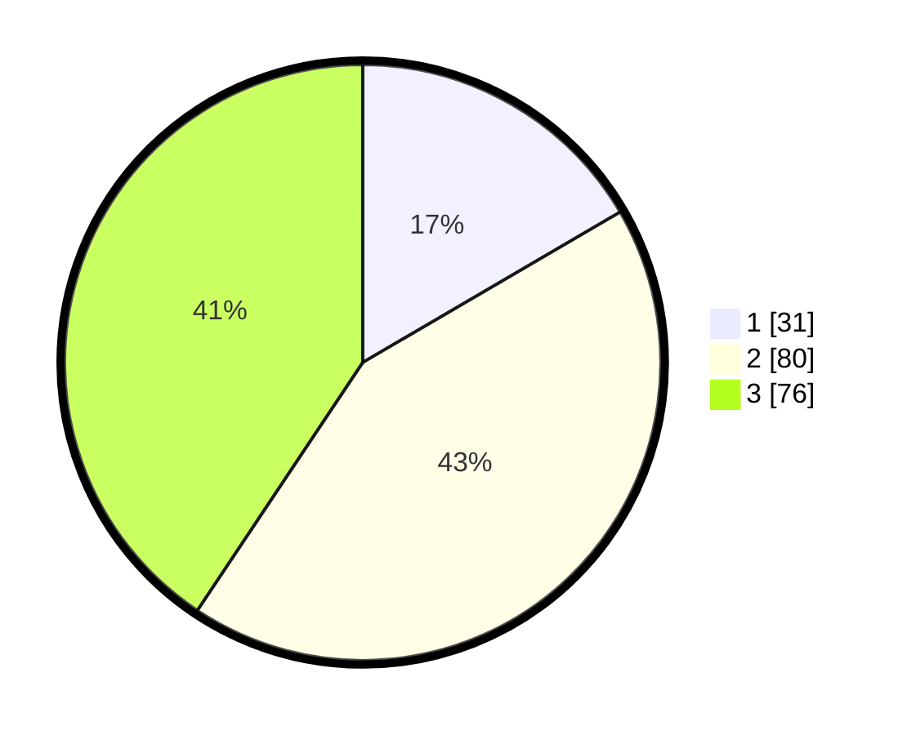

# Hasil

## Grafik

## Tabel

| No. | Nama Paslon    | Suara | Suara (raw) | Persentase |
|:--- |:-------------- | -----:| -----------:| ----------:|
| 1   | ANIES MUHAIMIN | 31    | [31][p-1]   | 16,58      |
| 2   | PRABOWO GIBRAN | 80    | [80][p-2]   | 42,78      |
| 3   | GANJAR MAHFUD  | 76    | [76][p-3]   | 40,64      |

[p-1]: https://github.com/gigit-pemilu/pemilu-2024/blob/main/pilpres/hitung-suara/sub/34-di-yogyakarta/sub/02-bantul/sub/07-pajangan/sub/2002-sendangsari/sub/005-tps/sub/paslon-1.txt
[p-2]: https://github.com/gigit-pemilu/pemilu-2024/blob/main/pilpres/hitung-suara/sub/34-di-yogyakarta/sub/02-bantul/sub/07-pajangan/sub/2002-sendangsari/sub/005-tps/sub/paslon-2.txt
[p-3]: https://github.com/gigit-pemilu/pemilu-2024/blob/main/pilpres/hitung-suara/sub/34-di-yogyakarta/sub/02-bantul/sub/07-pajangan/sub/2002-sendangsari/sub/005-tps/sub/paslon-3.txt

## Foto C Plano

https://sirekap-obj-formc.kpu.go.id/c991/pemilu/ppwp/34/02/07/20/02/3402072002005-20240214-200331--ef3a44d4-6bcd-41d1-ba70-a9368fa93336.jpg

https://sirekap-obj-formc.kpu.go.id/c991/pemilu/ppwp/34/02/07/20/02/3402072002005-20240214-200553--197239ef-57eb-4283-8c7f-d9369ef186de.jpg

https://sirekap-obj-formc.kpu.go.id/c991/pemilu/ppwp/34/02/07/20/02/3402072002005-20240214-201516--ad81ab93-db08-418d-8245-a692c35037b7.jpg

## Metadata

| Key        | Value               |
| ---------- | ------------------- |
| Time Stamp | 2024-02-25 11:00:00 |

