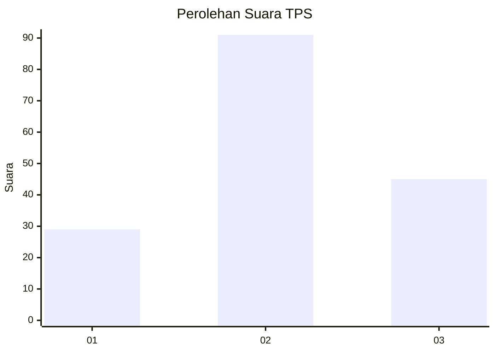
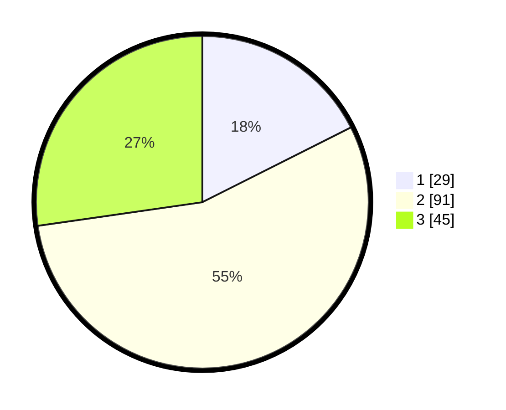

# Hasil

## Grafik

## Tabel

| No. | Nama Paslon    | Suara | Suara (raw) | Persentase |
|:--- |:-------------- | -----:| -----------:| ----------:|
| 1   | ANIES MUHAIMIN | 29    | [29][p-1]   | 17,58      |
| 2   | PRABOWO GIBRAN | 91    | [91][p-2]   | 55,15      |
| 3   | GANJAR MAHFUD  | 45    | [45][p-3]   | 27,27      |

[p-1]: https://github.com/gigit-pemilu/pemilu-2024-34-di-yogyakarta/blob/main/pilpres/hitung-suara/sub/34-di-yogyakarta/sub/02-bantul/sub/07-pajangan/sub/2002-sendangsari/sub/007-tps/sub/paslon-1.txt
[p-2]: https://github.com/gigit-pemilu/pemilu-2024-34-di-yogyakarta/blob/main/pilpres/hitung-suara/sub/34-di-yogyakarta/sub/02-bantul/sub/07-pajangan/sub/2002-sendangsari/sub/007-tps/sub/paslon-2.txt
[p-3]: https://github.com/gigit-pemilu/pemilu-2024-34-di-yogyakarta/blob/main/pilpres/hitung-suara/sub/34-di-yogyakarta/sub/02-bantul/sub/07-pajangan/sub/2002-sendangsari/sub/007-tps/sub/paslon-3.txt

## Foto C Plano

https://sirekap-obj-formc.kpu.go.id/63aa/pemilu/ppwp/34/02/07/20/02/3402072002007-20240214-215322--c2e13998-22e8-4c99-9273-3c09213ec98c.jpg

https://sirekap-obj-formc.kpu.go.id/63aa/pemilu/ppwp/34/02/07/20/02/3402072002007-20240214-141842--4bfd5c1d-d707-4661-9f24-2a9ab056346d.jpg

https://sirekap-obj-formc.kpu.go.id/63aa/pemilu/ppwp/34/02/07/20/02/3402072002007-20240214-141502--cb3da2f7-70c0-42af-aa12-df85dc746e0d.jpg

## Metadata

| Key        | Value               |
| ---------- | ------------------- |
| Time Stamp | 2024-02-24 22:31:28 |

