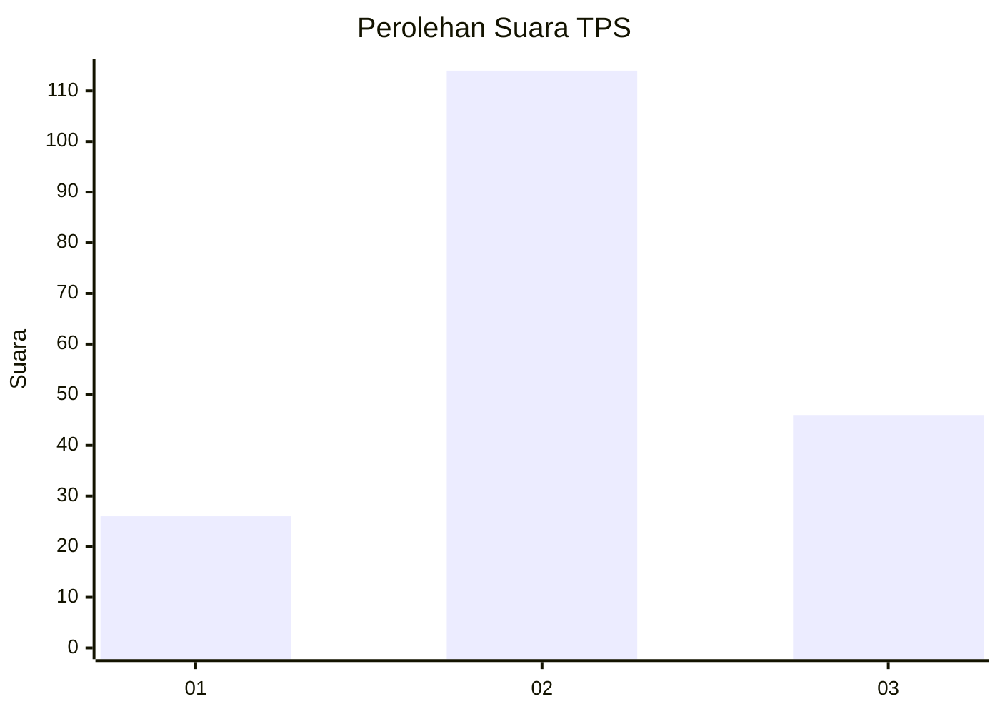
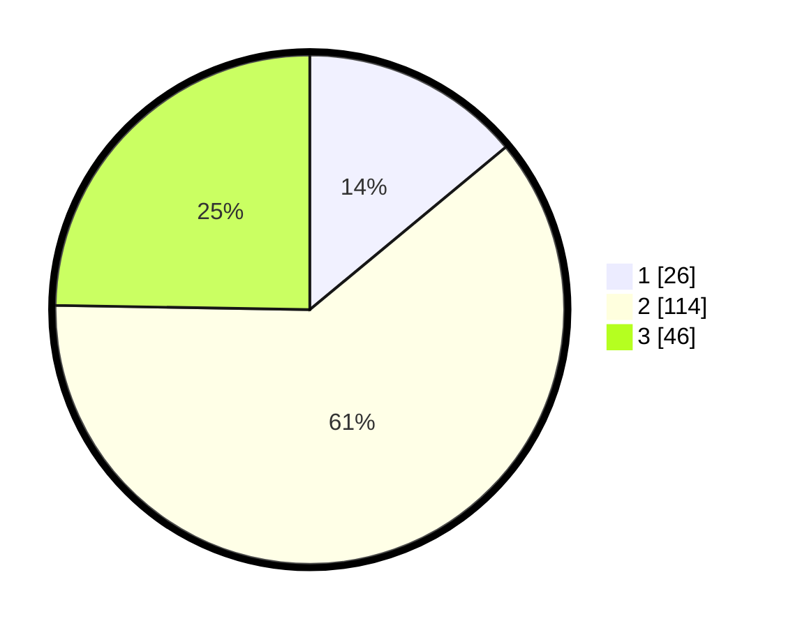

# Hasil

## Grafik

## Tabel

| No. | Nama Paslon    | Suara | Suara (raw) | Persentase |
|:--- |:-------------- | -----:| -----------:| ----------:|
| 1   | ANIES MUHAIMIN | 26    | [26][p-1]   | 13,98      |
| 2   | PRABOWO GIBRAN | 114   | [114][p-2]  | 61,29      |
| 3   | GANJAR MAHFUD  | 46    | [46][p-3]   | 24,73      |

[p-1]: https://github.com/gigit-pemilu/pemilu-2024-34-di-yogyakarta/blob/main/pilpres/hitung-suara/sub/34-di-yogyakarta/sub/02-bantul/sub/07-pajangan/sub/2002-sendangsari/sub/008-tps/sub/paslon-1.txt
[p-2]: https://github.com/gigit-pemilu/pemilu-2024-34-di-yogyakarta/blob/main/pilpres/hitung-suara/sub/34-di-yogyakarta/sub/02-bantul/sub/07-pajangan/sub/2002-sendangsari/sub/008-tps/sub/paslon-2.txt
[p-3]: https://github.com/gigit-pemilu/pemilu-2024-34-di-yogyakarta/blob/main/pilpres/hitung-suara/sub/34-di-yogyakarta/sub/02-bantul/sub/07-pajangan/sub/2002-sendangsari/sub/008-tps/sub/paslon-3.txt

## Foto C Plano

https://sirekap-obj-formc.kpu.go.id/4017/pemilu/ppwp/34/02/07/20/02/3402072002008-20240214-190358--338a4155-531b-4b88-ab74-46c4c9f30c6d.jpg

https://sirekap-obj-formc.kpu.go.id/4017/pemilu/ppwp/34/02/07/20/02/3402072002008-20240214-185857--1615a769-00f3-41e2-bafe-86b6d402954e.jpg

https://sirekap-obj-formc.kpu.go.id/4017/pemilu/ppwp/34/02/07/20/02/3402072002008-20240214-191425--82113be0-f98b-46b2-8569-99b085499338.jpg

## Metadata

| Key        | Value               |
| ---------- | ------------------- |
| Time Stamp | 2024-02-14 21:46:01 |

