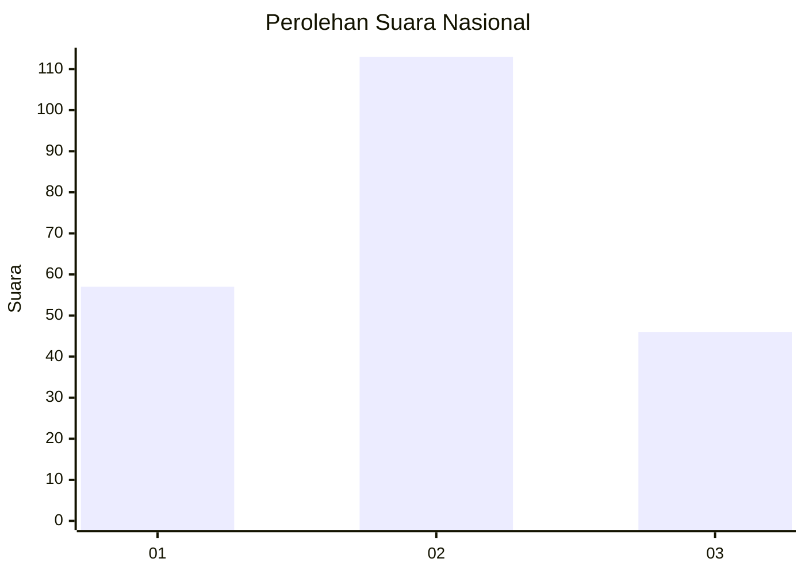
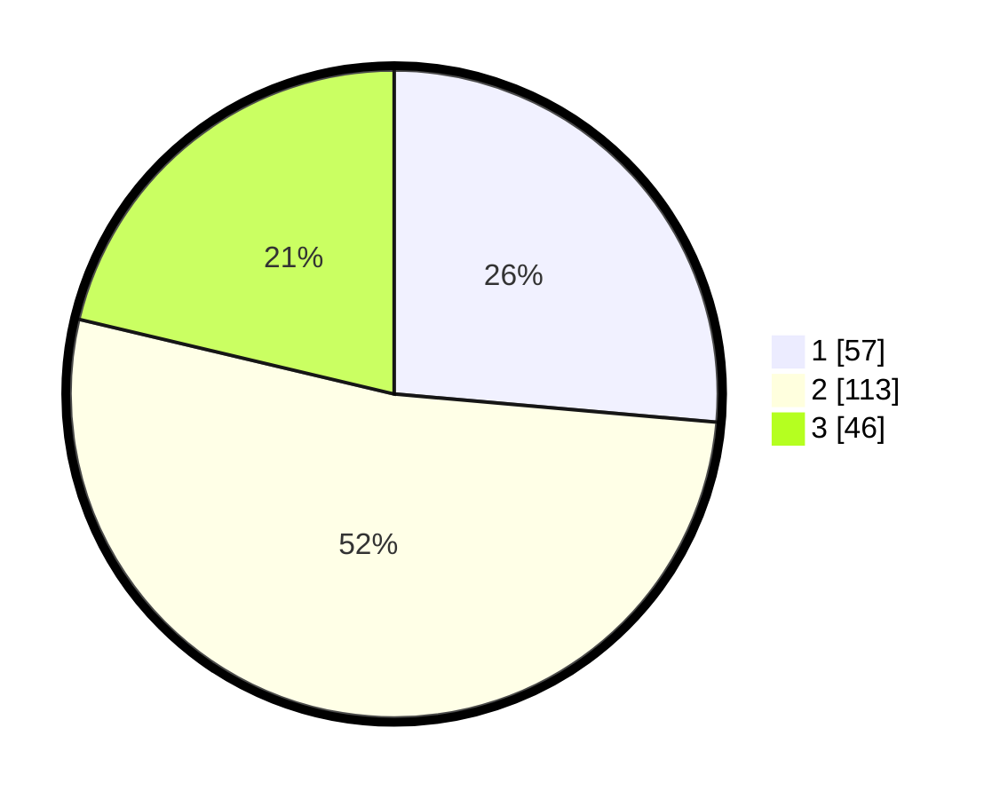

# Hasil

## Grafik

## Tabel

| No. | Nama Paslon    | Suara | Suara (raw) | Persentase |
|:--- |:-------------- | -----:| -----------:| ----------:|
| 1   | ANIES MUHAIMIN | 57    | [57][p-1]   | 26,39      |
| 2   | PRABOWO GIBRAN | 113   | [113][p-2]  | 52,31      |
| 3   | GANJAR MAHFUD  | 46    | [46][p-3]   | 21,30      |

[p-1]: https://github.com/gigit-pemilu/pemilu-2024/blob/main/pilpres/hitung-suara/sub/34-di-yogyakarta/sub/02-bantul/sub/07-pajangan/sub/2002-sendangsari/sub/009-tps/sub/paslon-1.txt
[p-2]: https://github.com/gigit-pemilu/pemilu-2024/blob/main/pilpres/hitung-suara/sub/34-di-yogyakarta/sub/02-bantul/sub/07-pajangan/sub/2002-sendangsari/sub/009-tps/sub/paslon-2.txt
[p-3]: https://github.com/gigit-pemilu/pemilu-2024/blob/main/pilpres/hitung-suara/sub/34-di-yogyakarta/sub/02-bantul/sub/07-pajangan/sub/2002-sendangsari/sub/009-tps/sub/paslon-3.txt

## Foto C Plano

https://sirekap-obj-formc.kpu.go.id/eff9/pemilu/ppwp/34/02/07/20/02/3402072002009-20240214-191637--39d1ff10-ddcc-4cf6-925f-cb4ad3e2df82.jpg

https://sirekap-obj-formc.kpu.go.id/eff9/pemilu/ppwp/34/02/07/20/02/3402072002009-20240214-191847--8e4ce984-d83c-48e4-b391-fe725f75158c.jpg

https://sirekap-obj-formc.kpu.go.id/eff9/pemilu/ppwp/34/02/07/20/02/3402072002009-20240214-205528--d4f77794-71c1-4111-b70c-78ba946955a7.jpg

## Metadata

| Key        | Value               |
| ---------- | ------------------- |
| Time Stamp | 2024-02-14 21:46:01 |

