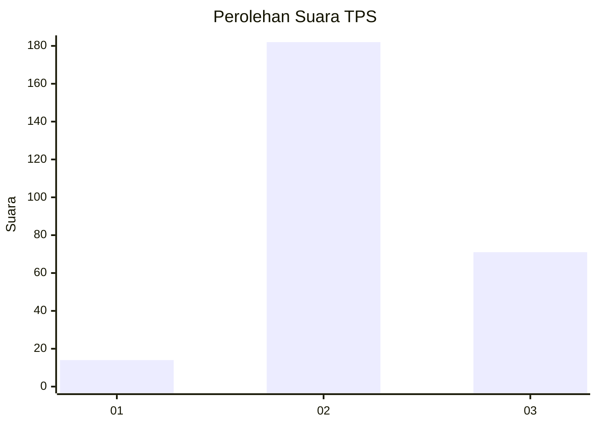

# Hasil

## Grafik

## Tabel

| No. | Nama Paslon    | Suara | Suara (raw) | Persentase |
|:--- |:-------------- | -----:| -----------:| ----------:|
| 1   | ANIES MUHAIMIN | 14    | [14][p-1]   | 5,24       |
| 2   | PRABOWO GIBRAN | 182   | [182][p-2]  | 68,16      |
| 3   | GANJAR MAHFUD  | 71    | [71][p-3]   | 26,59      |

[p-1]: https://github.com/gigit-pemilu/pemilu-2024-34-di-yogyakarta/blob/main/pilpres/hitung-suara/sub/34-di-yogyakarta/sub/02-bantul/sub/07-pajangan/sub/2002-sendangsari/sub/021-tps/sub/paslon-1.txt
[p-2]: https://github.com/gigit-pemilu/pemilu-2024-34-di-yogyakarta/blob/main/pilpres/hitung-suara/sub/34-di-yogyakarta/sub/02-bantul/sub/07-pajangan/sub/2002-sendangsari/sub/021-tps/sub/paslon-2.txt
[p-3]: https://github.com/gigit-pemilu/pemilu-2024-34-di-yogyakarta/blob/main/pilpres/hitung-suara/sub/34-di-yogyakarta/sub/02-bantul/sub/07-pajangan/sub/2002-sendangsari/sub/021-tps/sub/paslon-3.txt

## Foto C Plano

https://sirekap-obj-formc.kpu.go.id/ebf9/pemilu/ppwp/34/02/07/20/02/3402072002021-20240214-234241--c33bea68-1562-4dcf-966e-a1ba7f78297c.jpg

https://sirekap-obj-formc.kpu.go.id/ebf9/pemilu/ppwp/34/02/07/20/02/3402072002021-20240214-234453--77ac7853-d9e7-4f8e-b13d-9177dbcf7ea1.jpg

https://sirekap-obj-formc.kpu.go.id/ebf9/pemilu/ppwp/34/02/07/20/02/3402072002021-20240214-234852--ff5911fa-3c1a-4660-acf2-ab786946e1b1.jpg

## Metadata

| Key        | Value               |
| ---------- | ------------------- |
| Time Stamp | 2024-02-25 12:00:00 |

