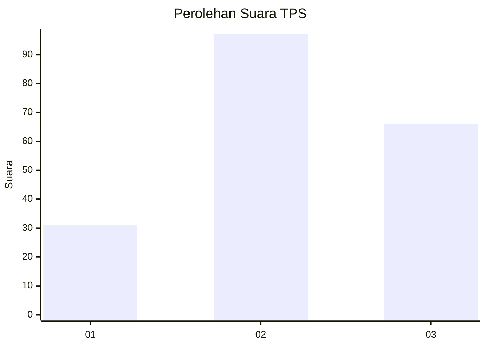
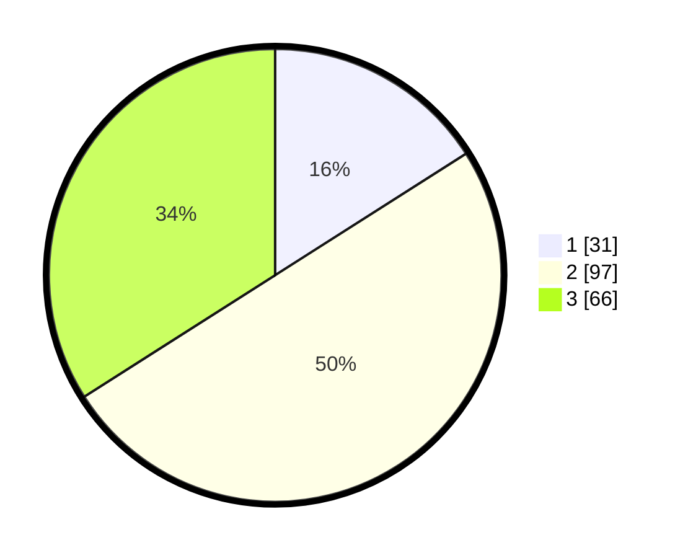

# Hasil

## Grafik

## Tabel

| No. | Nama Paslon    | Suara | Suara (raw) | Persentase |
|:--- |:-------------- | -----:| -----------:| ----------:|
| 1   | ANIES MUHAIMIN | 31    | [31][p-1]   | 15,98      |
| 2   | PRABOWO GIBRAN | 97    | [97][p-2]   | 50,00      |
| 3   | GANJAR MAHFUD  | 66    | [66][p-3]   | 34,02      |

[p-1]: https://github.com/gigit-pemilu/pemilu-2024-34-di-yogyakarta/blob/main/pilpres/hitung-suara/sub/34-di-yogyakarta/sub/02-bantul/sub/07-pajangan/sub/2002-sendangsari/sub/026-tps/sub/paslon-1.txt
[p-2]: https://github.com/gigit-pemilu/pemilu-2024-34-di-yogyakarta/blob/main/pilpres/hitung-suara/sub/34-di-yogyakarta/sub/02-bantul/sub/07-pajangan/sub/2002-sendangsari/sub/026-tps/sub/paslon-2.txt
[p-3]: https://github.com/gigit-pemilu/pemilu-2024-34-di-yogyakarta/blob/main/pilpres/hitung-suara/sub/34-di-yogyakarta/sub/02-bantul/sub/07-pajangan/sub/2002-sendangsari/sub/026-tps/sub/paslon-3.txt

## Foto C Plano

https://sirekap-obj-formc.kpu.go.id/9a9c/pemilu/ppwp/34/02/07/20/02/3402072002026-20240214-204632--993c1474-d93f-4343-9a93-359c7183eac9.jpg

https://sirekap-obj-formc.kpu.go.id/9a9c/pemilu/ppwp/34/02/07/20/02/3402072002026-20240214-204853--24466412-285f-4d2b-9840-596c0ddd472f.jpg

https://sirekap-obj-formc.kpu.go.id/9a9c/pemilu/ppwp/34/02/07/20/02/3402072002026-20240214-205307--3d3777e2-aeed-4a3e-9095-fe05fac6677d.jpg

## Metadata

| Key        | Value               |
| ---------- | ------------------- |
| Time Stamp | 2024-02-24 22:31:28 |

