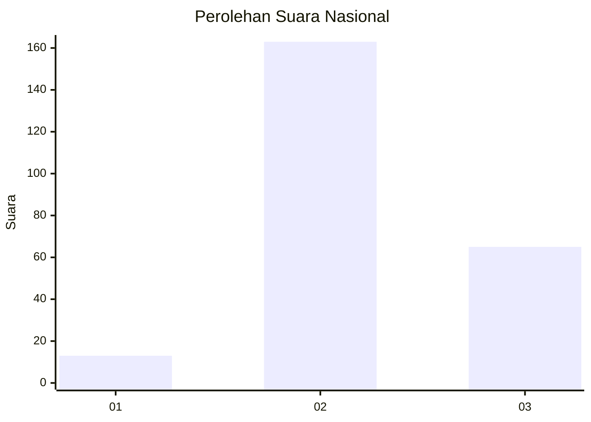

# Hasil

## Grafik

## Tabel

| No. | Nama Paslon    | Suara | Suara (raw) | Persentase |
|:--- |:-------------- | -----:| -----------:| ----------:|
| 1   | ANIES MUHAIMIN | 13    | [13][p-1]   | 5,39       |
| 2   | PRABOWO GIBRAN | 163   | [163][p-2]  | 67,63      |
| 3   | GANJAR MAHFUD  | 65    | [65][p-3]   | 26,97      |

[p-1]: https://github.com/gigit-pemilu/pemilu-2024/blob/main/pilpres/hitung-suara/sub/34-di-yogyakarta/sub/02-bantul/sub/07-pajangan/sub/2002-sendangsari/sub/027-tps/sub/paslon-1.txt
[p-2]: https://github.com/gigit-pemilu/pemilu-2024/blob/main/pilpres/hitung-suara/sub/34-di-yogyakarta/sub/02-bantul/sub/07-pajangan/sub/2002-sendangsari/sub/027-tps/sub/paslon-2.txt
[p-3]: https://github.com/gigit-pemilu/pemilu-2024/blob/main/pilpres/hitung-suara/sub/34-di-yogyakarta/sub/02-bantul/sub/07-pajangan/sub/2002-sendangsari/sub/027-tps/sub/paslon-3.txt

## Foto C Plano

https://sirekap-obj-formc.kpu.go.id/3637/pemilu/ppwp/34/02/07/20/02/3402072002027-20240214-225434--0a08f6dc-faa2-45aa-94ff-b6ded125ebd9.jpg

https://sirekap-obj-formc.kpu.go.id/3637/pemilu/ppwp/34/02/07/20/02/3402072002027-20240214-225307--94962ace-7a0d-4965-9b36-1f455976f9c6.jpg

https://sirekap-obj-formc.kpu.go.id/3637/pemilu/ppwp/34/02/07/20/02/3402072002027-20240214-225744--f6461913-e099-4055-b39b-f246003898f7.jpg

## Metadata

| Key        | Value               |
| ---------- | ------------------- |
| Time Stamp | 2024-02-16 21:01:00 |

